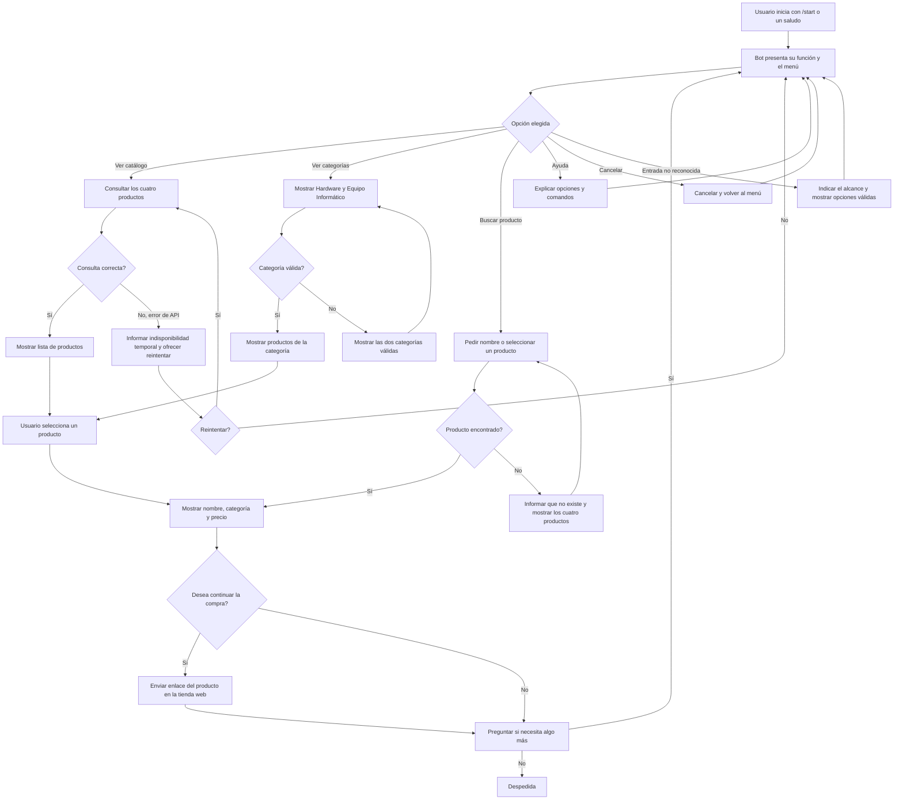

# Diseño conversacional del bot de Tienda Electrónica

## 1. Descripción y alcance

El bot `@TiendaElectronicaCETBot` permitirá consultar desde Telegram el catálogo actual de Tienda Electrónica. Su función es mostrar los cuatro productos existentes, sus categorías y precios, ayudar al usuario a elegir uno y dirigirlo a la tienda web para continuar la compra.

El bot no procesará pagos, no modificará el carrito de WooCommerce, no consultará pedidos y no ofrecerá productos que no existan en la tienda. Su alcance se limita al catálogo actual.

### Catálogo disponible

| Producto | Categoría | Precio mostrado |
|---|---|---:|
| NVIDIA DGX Station GB300 | Equipo Informático | $199,999.00 (oferta; precio anterior: $200,000.00) |
| Nvidia GeForce RTX 5090 | Hardware | $1,890.00 (oferta; precio anterior: $2,000.00) |
| NVIDIA RTX PRO 6000 Blackwell Workstation Edition | Hardware | $10,000.00 |
| PowerEdge XE9780L | Equipo Informático | $2,000,000.00 |

## 2. Lista de chequeo

### ¿Quién usará el chatbot?

Personas interesadas en consultar y comprar los productos tecnológicos de Tienda Electrónica. Entre ellas puede haber estudiantes, profesionales de informática, creadores de contenido, especialistas en inteligencia artificial y representantes de empresas que buscan hardware o equipos informáticos.

### ¿Qué problema resuelve?

Permite conocer rápidamente desde Telegram qué productos ofrece la tienda, cuánto cuestan y a qué categoría pertenecen, sin que el usuario tenga que recorrer primero todo el sitio web. Cuando el usuario elige un producto, el bot lo dirige a la tienda para continuar la compra.

### ¿Qué necesidades específicas tienen los usuarios?

- Ver todos los productos disponibles en el catálogo.
- Filtrar los productos por las categorías `Hardware` o `Equipo Informático`.
- Consultar el nombre y el precio de un producto concreto.
- Distinguir cuándo un producto tiene precio de oferta.
- Recibir un enlace hacia la tienda para continuar la compra.
- Volver al menú, pedir ayuda o cancelar la conversación en cualquier momento.

### ¿Qué preguntas se pueden hacer?

- ¿Qué productos tienen?
- Muéstrame el catálogo.
- ¿Qué productos hay en Hardware?
- Muéstrame los equipos informáticos.
- ¿Cuánto cuesta la RTX 5090?
- ¿Cuáles productos están en oferta?
- Quiero ver la NVIDIA RTX PRO 6000.
- Quiero comprar este producto.
- Ayuda.
- Cancelar.

### ¿Qué tipo de respuesta se espera en cada caso?

| Solicitud | Tipo de respuesta |
|---|---|
| Mostrar el catálogo | Lista de productos mediante botones o lista numerada |
| Filtrar por categoría | Selección de una lista y lista de resultados |
| Consultar un producto | Texto con nombre, categoría y precio |
| Consultar ofertas | Lista con precio anterior y precio de oferta |
| Continuar la compra | Botón o enlace a la página del producto en la tienda |
| Ayuda, menú o cancelación | Texto breve con las acciones disponibles |

Los precios se mostrarán en dólares de los Estados Unidos con dos decimales. El bot no afirmará que un producto está disponible porque la tienda no publica información sobre existencias.

### Perfil del usuario

- **Edad:** personas adultas capaces de realizar una compra en línea.
- **Ocupación:** estudiantes, profesionales de tecnología, creadores de contenido o representantes de empresas.
- **Intereses:** computación de alto rendimiento, inteligencia artificial, tarjetas gráficas, servidores y estaciones de trabajo.
- **Experiencia tecnológica:** desde nivel básico hasta avanzado. El bot no exigirá conocer comandos, aunque aceptará comandos como `/start`, `/menu`, `/ayuda` y `/cancelar`.

### Escenarios alternativos

- Si el usuario escribe un producto inexistente, el bot indicará que no lo encontró y mostrará los cuatro productos válidos.
- Si el usuario escribe una categoría inexistente, el bot ofrecerá `Hardware` y `Equipo Informático`.
- Si el mensaje es ambiguo, el bot preguntará si desea ver el catálogo, elegir una categoría o pedir ayuda.
- Si el usuario cambia de tema, el bot explicará brevemente que solo atiende consultas sobre el catálogo de Tienda Electrónica y mostrará el menú.
- Si el usuario envía una imagen, audio, documento o ubicación, el bot explicará que por el momento solo comprende texto y botones.
- Si falla la consulta al catálogo, el bot informará que no puede obtener los productos en ese momento e invitará a intentar de nuevo.
- Si el usuario escribe `/ayuda`, el bot mostrará las acciones disponibles.
- Si el usuario escribe `/cancelar`, el bot abandonará la operación actual y volverá al menú principal.

### Interfaz de usuario y accesibilidad

- Mensajes cortos, directos y en español.
- Botones de Telegram para las opciones principales, acompañados por texto comprensible.
- Listas numeradas como alternativa cuando no se puedan utilizar botones.
- Nombres completos de los productos y precios con formato consistente.
- No se dependerá solamente del color, imágenes o emojis para comunicar información.
- Se evitará la jerga innecesaria y se indicará siempre cómo volver, cancelar o pedir ayuda.

### ¿Cómo se validará el prototipo?

Se realizará una prueba de Mago de Oz con compañeros. Una persona actuará como usuario y otra responderá exclusivamente con los mensajes definidos en este documento. Se ejecutará un camino feliz y un camino con fricción. Luego se revisará cada turno con las heurísticas de Grice y se registrarán los cambios propuestos.

### Pruebas de usabilidad y desempeño

Las pruebas comprobarán que el usuario pueda:

1. Iniciar el bot y comprender su función.
2. Mostrar el catálogo.
3. Filtrar por una categoría.
4. Consultar el precio de un producto.
5. Abrir el enlace para continuar la compra.
6. Recuperarse de un nombre incorrecto.
7. Pedir ayuda y cancelar sin quedar atrapado en un flujo.

Se considerará satisfactoria la prueba cuando la persona complete las tareas sin explicaciones externas, comprenda los mensajes y encuentre una salida ante los errores. Durante la implementación se comprobará también que el bot responda sin duplicar mensajes y sin mostrar errores internos o datos sensibles.

### Privacidad

El bot no solicitará nombres, correos electrónicos, contraseñas, información de pago ni otros datos personales. Telegram proporciona identificadores técnicos, como el identificador del chat, para permitir que el bot responda; estos no se mostrarán al usuario ni se usarán con fines distintos a la conversación.

El token del bot se guardará en la variable de entorno `BOT_TOKEN` dentro del archivo `.env`. Este archivo no se subirá al repositorio y el token no se escribirá en el código, capturas, mensajes ni documentación.

### Recolección y eliminación de datos

| Dato | Finalidad | Conservación |
|---|---|---|
| Identificador del chat | Enviar la respuesta al chat correcto | Solo durante el procesamiento de la actualización; no se guardará en una base de datos |
| Texto o botón seleccionado | Identificar la intención y el producto solicitado | Solo durante la conversación necesaria para responder |
| Datos públicos del producto | Mostrar el catálogo de la tienda | Se consultarán desde la API de la tienda; no son datos personales |

El bot no mantendrá un historial propio de usuarios. Los mensajes que Telegram conserve se regirán por las opciones y políticas de esa plataforma.

## 3. Inventario de intenciones

| Intención | Ejemplo de enunciado | Frecuencia | Prioridad | Dato o API necesaria |
|---|---|---:|---:|---|
| Iniciar o mostrar el menú | `/start`, `Hola`, `Menú` | Alta | 1 | No requiere API |
| Consultar el catálogo completo | `¿Qué productos tienen?` | Alta | 1 | API REST de productos de WooCommerce |
| Consultar por categoría | `Muéstrame el hardware` | Media | 2 | Categoría elegida y API REST de productos |
| Consultar un producto | `¿Cuánto cuesta la RTX 5090?` | Alta | 1 | Nombre o identificador del producto y API REST de productos |
| Consultar ofertas | `¿Qué productos están en oferta?` | Media | 2 | Precio normal, precio de oferta y API REST de productos |
| Continuar la compra | `Quiero comprar la RTX 5090` | Alta | 1 | Enlace público del producto en la tienda |
| Solicitar ayuda | `/ayuda`, `Necesito ayuda` | Media | 1 | No requiere API |
| Cancelar la operación | `/cancelar`, `Ya no quiero continuar` | Media | 1 | Estado temporal de la conversación |

## 4. Diagrama de flujo de la conversación

En cualquier punto, `/ayuda` muestra las opciones disponibles y `/cancelar` abandona la operación actual para regresar al menú.

## 5. Diálogo de muestra: camino feliz

**Usuario:** `/start`

**Bot:** ¡Hola! Bienvenido a Tienda Electrónica.

Aquí encontrarás información sobre los cuatro productos de la tienda, sus categorías y precios. ¿Qué deseas consultar?

1. Ver catálogo
2. Ver categorías
3. Buscar un producto
4. Ayuda

**Usuario:** Ver catálogo

**Bot:** Este es el catálogo actual de Tienda Electrónica:

1. NVIDIA DGX Station GB300 - $199,999.00
2. Nvidia GeForce RTX 5090 - $1,890.00
3. NVIDIA RTX PRO 6000 Blackwell Workstation Edition - $10,000.00
4. PowerEdge XE9780L - $2,000,000.00

Selecciona un producto para ver sus datos.

**Usuario:** Nvidia GeForce RTX 5090

**Bot:** Nvidia GeForce RTX 5090

- Categoría: Hardware
- Precio actual: $1,890.00
- Precio anterior: $2,000.00
- Estado: oferta

¿Deseas abrir este producto en la tienda para continuar la compra?

**Usuario:** Sí

**Bot:** Continúa la compra en este enlace: [Ver producto en la tienda](https://mt23014.duckdns.org/).

¿Necesitas consultar otro producto?

**Usuario:** No

**Bot:** Gracias por visitar Tienda Electrónica. Puedes escribir `/menu` cuando quieras consultar nuevamente el catálogo.

## 6. Cambios derivados de la revisión entre pares

## 1. ¿El mensaje de bienvenida explica en una o dos frases qué hace el bot y qué no? Después del Guion 1, ¿B habría sabido qué más puede pedir sin adivinar (comando de ayuda, botones, ejemplos)?
**Veredicto:** Parcial.
**Evidencia:** La bienvenida comunica bien las funciones principales y despliega un menú numerado para guiar al usuario. Pero la respuesta inicial omite decir lo que el bot no hace (por ejemplo, procesar pagos o verificar existencias).
**Mejora:** Agregar en el saludo inicial lo que el bot no hace para que el usuario lo tenga claro.

## 2. Recorran el diálogo de muestra de A turno a turno. ¿Algún mensaje del bot da de más o de menos? ¿Alguna respuesta no viene a cuento del turno anterior? ¿Hay turnos con más de una pregunta, frases largas o jerga interna («número de orden transaccional» en vez de «número de pedido»)
**Veredicto:** Resuelto.
**Evidencia:** El diálogo nos muestra la información del producto (categoría y precio) sin saturar la interfaz con especificaciones técnicas innecesarias. Tambien evita jerga interna, formulando una única pregunta directa por turno, como "¿Deseas abrir este producto en la tienda para continuar la compra?". 
**Mejora:** Aplicar formato de negritas a los nombres de los productos y montos económicos en los mensajes para mejorar la lectura en dispositivos móviles.

## 3. ¿El bot promete algo que no podría cumplir con las API del inventario, o afirma datos que no puede verificar? Si el usuario ya dio un dato en su primer mensaje, ¿el diagrama evita volver a pedírselo?
**Veredicto:** Resuelto.
**Evidencia:** El diseño es claro sobre la procedencia de sus datos; se niega a confirmar niveles de inventario porque la API de WooCommerce de la tienda no proporciona esa métrica. Además, el modelo no exige que el usuario repita búsquedas durante el flujo de una misma intención. 
**Mejora:** Detallar el comportamiento del sistema ante latencias altas para evitar que el usuario asuma que el catálogo está vacío si la petición demora.

## 4. Para cada una de las cuatro situaciones de fricción: ¿el diagrama de A tiene una rama para ella? ¿La reparación va por niveles y corta a los tres intentos? ¿Hay un punto claro donde se deriva a un humano? ¿Los mensajes de error son útiles («no encontré ese pedido, ¿probamos con otro número?») y no técnicos («Error 404»)?
**Veredicto:** Parcial.
**Evidencia:** El diagrama central y la sección de escenarios alternativos logra captar mensajes ambiguos, filtros de categorías erróneos, caídas de la API y formatos no soportados como imágenes. Pero, el esquema carece de un tope máximo de tres intentos fallidos y no contempla un mecanismo de escalamiento para derivar al usuario con un operador humano. 
**Mejora:** Integrar un control en el diagrama de flujo que cuente los fallos; asi al alcanzar tres errores consecutivos, el sistema debe abortar el flujo actual y proporcionar un enlace directo a soporte humano.

## 5. ¿En cualquier punto de los dos guiones el usuario pudo cancelar, volver atrás o pedir ayuda? ¿Toda acción irreversible (pago, cancelación de pedido) se confirma de forma explícita? ¿Cada intención termina con una respuesta clara y una oferta de continuar?
**Veredicto:** Resuelto.
**Evidencia:** La arquitectura del bot garantiza los comandos /ayuda y /cancelar pueden llamarse en cualquier estado para limpiar el contexto y regresar al menú base del flujo. Todo el recorrido termina con una invitación clara a para continuar con la interacción ("¿Necesitas consultar otro producto?"). 
**Mejora:** Documentar un turno de diálogo adicional que muestre exactamente qué texto devuelve el bot cuando el usuario detona el comando /cancelar a mitad de una búsqueda.

