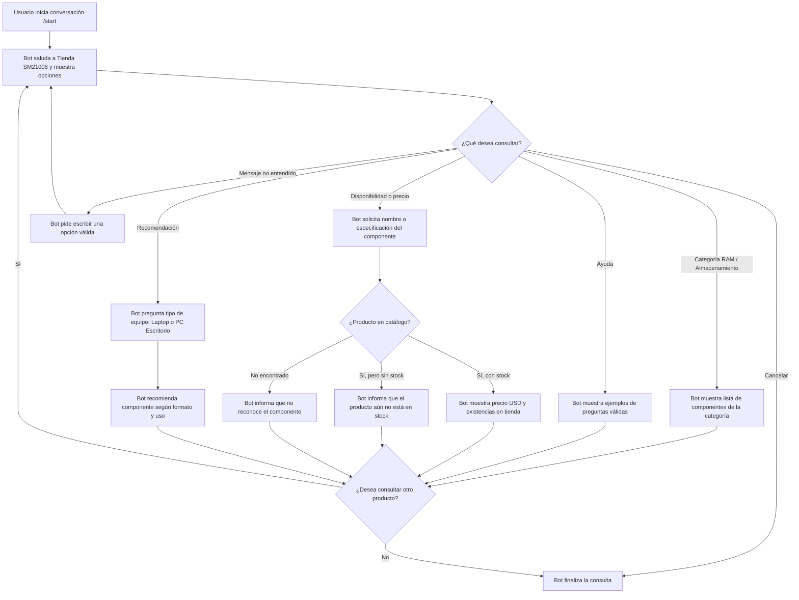

# Diseño conversacional - Tienda SM21008 (Electrónica y Componentes)

## Lista de chequeo

- **¿Quién usará el chatbot?** Clientes interesados en adquirir componentes de electrónica, memorias RAM, unidades de almacenamiento (SSD/HDD) y consultar disponibilidad de productos en la Tienda SM21008.
- **¿Qué problema resuelve?** Permite conocer de forma inmediata el precio y stock disponible de componentes sin esperar atención humana, e informa de manera clara sobre artículos que aún no están en stock.
- **¿Qué necesidades específicas tienen?** Verificar compatibilidad rápida (capacidad/tipo), consultar precios, confirmar existencias actuales y saber si ciertos productos aún no han ingresado al inventario.
- **¿Qué preguntas se pueden hacer?** “¿Tienen memorias RAM DDR4 de 16GB?”, “¿Cuánto cuesta un SSD Kingston de 1TB?”, “¿Tienen almacenamiento para laptop?” y “¿Tienen tarjetas de video disponibles?”.
- **¿Qué tipo de respuesta espero en cada caso?** Texto para descripción y compatibilidad; números para precio ($ USD) y unidades en stock; listas de selección para elegir entre categorías (RAM, Almacenamiento, etc.).
- **Edad, ocupación, intereses y experiencia con tecnología:** Personas de 16 años en adelante, estudiantes, técnicos, entusiastas del ensamble de PC y público general. El nivel tecnológico varía, por lo que el lenguaje debe ser claro y directo.
- **Escenarios alternativos:** Producto agotado o aún no en stock, producto no encontrado en el catálogo, mensaje no entendido, usuario que cambia de tema o cancela la consulta.
- **UI y accesibilidad:** Mensajes breves, opciones numeradas o claras, precios expresados en dólares ($ USD) y estados de stock visibles.
- **¿Cómo validar el prototipo?** Probar el diálogo simulando consultas de precio, stock de memorias RAM, unidades de almacenamiento y verificación de artículos sin stock.
- **Pruebas de usabilidad y desempeño:** Evaluar que el usuario identifique rápidamente si un componente está en existencia y comprenda cuando un producto aún no está disponible.
- **Privacidad:** No se solicitarán ni almacenarán datos personales durante la consulta del catálogo de Tienda SM21008.

## Inventario de intenciones

| Intención | Ejemplo de enunciado | Frecuencia | Prioridad | Dato / API |
|---|---|---:|---:|---|
| Consultar disponibilidad | “¿Tienen memoria RAM DDR4 de 16GB?” | Alta | 1 | API de catálogo: nombre del componente y stock. |
| Consultar precio | “¿Cuánto cuesta un SSD NVMe de 1TB?” | Alta | 1 | API de catálogo: precio del producto en USD. |
| Buscar por categoría | “Quiero ver opciones de almacenamiento” | Alta | 1 | API de catálogo: componentes por categoría (RAM / SSD / HDD). |
| Consultar sin stock | “¿Tienen tarjetas gráficas o fuentes de poder?” | Media | 2 | API de catálogo: estado de producto / alerta "Aún no en stock". |
| Pedir recomendación | “Necesito almacenamiento rápido para mi laptop” | Media | 2 | Catálogo: sugerencia según formato (M.2 / SATA / SODIMM). |
| Pedir ayuda | “Ayuda” o “/start” | Media | 2 | Mensaje estático: lista de opciones y ejemplos. |
| Cancelar consulta | “Cancelar” | Baja | 2 | Mensaje estático: cierre de la interacción actual. |

## Diagrama de flujo de la conversación

