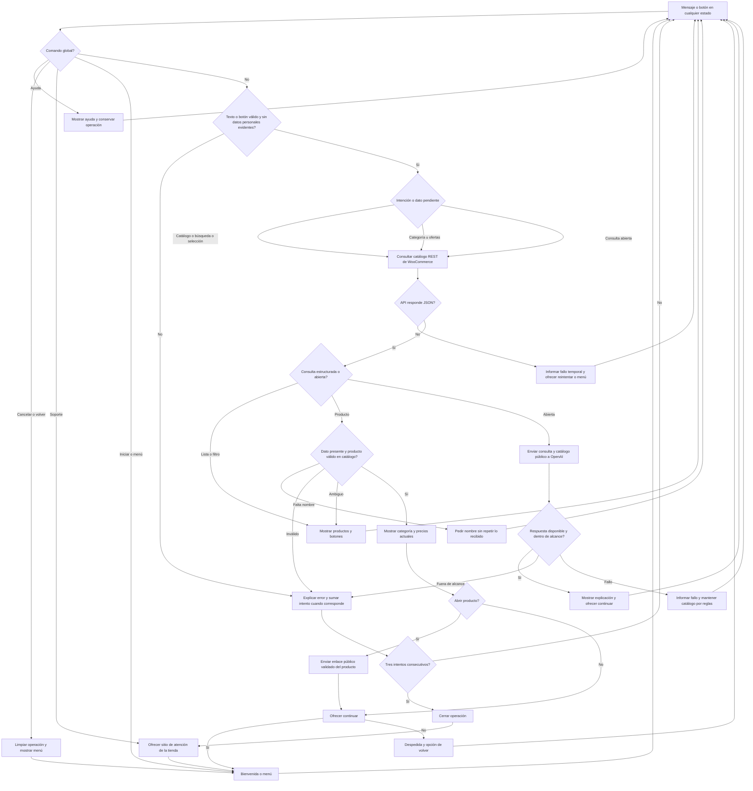

# Diseño conversacional del bot de Tienda Electrónica

## 1. Descripción y alcance

El bot `@TiendaElectronicaCETBot` permite consultar desde Telegram el catálogo actual de Tienda Electrónica. Su función es mostrar los productos del catálogo, sus categorías y precios, ayudar al usuario a elegir uno y dirigirlo a la tienda web para continuar la compra.

El bot no procesará pagos, no modificará el carrito de WooCommerce, no consultará pedidos y no ofrecerá productos que no existan en la tienda. Su alcance se limita al catálogo actual. Las consultas estructuradas se atienden con reglas y datos de WooCommerce; las preguntas abiertas y comparaciones sobre ese catálogo se atienden mediante la API oficial de OpenAI.

### Catálogo disponible

| Producto | Categoría | Precio mostrado |
|---|---|---:|
| NVIDIA DGX Station GB300 | Equipo Informático | $199,999.00 (oferta; precio anterior: $200,000.00) |
| Nvidia GeForce RTX 5090 | Hardware | $1,890.00 (oferta; precio anterior: $2,000.00) |
| NVIDIA RTX PRO 6000 Blackwell Workstation Edition | Hardware | $10,000.00 |
| PowerEdge XE9780L | Equipo Informático | $2,000,000.00 |

## 2. Lista de chequeo

### ¿Quién usará el chatbot?

Personas interesadas en consultar y comprar los productos tecnológicos de Tienda Electrónica. Entre ellas puede haber estudiantes, profesionales de informática, creadores de contenido, especialistas en inteligencia artificial y representantes de empresas que buscan hardware o equipos informáticos.

### ¿Qué problema resuelve?

Permite conocer rápidamente desde Telegram qué productos ofrece la tienda, cuánto cuestan y a qué categoría pertenecen, sin que el usuario tenga que recorrer primero todo el sitio web. Cuando el usuario elige un producto, el bot lo dirige a la tienda para continuar la compra.

### ¿Qué necesidades específicas tienen los usuarios?

- Ver todos los productos disponibles en el catálogo.
- Filtrar los productos por las categorías `Hardware` o `Equipo Informático`.
- Consultar el nombre y el precio de un producto concreto.
- Distinguir cuándo un producto tiene precio de oferta.
- Recibir un enlace hacia la tienda para continuar la compra.
- Volver al menú, pedir ayuda o cancelar la conversación en cualquier momento.

### ¿Qué preguntas se pueden hacer?

- ¿Qué productos tienen?
- Muéstrame el catálogo.
- ¿Qué productos hay en Hardware?
- Muéstrame los equipos informáticos.
- ¿Cuánto cuesta la RTX 5090?
- ¿Cuáles productos están en oferta?
- Quiero ver la NVIDIA RTX PRO 6000.
- Quiero comprar este producto.
- Ayuda.
- Cancelar.

### ¿Qué tipo de respuesta se espera en cada caso?

| Solicitud | Tipo de respuesta |
|---|---|
| Mostrar el catálogo | Lista de productos mediante botones o lista numerada |
| Filtrar por categoría | Selección de una lista y lista de resultados |
| Consultar un producto | Texto con nombre, categoría y precio |
| Consultar ofertas | Lista con precio anterior y precio de oferta |
| Continuar la compra | Botón o enlace a la página del producto en la tienda |
| Ayuda, menú o cancelación | Texto breve con las acciones disponibles |

Los precios se mostrarán en dólares de los Estados Unidos con dos decimales. El bot mantiene el alcance acordado de productos y precios y no confirma existencias, reservas ni condiciones de entrega. Los precios de esta tabla son la referencia del diseño; en ejecución se consultan los valores actuales del catálogo.

### Perfil del usuario

- **Edad:** personas adultas capaces de realizar una compra en línea.
- **Ocupación:** estudiantes, profesionales de tecnología, creadores de contenido o representantes de empresas.
- **Intereses:** computación de alto rendimiento, inteligencia artificial, tarjetas gráficas, servidores y estaciones de trabajo.
- **Experiencia tecnológica:** desde nivel básico hasta avanzado. El bot no exigirá conocer comandos, aunque aceptará comandos como `/start`, `/menu`, `/ayuda` y `/cancelar`.

### Escenarios alternativos

- Si el usuario escribe un producto inexistente, el bot indicará que no lo encontró y mostrará los cuatro productos válidos.
- Si el usuario escribe una categoría inexistente, el bot ofrecerá `Hardware` y `Equipo Informático`.
- Si el mensaje es ambiguo, el bot preguntará si desea ver el catálogo, elegir una categoría o pedir ayuda.
- Si el usuario cambia de tema, el bot explicará brevemente que solo atiende consultas sobre el catálogo de Tienda Electrónica y mostrará el menú.
- Si el usuario envía una imagen, audio, documento o ubicación, el bot explicará que por el momento solo comprende texto y botones.
- Si falla la consulta al catálogo, el bot informará que no puede obtener los productos en ese momento e invitará a intentar de nuevo.
- Si el usuario escribe `/ayuda`, el bot mostrará las acciones disponibles.
- Si el usuario escribe `/cancelar`, el bot abandonará la operación actual y volverá al menú principal.
- Ante datos o selecciones inválidas, habrá hasta tres intentos consecutivos; después se cierra la operación y se ofrece atención mediante el sitio de la tienda.
- `/ayuda`, `/cancelar`, `/volver`, `/menu` y `/soporte` se comprueban antes de validar el dato pendiente. La ayuda conserva la operación; cancelar o volver la abandona.
- La selección de producto se valida contra el catálogo actual antes de mostrar datos.
- Si la IA no está disponible, se informa en lenguaje claro y siguen disponibles las consultas por reglas.
- Correos, teléfonos y otros patrones evidentes de datos personales se rechazan antes de enviar una consulta a la IA; no se solicita información personal. Esta detección no garantiza identificar todas las formas de datos personales.

### Interfaz de usuario y accesibilidad

- Mensajes cortos, directos y en español.
- Botones de Telegram para las opciones principales, acompañados por texto comprensible.
- Listas numeradas como alternativa cuando no se puedan utilizar botones.
- Nombres completos de los productos y precios con formato consistente.
- No se dependerá solamente del color, imágenes o emojis para comunicar información.
- Se evitará la jerga innecesaria y se indicará siempre cómo volver, cancelar o pedir ayuda.

### Validación del prototipo

El diseño se revisó mediante la prueba de Mago de Oz y las heurísticas de Grice. La revisión consideró el camino feliz, los escenarios de fricción, el alcance de las respuestas y las salidas de ayuda o cancelación. La sección 6 resume las observaciones de la revisión inicial y los ajustes aplicados.

### Pruebas de usabilidad y desempeño

Las pruebas comprueban que el usuario pueda:

1. Iniciar el bot y comprender su función.
2. Mostrar el catálogo.
3. Filtrar por una categoría.
4. Consultar el precio de un producto.
5. Abrir el enlace para continuar la compra.
6. Recuperarse de un nombre incorrecto.
7. Pedir ayuda y cancelar sin quedar atrapado en un flujo.

Los criterios de usabilidad son completar las tareas sin explicaciones externas, comprender los mensajes y encontrar una salida ante los errores. Las comprobaciones del código verifican el flujo, la recuperación ante entradas inválidas, el estado temporal y la eliminación de actualizaciones duplicadas. Los resultados de servidor e integraciones se registran en `docs/pruebas-5b.md`.

### Privacidad

El bot no solicita nombres, correos, contraseñas, datos de pago ni otros datos personales.
Telegram proporciona el ID de chat para enviar la respuesta; no se envía a OpenAI.
Las consultas estructuradas y acciones fuera del alcance (pagos, pedidos, carritos)
se resuelven con reglas. Solo las preguntas abiertas depuradas de patrones evidentes
de datos personales se envían a la API oficial de OpenAI junto con datos públicos
del catálogo. No se envían objetos completos de Telegram, claves, IDs ni historial.

La bienvenida informa del uso de OpenAI. El modelo no ejecuta compras ni acciones
críticas. Se usa `store: false`; esto no equivale a retención cero en todos los
sistemas del proveedor. La conservación externa depende de los
[controles de datos de OpenAI](https://developers.openai.com/api/docs/guides/your-data).

`BOT_TOKEN` y `OPENAI_API_KEY` permanecen en `.env` fuera del acceso público y de Git.

### Recolección y eliminación de datos

| Dato | Finalidad | Conservación |
|---|---|---|
| ID de chat | Responder a Telegram | En memoria durante la solicitud; en disco solo se usa su hash como nombre de archivo |
| Estado, IDs públicos de productos y contador de intentos | Recordar la operación sin repetir datos | 30 minutos de inactividad; borrado físico en la siguiente limpieza, hasta 15 minutos después con cron |
| IDs de actualizaciones recientes | Evitar procesar mensajes duplicados | En el mismo estado temporal, máximo 50 IDs |
| Texto del usuario | Identificar intención o contestar una pregunta abierta | No se guarda en archivos de estado ni logs del bot |
| Metadatos de entrada/salida, estado y códigos HTTP | Depurar el funcionamiento | Logs locales, siete días y siguiente limpieza |
| Datos públicos del producto | Consultar y explicar el catálogo | Se consultan desde la API; solo se mantienen durante la solicitud |

No se mantiene historial propio de conversaciones. Los datos guardados quedan
fuera de la carpeta pública. Telegram y OpenAI conservan los datos que les
correspondan conforme a sus políticas.

## 3. Inventario de intenciones

| Intención | Ejemplo de enunciado | Frecuencia | Prioridad | Dato o API necesaria |
|---|---|---:|---:|---|
| Iniciar o mostrar el menú | `/start`, `Hola`, `Menú` | Alta | 1 | No requiere API |
| Consultar el catálogo completo | `¿Qué productos tienen?` | Alta | 1 | API REST de productos de WooCommerce |
| Consultar por categoría | `Muéstrame el hardware` | Media | 2 | Categoría elegida y API REST de productos |
| Consultar un producto | `¿Cuánto cuesta la RTX 5090?` | Alta | 1 | Nombre o identificador del producto y API REST de productos |
| Consultar ofertas | `¿Qué productos están en oferta?` | Media | 2 | Precio normal, precio de oferta y API REST de productos |
| Continuar la compra | `Quiero comprar la RTX 5090` | Alta | 1 | Enlace público del producto en la tienda |
| Solicitar ayuda | `/ayuda`, `Necesito ayuda` | Media | 1 | No requiere API |
| Cancelar o volver | `/cancelar`, `/volver`, `Ya no quiero continuar` | Media | 1 | Estado temporal de la conversación |
| Atención de la tienda | `/soporte`, `Hablar con un humano` | Media | 1 | Enlace de atención configurado |
| Consulta abierta sobre productos | `Compara la RTX 5090 y la PRO 6000` | Media | 2 | Catálogo público y API oficial de OpenAI |

## 4. Diagrama de flujo de la conversación

Todas las entradas pasan por el nodo global, también cuando hay un nombre o una selección pendiente. `/ayuda` conserva la operación; `/cancelar` y `/volver` la abandonan. Las compras se realizan en la web: el bot solo abre enlaces y no ejecuta acciones irreversibles. La atención se ofrece con `SUPPORT_URL`, la página principal de la tienda; no existe transferencia automática a un operador.

## 5. Diálogo de muestra: camino feliz

**Usuario:** `/start`

**Bot:** ¡Hola! Bienvenido a Tienda Electrónica.

Consulta el catálogo, categorías, precios y ofertas; abre los productos para comprar en la web. No proceso pagos ni pedidos. Las consultas abiertas usan OpenAI; no compartas datos personales.

¿Qué deseas consultar?

1. Ver catálogo
2. Ver categorías
3. Buscar producto
4. Ofertas
5. Ayuda
6. Atención de la tienda

**Usuario:** Ver catálogo

**Bot:** Este es el catálogo actual de Tienda Electrónica:

1. NVIDIA DGX Station GB300 - $199,999.00
2. Nvidia GeForce RTX 5090 - $1,890.00
3. NVIDIA RTX PRO 6000 Blackwell Workstation Edition - $10,000.00
4. PowerEdge XE9780L - $2,000,000.00

Selecciona un producto para ver sus datos.

**Usuario:** Nvidia GeForce RTX 5090

**Bot:** Nvidia GeForce RTX 5090

- Categoría: Hardware
- Precio actual: $1,890.00
- Precio anterior: $2,000.00
- Estado: oferta

¿Deseas abrir este producto en la tienda para continuar la compra?

**Usuario:** Sí

**Bot:** Continúa la compra en la página de Nvidia GeForce RTX 5090.

El botón **Abrir producto en la tienda** utiliza el enlace público del producto
recibido de WooCommerce.

¿Necesitas consultar otro producto?

**Usuario:** No

**Bot:** Gracias por visitar Tienda Electrónica. Puedes escribir `/menu` cuando quieras consultar nuevamente el catálogo.

## 6. Revisión del diseño inicial y ajustes aplicados

La evaluación de la sesión 1 correspondió a la versión inicial del diseño:

| Aspecto revisado | Veredicto inicial | Observación registrada |
|---|---|---|
| Bienvenida y alcance | Parcial | La bienvenida describía las funciones, pero no explicitaba las operaciones fuera del alcance. |
| Claridad de los turnos | Resuelto | Los mensajes eran breves, evitaban jerga y formulaban una pregunta por turno. |
| Coherencia de respuestas y reutilización de datos | Resuelto | Se reconocía el alcance del catálogo y se evitaba solicitar de nuevo un producto ya indicado. |
| Manejo de fricción | Parcial | El flujo inicial no limitaba los intentos ni incluía una salida hacia atención de la tienda. |
| Ayuda, cancelación y cierre | Resuelto | Se declaraban comandos globales y cierre de cada intención; la retroalimentación posterior precisó su representación en el diagrama. |

Los cambios aplicados a partir de esa revisión son:

| Observación de origen | Cambio aplicado |
|---|---|
| Pregunta 1: explicitar el alcance en la bienvenida | El saludo indica que el bot no procesa pagos ni pedidos. |
| Pregunta 4 y retroalimentación 5a: limitar las reparaciones | Se cuentan las entradas inválidas y se cierra la operación después de tres intentos, ofreciendo menú o atención de la tienda. |
| Pregunta 5 y retroalimentación 5a: representar los comandos globales | El diagrama y el código comprueban ayuda, cancelar, volver y soporte antes de validar datos de la operación. |
| Retroalimentación 5a sobre la selección de producto | Los IDs seleccionados se validan contra el catálogo actual antes de mostrar datos o enlaces. |
| Pregunta 3: distinguir la latencia o el fallo de un catálogo vacío | Las solicitudes tienen tiempos máximos y devuelven mensajes claros ante errores del servicio. |
| Pregunta 5: mostrar una cancelación a mitad del flujo | Se incorpora el diálogo de cancelación de una búsqueda. |

### Cancelación durante una búsqueda

**Usuario:** Buscar producto

**Bot:** ¿Qué producto deseas consultar? Escribe su nombre; por ejemplo, RTX 5090.

**Usuario:** `/cancelar`

**Bot:** Operación cancelada. ¿Qué deseas consultar?

El bot muestra el menú y elimina la operación anterior.

## 7. Integración y respuestas

La implementación combina reglas para el catálogo y navegación con un servicio
externo de lenguaje para las consultas abiertas. Los precios y enlaces se obtienen
de WooCommerce; el servicio de lenguaje utiliza únicamente el contexto público
necesario para explicar o comparar productos. No realiza acciones de compra.

Los ejemplos del camino feliz muestran precios de referencia. En ejecución se
usan precios y enlaces recibidos de WooCommerce, sin copiar importes fijos.
