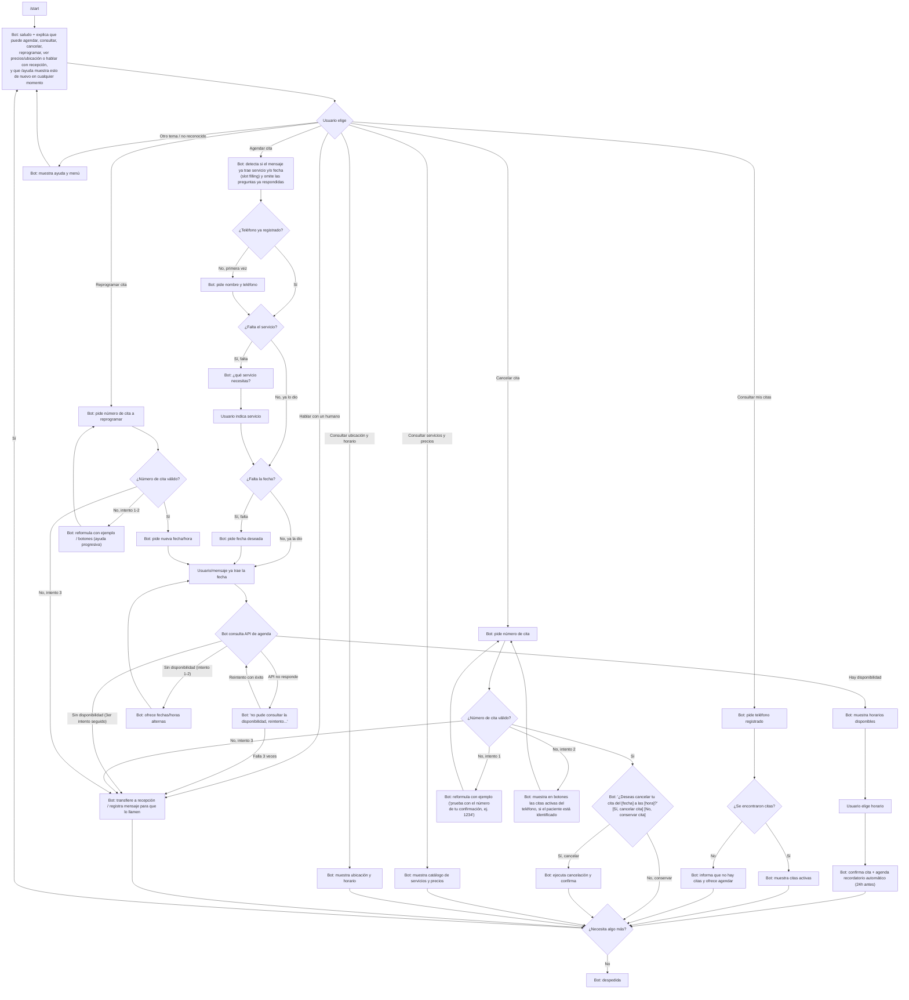

# Documento de diseño conversacional — CitasBot

**Curso:** CET 115 — Comercio Electrónico, ciclo II/2026
**Bot:** Clínica Sonrisa Sana — reservas de citas
**Sesión:** 1 de 2 (Diseño y puesta en marcha)

---

## 1. Lista de chequeo

**¿Quién usará el chatbot?**
Pacientes actuales y nuevos de la clínica dental Sonrisa Sana que quieren agendar, consultar o cancelar una cita sin llamar por teléfono.

**¿Qué problema o problemas resuelve?**
Elimina la espera telefónica para agendar citas, permite consultar disponibilidad y gestionar citas fuera del horario de atención de la recepción, y reduce las inasistencias mediante recordatorios.

**¿Qué necesidades específicas tienen?**
- Agendar una cita rápido, sin llamar.
- Saber qué horarios hay disponibles antes de comprometerse.
- Poder cancelar o reprogramar sin fricción.
- Recibir confirmación clara de la cita (fecha, hora, servicio).

**¿Qué preguntas se pueden hacer?**
Agendar cita, consultar mis citas, cancelar cita, reprogramar cita, consultar servicios y precios, consultar ubicación/horario de atención, hablar con un humano.

**¿Qué tipo de respuesta espero en cada caso?**
- Servicio deseado → selección de lista (limpieza, consulta general, urgencia).
- Fecha deseada → texto/fecha en formato día-mes (ejemplo: "jueves 11 de septiembre").
- Horario → selección de lista (entre las opciones disponibles).
- Número de cita (para cancelar/reprogramar/consultar) → número entero positivo.
- Nombre y teléfono (primera vez) → texto/número. Se piden solo la primera vez; si el teléfono ya está registrado, el bot lo reconoce y no vuelve a pedir estos datos.

**¿Cuál es su edad, ocupación, intereses, nivel de experiencia con tecnología?**
Adultos de 18 a 65 años, ocupaciones variadas (estudiantes, empleados, adultos mayores). Se asume nivel tecnológico medio-bajo: preferir botones y comandos cortos sobre lenguaje libre, evitar tecnicismos.

**¿Cuáles son los escenarios alternativos?**
- El usuario pide una fecha sin disponibilidad → el bot ofrece fechas/horas alternas; si tras 3 intentos seguidos no hay cupo, ofrece hablar con un humano.
- El usuario escribe un número de cita inválido → 1er intento: el bot reformula con un ejemplo concreto; 2do intento: muestra en botones las citas activas del teléfono, si el paciente está identificado; 3er intento: escala a "hablar con un humano".
- El usuario cambia de tema a mitad de un flujo → el bot responde la nueva pregunta y ofrece retomar el flujo anterior exactamente donde quedó, sin perder los datos ya capturados.
- El usuario no responde en el formato esperado → el bot reintenta interpretar la respuesta y, si no puede, repite la pregunta con las opciones. Cuenta para el mismo límite de 3 intentos.
- El usuario ya incluye datos en su primer mensaje (p. ej. "quiero una limpieza el jueves 11") → el bot reutiliza esos datos y solo pregunta lo que falta.
- El usuario quiere cancelar el proceso en cualquier punto → comando `/cancelar` siempre disponible; regresa al menú principal.
- El usuario quiere corregir solo el último dato sin reiniciar todo → comando `/volver` siempre disponible; regresa un solo paso atrás, conservando los demás datos ya capturados.
- El usuario escribe `/ayuda` en cualquier punto → el bot muestra las opciones sin perder el progreso del flujo actual.
- La API de agenda o de citas no responde → el bot muestra un mensaje no técnico ("no pude consultar la disponibilidad, intento de nuevo") y reintenta; si falla varias veces, ofrece hablar con un humano.
- El usuario pide cancelar una cita → el bot siempre muestra fecha y hora de la cita encontrada y pide confirmación explícita (Sí, cancelar / No, conservar) antes de ejecutar la cancelación.

**¿UI, Accesibilidad?**
Uso de teclado de respuesta (botones) de Telegram para reducir errores de tipeo y evitar que el usuario tenga que recordar comandos. Mensajes cortos, sin jerga médica. Todo el flujo funciona también si el usuario solo escribe texto (sin usar botones).

**¿Cómo haré para validar mi prototipo?**
Prueba de Mago de Oz con dos guiones (camino feliz y camino con fricción) en la Actividad 4, seguida de revisión con las heurísticas de Grice. Antes de producción, prueba de usabilidad con 3-5 usuarios reales midiendo tiempo para completar una reserva y tasa de errores.

**Pruebas de usabilidad, desempeño**
Se mide: tiempo para completar el agendamiento de una cita, número de veces que el usuario tuvo que repetir una respuesta, y si el usuario logró cancelar/consultar sin ayuda externa.

**¿Privacidad?**
**Recolectar datos: para qué, cuáles y cuándo eliminarlos**
Se recolecta: nombre, número de teléfono y motivo de consulta, únicamente para gestionar la cita y enviar el recordatorio. No se solicitan datos médicos sensibles dentro del chat. Los datos de contacto se eliminan de la base de citas 90 días después de la fecha de la cita, salvo que el paciente tenga otra cita futura agendada.

---

## 2. Inventario de intenciones

| Intención | Ejemplo de enunciado | Frecuencia | Prioridad | Dato / API |
|---|---|---|---|---|
| Consultar disponibilidad | ¿tienen espacio el jueves? | Alta | 1 | API de agenda |
| Agendar una cita | quiero una cita con el odontólogo | Alta | 1 | API de agenda |
| Consultar mis citas | ¿cuándo es mi próxima cita? | Media | 2 | API de citas (por paciente) |
| Cancelar una cita | quiero cancelar mi cita | Media | 2 | API de citas (requiere confirmación explícita antes de ejecutar) |
| Reprogramar una cita | necesito cambiar la hora de mi cita | Media | 2 | API de citas |
| Consultar servicios y precios | ¿cuánto cuesta una limpieza? | Baja | 3 | Catálogo de servicios |
| Consultar ubicación y horario | ¿dónde están ubicados? | Baja | 3 | Dato estático |
| Hablar con un humano | quiero hablar con alguien | Baja | 3 | Escalamiento a recepción |
| Enviar recordatorio (automático) | — | Alta (por cada cita agendada) | 1 | Tarea programada / API de notificaciones, disparada 24 h antes de la cita confirmada |

---

## 3. Diagrama de flujo



**Notas del diagrama:**
- **Interrupción global:** en cualquier nodo donde el bot espera un dato del usuario, revisa primero si el mensaje es `/cancelar`, `/volver` o `/ayuda` antes de validarlo como respuesta a la pregunta activa:
  - `/cancelar` → interrumpe el flujo actual y regresa a `B` (menú principal).
  - `/volver` → regresa un solo paso atrás (a la pregunta inmediatamente anterior), sin perder los demás datos ya capturados.
  - `/ayuda` → muestra las opciones/ayuda y luego repite la misma pregunta que estaba pendiente.
- **Slot filling:** el nodo `SLOT`, junto con las decisiones `D` y `F0`, evita volver a preguntar por el servicio o la fecha si el usuario ya los mencionó en su primer mensaje. El mismo principio aplica al número de cita cuando el usuario lo da junto con la intención (p. ej. "cancela la cita 1234").
- **Ayuda progresiva en errores:** los nodos de recuperación (`X1`, `X2b`, `X2`, `K`, `ERR1`) siguen la secuencia: 1) reformular con ejemplo concreto, 2) ofrecer botones/alternativas en vez de texto libre, 3) al tercer intento fallido, derivar a `HH`.
- **Confirmación antes de cancelar:** `WC` obliga a que el usuario confirme explícitamente antes de que `W` ejecute la cancelación; si responde "No, conservar", la cita queda intacta y el flujo va a `Q`.
- **Cierre del ciclo:** todos los sub-flujos reconectan a `Q` ("¿necesita algo más?"), que regresa al menú principal `B`. Ningún nodo queda como destino final salvo `R` (despedida).
- **Fallo de API:** modelado explícitamente en `API1`/`ERR1`; el mismo patrón (mensaje no técnico + reintento + escalamiento) aplica a las llamadas de la API de citas en consultar/cancelar/reprogramar.

---

## 4. Diálogo de muestra (camino feliz) — intención principal: Agendar una cita

```
Usuario: Hola
Bot: Hola, soy CitasBot de Clínica Sonrisa Sana. Puedo ayudarte a agendar,
     consultar, cancelar o reprogramar una cita, ver precios y ubicación, o
     comunicarte con recepción. Escribe /ayuda en cualquier momento para ver
     estas opciones de nuevo. ¿Qué necesitas?

Usuario: Quiero una limpieza el jueves 11 de septiembre
Bot: Antes de continuar, ¿es tu primera vez agendando con nosotros?

Usuario: Sí
Bot: Perfecto, ¿me confirmas tu nombre completo y un número de teléfono
     para tu cita?

Usuario: Ana Pérez, 7777-1234
Bot: Gracias, Ana. Como ya me dijiste que quieres una limpieza el jueves 11 de
     septiembre, tengo espacio ese día a las 9:00 am y a las 3:00 pm. ¿Cuál
     prefieres?

Usuario: 3:00 pm
Bot: Confirmado: limpieza dental el jueves 11 de septiembre a las 3:00 pm.
     Te enviaré un recordatorio un día antes. ¿Necesitas algo más?

Usuario: No, gracias
Bot: Perfecto, ¡nos vemos el jueves! Escribe /start cuando quieras agendar
     otra cita.
```

**Diálogo adicional — cancelación con confirmación:**

```
Usuario: Quiero cancelar mi cita
Bot: Claro, dame el número de tu cita.

Usuario: 1234
Bot: Encontré tu cita: limpieza dental el jueves 11 de septiembre a las 3:00 pm.
     ¿Deseas cancelarla?
     [Sí, cancelar cita]   [No, conservar cita]

Usuario: Sí, cancelar cita
Bot: Listo, cancelé tu cita del jueves 11 de septiembre a las 3:00 pm.
     ¿Necesitas algo más?
```

---

## 5. Revisión entre pares — Actividad 4

### 1. Alcance y descubribilidad
**Veredicto:** Resuelto.
**Evidencia:** La bienvenida explica de forma breve las funciones principales del bot: agendar, consultar y cancelar citas. El diagrama incluye un menú principal y las notas establecen que `/ayuda` permite consultar las opciones en cualquier momento. Estos elementos orientan al usuario para comenzar y descubrir las funciones disponibles.
**Mejora concreta:** Mencionar `/ayuda` desde la bienvenida y hacer visibles las funciones complementarias del inventario, como consultar precios, reprogramar y contactar con recepción.

### 2. Grice: cantidad, relación y manera
**Veredicto:** Resuelto.
**Evidencia:** El diálogo sigue una secuencia comprensible: servicio, fecha, horario y confirmación. Los mensajes son breves, hacen una pregunta a la vez y mantienen relación con las respuestas del usuario. El lenguaje es cotidiano y el cierre resume la cita y ofrece continuar.
**Mejora concreta:** Unificar la indicación del formato de fecha entre la lista de chequeo y el diálogo para que el usuario tenga una referencia consistente.

### 3. Grice: calidad y relleno de datos
**Veredicto:** Parcial.
**Evidencia:** Las funciones principales tienen una fuente de información definida en el inventario, como la API de agenda para consultar disponibilidad y reservar. Falta precisar cómo se enviarán los recordatorios y cómo se aprovecharán los datos que el usuario proporcione desde su primer mensaje. La identificación del paciente se menciona en la lista de chequeo, pero todavía no aparece en el flujo.
**Mejora concreta:** Incorporar un paso que compruebe los datos disponibles y solicite únicamente los faltantes, incluyendo la identificación del paciente cuando corresponda. Definir el mecanismo de recordatorios antes de ofrecerlos en la confirmación.

### 4. Manejo de errores
**Veredicto:** Parcial.
**Evidencia:** El documento contempla situaciones frecuentes: fecha sin disponibilidad, número de cita inválido, respuestas fuera de formato y cambio de tema. También ofrece alternativas de horario, reintentos y ayuda. Algunas de estas respuestas están descritas en la lista de chequeo y las notas, pero necesitan completarse en el diagrama. No se especifica todavía el límite de tres intentos ni el momento de derivar a recepción.
**Mejora concreta:** Completar las ramas de error con una secuencia de ayuda: reformular con un ejemplo, ofrecer botones y, al tercer intento fallido, dar la opción de contactar con recepción. Representar también cómo se retoma el proceso después de un cambio de tema.

### 5. Reglas de producto
**Veredicto:** Parcial.
**Evidencia:** Las notas permiten usar `/cancelar` y `/ayuda` en cualquier paso, y el agendamiento termina con una confirmación clara y una oferta de continuar. Falta incluir la opción de volver al paso anterior y aclarar que la cancelación de una cita requiere la autorización del usuario antes de ejecutarse. Los otros flujos pueden aprovechar el mismo cierre del agendamiento.
**Mejora concreta:** Incorporar `/volver`, conectar todas las intenciones con "¿Necesitas algo más?" y agregar una confirmación previa a la cancelación:
```
¿Deseas cancelar tu cita del [fecha] a las [hora]?
[Sí, cancelar cita] [No, conservar cita]
```

### Cambios incorporados al diseño

- [x] Mencionar `/ayuda` en la bienvenida y mostrar las funciones complementarias (precios, reprogramar, recepción).
- [x] Reutilizar los datos que el usuario ya proporcionó y preguntar solo lo que falta (slot filling).
- [x] Completar las ramas de recuperación con ayuda progresiva, límite de tres intentos y contacto con recepción.
- [x] Agregar `/volver`, confirmación previa a la cancelación, y conectar todos los cierres a "¿Necesitas algo más?".
- [x] Cerrar los callejones sin salida de "Consultar mis citas" y "Cancelar cita".
- [x] Agregar límite de reintentos en la búsqueda de disponibilidad y en el número de cita inválido.
- [x] Completar las ramas faltantes del inventario (reprogramar, precios, ubicación, hablar con un humano).
- [x] Respaldar la promesa de recordatorio con una tarea automática definida en el inventario.
- [x] Identificar al paciente (nombre y teléfono) dentro del propio flujo de agendar.
