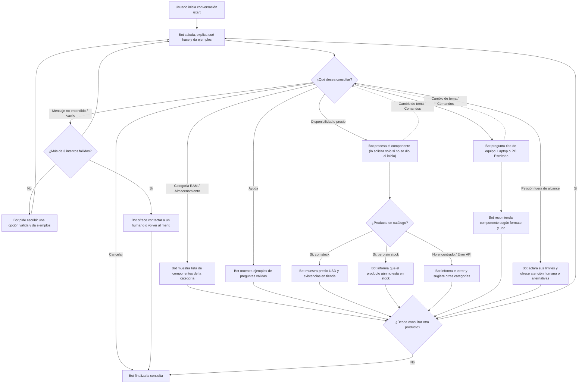

# Diseño conversacional - Tienda SM21008 (Electrónica y Componentes)

## Lista de chequeo

- **¿Quién usará el chatbot?** Clientes interesados en adquirir componentes de electrónica, memorias RAM, unidades de almacenamiento (SSD/HDD) y consultar disponibilidad de productos en la Tienda SM21008.
- **¿Qué problema resuelve?** Permite conocer de forma inmediata el precio y stock disponible de componentes sin esperar atención humana, e informa de manera clara sobre artículos que aún no están en stock.
- **¿Qué necesidades específicas tienen?** Verificar compatibilidad rápida (capacidad/tipo), consultar precios, confirmar existencias actuales y saber si ciertos productos aún no han ingresado al inventario.
- **¿Qué preguntas se pueden hacer?** “¿Tienen memorias RAM DDR4 de 16GB?”, “¿Cuánto cuesta un SSD Kingston de 1TB?”, “¿Tienen almacenamiento para laptop?” y “¿Tienen tarjetas de video disponibles?”.
- **¿Qué tipo de respuesta espero en cada caso?** Texto para descripción y compatibilidad; números para precio ($ USD) y unidades en stock; listas de selección para elegir entre categorías (RAM, Almacenamiento, etc.).
- **Edad, ocupación, intereses y experiencia con tecnología:** Personas de 16 años en adelante, estudiantes, técnicos, entusiastas del ensamble de PC y público general. El nivel tecnológico varía, por lo que el lenguaje debe ser claro y directo.
- **Escenarios alternativos:** Producto agotado, producto no encontrado (se sugieren alternativas de categorías), mensaje no entendido o entrada vacía, usuario cambia de tema en medio de una consulta, peticiones fuera del alcance (ej. descuentos), caída de la API, y un máximo de 3 intentos incorrectos antes de derivar a atención humana.
- **UI y accesibilidad:** Mensajes breves, opciones numeradas o claras, precios expresados en dólares ($ USD), estados de stock visibles, y recordatorios del uso de comandos globales (`ayuda`, `volver`, `cancelar`) durante la conversación.
- **¿Cómo validar el prototipo?** Probar el diálogo simulando consultas de precio, stock de memorias RAM, unidades de almacenamiento y verificación de artículos sin stock.
- **Pruebas de usabilidad y desempeño:** Evaluar que el usuario identifique rápidamente si un componente está en existencia y comprenda cuando un producto aún no está disponible.
- **Privacidad:** No se solicitarán ni almacenarán datos personales durante la consulta del catálogo de Tienda SM21008.

## Inventario de intenciones

| Intención | Ejemplo de enunciado | Frecuencia | Prioridad | Dato / API |
|---|---|---:|---:|---|
| Consultar disponibilidad | “¿Tienen memoria RAM DDR4 de 16GB?” | Alta | 1 | API de catálogo: nombre del componente y stock. |
| Consultar precio | “¿Cuánto cuesta un SSD NVMe de 1TB?” | Alta | 1 | API de catálogo: precio del producto en USD. |
| Buscar por categoría | “Quiero ver opciones de almacenamiento” | Alta | 1 | API de catálogo: componentes por categoría (RAM / SSD / HDD). |
| Consultar sin stock | “¿Tienen tarjetas gráficas o fuentes de poder?” | Media | 2 | API de catálogo: estado de producto / alerta "Aún no en stock". |
| Pedir recomendación | “Necesito almacenamiento rápido para mi laptop” | Media | 2 | Catálogo: sugerencia según formato (M.2 / SATA / SODIMM). |
| Pedir ayuda | “Ayuda” o “/start” | Media | 2 | Mensaje estático: lista de opciones y ejemplos. |
| Cancelar consulta | “Cancelar” | Baja | 2 | Mensaje estático: cierre de la interacción actual. |

## Diagrama de flujo de la conversación


## Diálogo de muestra - camino feliz

**Usuario:** /start

**Bot:** Hola, soy el asistente de Tienda SM21008. Puedo ayudarte a consultar precios, existencias y componentes de RAM o almacenamiento. Escribe 'ayuda' si quieres ver ejemplos. ¿Qué necesitas consultar hoy?

**Usuario:** ¿Tienen memoria RAM DDR4 de 16GB?

**Bot:** ¡Claro! Buscando "memoria RAM DDR4 16GB"...
Tenemos en stock la marca Kingston Fury Beast a $45.00 USD (5 unidades disponibles en tienda). *(Recuerda que puedes escribir 'ayuda', 'volver' o 'cancelar' en cualquier momento).* ¿Deseas consultar otro producto?

**Usuario:** No, gracias.

**Bot:** Consulta finalizada. Escribe /start cuando quieras buscar otro componente. ¡Feliz día!

## Cambios realizados tras la revisión de la pareja B

- **Cambio 1 (Observación 1 y Guion 1):** Se modificó el saludo inicial en el diagrama y se plasmó en el diálogo de muestra para explicar claramente las funciones y ofrecer ejemplos.
- **Cambio 2 (Observación 2):** Se añadió el "Diálogo de muestra - camino feliz" completo, aplicando respuestas directas (cantidad, relación y manera).
- **Cambio 3 (Observación 3):** Se ajustó el diagrama de flujo y el diálogo para que el bot reutilice el dato del componente si el usuario lo brinda desde el inicio, evitando pedir datos repetidos.
- **Cambio 4 (Observación 4 y Guion 2):** Se añadieron ramas al diagrama y a la lista de chequeo para manejar entradas vacías, peticiones fuera de alcance, errores de API y un máximo de 3 intentos fallidos antes de ofrecer soporte humano.
- **Cambio 5 (Observación 5):** Se agregaron líneas punteadas en el flujo para comandos globales (ayuda, volver, cancelar) en cualquier momento, y se incluyó un mensaje de cierre claro indicando el uso de /start.

---

**Veredicto final, pareja B**

1. **¿El mensaje de bienvenida explica en una o dos frases qué hace el bot y qué no? ¿El usuario sabe qué más puede pedir?**

   **Calificación: Parcial.** Si se entiende que el bot va a saludar y mostrar opciones, porque así aparece en el diagrama. También está la opción de ayuda. Pero no se ve cuál sería el mensaje de bienvenida como tal, entonces no sabemos si el usuario entendería de una vez qué puede preguntar. Yo agregaría algo sencillo como un: “Hola, puedo ayudarte a consultar precios, existencias y componentes de RAM o almacenamiento. Escribe ayuda si quieres ver ejemplos”.

2. **¿Los mensajes del bot cumplen con cantidad, relación y manera?**

   **Calificación: No resuelto.** Aquí realmente es difícil evaluarlo porque falta el diálogo de muestra del camino feliz. Aunque el diagrama da una idea de lo que hará el bot, pero no muestra cómo respondería en una conversación real. Entonces, sería bueno agregar un ejemplo completo, por ejemplo alguien preguntando por una RAM y el bot respondiendo paso a paso. Así se puede ver si los mensajes son claros, cortos y si van de acuerdo con lo que el usuario pregunta.

3. **¿El bot promete solo información que puede verificar? ¿Evita pedir datos repetidos?**

   **Calificación: Parcial.** Está bien que el diseño mencione una API de catálogo para consultar precios y existencias, porque así el bot no estaría inventando información. Lo que se podría mejorar es que, si alguien escribe desde el inicio “¿Tienen RAM DDR4 de 16 GB?”, el bot no debería volver a preguntar qué componente busca. Sería mejor que use esa información de una vez y solo pregunte si realmente falta algún dato.

4. **¿El diagrama maneja las cuatro situaciones de fricción y ofrece una reparación clara?**

   **Calificación: Parcial.** El diseño sí cubre algunas cosas importantes, como cuando no se entiende el mensaje, cuando no se encuentra un producto o cuando no hay existencias. Pero faltan casos como cuando el usuario escribe algo vacío, cambia de tema mientras está haciendo una consulta o cuando la API no responde. También faltaría poner qué hace el bot después de varios intentos fallidos. Podrían agregar algo como: “No entendí el componente. Puedes escribir RAM, SSD o ayuda”, y si después de tres intentos sigue sin funcionar, ofrecer atención humana.

5. **¿El usuario puede cancelar, volver atrás o pedir ayuda en cualquier momento? ¿Cada intención termina claramente?**

   **Calificación: Parcial.** El documento sí incluye ayuda y cancelar, y al final de varias consultas pregunta si el usuario desea buscar otro producto. Eso está bien. Pero ayudaría mucho indicar que el usuario puede escribir “ayuda”, “volver” o “cancelar” mientras está en cualquier parte de la conversación, no solo al inicio. También sería bueno terminar con un mensaje más claro, por ejemplo: “Consulta finalizada. Escribe /start cuando quieras buscar otro componente”.


**Notas del Mago de Oz**

**Guion 1 - Camino feliz**

- **Turno 1:** El flujo indica que el bot saluda y muestra opciones, pero no presenta el mensaje exacto de bienvenida. Esto hace difícil saber si el usuario entendería desde el inicio qué puede consultar.
- **Turno 2 y 3:** El flujo permite consultar disponibilidad o precio y pedir el nombre del componente. La consulta puede continuar si el usuario da el dato correcto.
- **Turno 4:** Después de mostrar el resultado, el diagrama pregunta si el usuario desea consultar otro producto. Sin embargo, al elegir “No”, solo indica que el bot finaliza la consulta; falta un mensaje de despedida claro.

**Guion 2 - Camino con fricción**

- **Turno 1 - Entrada vacía o sin sentido:** El diseño contempla “Mensaje no entendido”, pero solo pide escribir una opción válida y vuelve al inicio. Falta dar un ejemplo concreto o una lista de opciones para ayudar al usuario.
- **Turno 2 - Producto mal escrito o inexistente:** El flujo llega a “Producto no encontrado”, lo cual está bien. Sin embargo, después no ofrece una alternativa como sugerir otro producto, mostrar categorías o pedir que se corrija la búsqueda.
- **Turno 3 - Cambio de tema:** Aquí el flujo se traba si el usuario cambia de tema mientras el bot está esperando el nombre de un componente. El diagrama no muestra una rama para abandonar la consulta actual e iniciar otra intención.
- **Turno 4 - Petición fuera de alcance:** El diseño no tiene una respuesta específica para una consulta fuera de alcance, como pedir un descuento o hablar con una persona. Falta explicar que el bot no puede realizar esa acción y ofrecer ayuda o derivación a atención humana.
```
