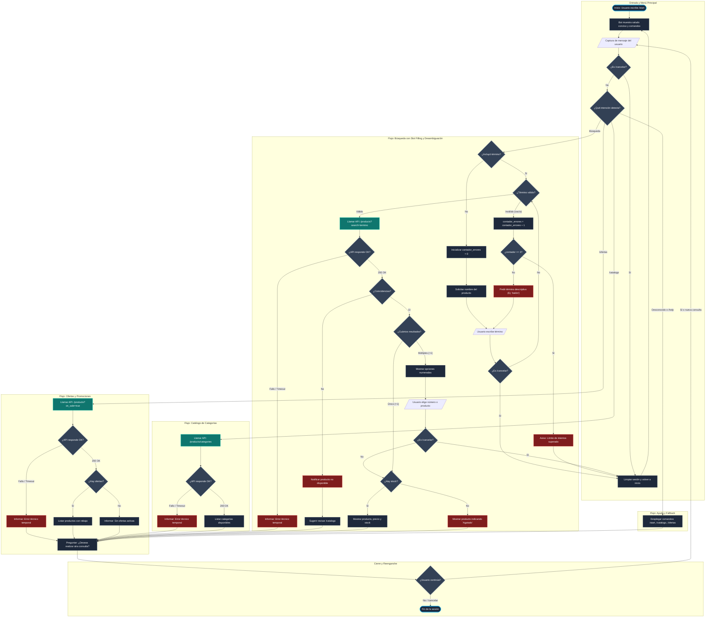

# Diseño Conversacional: Bot de Comercio Electrónico CET115

**Estudiante:** Carnet GT22004
**Asignatura:** Comercio Electrónico (CET115 - Ciclo II / 2026) 
**Docente:** Ing. William Ernesto Vides Ortez 
**Entregable:** Guía 5 - Diseño y puesta en marcha del bot 

---

## 1. Lista de Chequeo de Diseño Conversacional

* **¿Quién usará el chatbot?:** Clientes, deportistas y personas interesadas en el entrenamiento físico que buscan consultar disponibilidad de existencias, características y promociones en la tienda deportiva digital de forma ágil desde Telegram.
* **¿Qué problema o problemas resuelve?:** Automatiza la atención de primer contacto resolviendo dudas recurrentes sobre precios, stock inmediato y descuentos vigentes sin necesidad de navegar manualmente el sitio web.
* **¿Qué necesidades específicas tienen?:** Buscar artículos específicos por nombre, listar promociones activas con `/ofertas`, consultar las divisiones de la tienda con `/catalogo` y obtener enlaces directos a la ficha del producto.
* **¿Qué preguntas se pueden hacer?:**
  * "¿Tienen guantes de boxeo?"
  * "¿Cuáles son las ofertas de hoy?"
  * "¿Qué precio tienen las zapatillas running?"
  * "¿Qué categorías deportivas manejan?"
  * "¿Cómo cancelo una consulta?"
* **¿Qué tipo de respuesta espero en cada caso?:**
  * *Consulta de artículo único:* Ficha estructurada con nombre, categoría, precio en USD, estado de existencias (unidades disponibles / agotado) y enlace web directo.
  * *Múltiples coincidencias:* Lista numerada con los artículos encontrados para que el usuario elija cuál consultar en detalle.
  * *Consulta de promociones (`/ofertas`):* Listado de productos en descuento con precio regular tachado, precio rebajado y enlace de compra.
  * *Consulta de catálogo (`/catalogo`):* Lista de categorías principales de la tienda deportiva.
  * *Navegación / Escape:* Respuestas directas a comandos estándar (`/start`, `/catalogo`, `/ofertas`, `/cancelar`).
* **¿Cuál es su edad, ocupación, intereses, nivel de experiencia con tecnología?:** Usuarios de 16 a 50 años, estudiantes, deportistas o entusiastas del acondicionamiento físico, familiarizados con apps de mensajería instantánea.
* **¿Cuáles son los escenarios alternativos y manejo de fricción?:**
  * *Sin promociones vigentes:* El bot notifica la ausencia de descuentos activos y sugiere explorar el catálogo general.
  * *Sin coincidencias:* Notifica que no hay existencias del término buscado y sugiere revisar las categorías disponibles.
  * *Falla técnica / Timeout de API:* Presenta un mensaje comprensible ("No fue posible conectar con el catálogo en este momento") y permite reintentar sin romper el flujo.
  * *Bucle de entrada inválida:* Se establece un límite de 3 intentos para términos no válidos; superado el límite, se cancela la búsqueda y se regresa al menú principal.
  * *Interrupción global:* El usuario puede escribir `/cancelar` en cualquier momento para reiniciar el estado de la conversación y regresar al inicio.
* **¿UI, Accesibilidad?:** Mensajes concisos orientados a pantallas móviles, uso de viñetas, saltos de línea legibles y enlaces limpios sin sobrecargar la interfaz.
* **¿Cómo haré para validar mi prototipo?:** Simulación de turnos con técnica de Mago de Oz, evaluación cruzada entre pares y contrastación contra las heurísticas de cooperación de Grice.
* **¿Privacidad?:** Únicamente se gestiona el ID de chat de Telegram para mantener la sesión y los términos de búsqueda en memoria volátil; no se recolectan contraseñas, datos personales ni métodos de pago.

---

## 2. Inventario de Intenciones

| Intención | Enunciados de ejemplo | Frecuencia | Prioridad | Manejo de Datos / API |
| :--- | :--- | :--- | :--- | :--- |
| `saludo_inicio` | `/start`, `hola`, `buenos días` | Alta | 1 | Ninguno |
| `consultar_catalogo` | `/catalogo`, `ver catálogo`, `¿qué departamentos tienen?` | Alta | 1 | API WooCommerce: `/products/categories` |
| `consultar_ofertas` | `/ofertas`, `descuentos de hoy`, `promociones deportivas` | Alta | 1 | API WooCommerce: `/products?on_sale=true` |
| `buscar_producto` | `precio de guantes de boxeo`, `¿tienen balones?`, `zapatillas running` | Alta | 1 | Slot filling (`término`) $\rightarrow$ API WooCommerce: `/products?search=...` |
| `cancelar_accion` | `/cancelar`, `salir`, `olvídalo` | Media | 1 | Interrupción global (reseteo de estado) |
| `ayuda_menu` | `/help`, `ayuda`, `¿qué comandos hay?` | Baja | 2 | Ninguno |

---

## 3. Diálogo de Muestra (Camino Feliz y Desambiguación)

**Usuario:** `/start`

**Bot:** ¡Hola! 👋 Soy tu asistente en la tienda deportiva. Escribe el nombre de un producto, o usa `/ofertas` para descuentos y `/catalogo` para ver categorías.

**Usuario:** `/ofertas`

**Bot:** 🔥 **Promociones Deportivas Actuales:**

1. **Zapatillas Running Speed Pro**
   * **Categoría:** Calzado
   * **Precio de oferta:** $59.99 USD *(Antes: $85.00 USD)*
   * **Disponibilidad:** En existencia
   * **Enlace:** `https://gt22004.duckdns.org/producto/zapatillas-running-speed-pro`

2. **Set de Mancuernas Neopreno 15 lb**
   * **Categoría:** Fitness y Fuerza
   * **Precio de oferta:** $28.50 USD *(Antes: $35.00 USD)*
   * **Disponibilidad:** En existencia
   * **Enlace:** `https://gt22004.duckdns.org/producto/set-mancuernas-15lb`

¿Deseas consultar detalles de algún producto o escribir `/catalogo` para revisar departamentos?

**Usuario:** ¿Tienen guantes?

**Bot:** Encontré más de un artículo para tu búsqueda. ¿Cuál de ellos deseas consultar?
1. Guantes de Boxeo Pro 14 oz ($34.99 USD)
2. Guantes de Ciclismo Gel Antideslizante ($18.00 USD)
3. Guantes para Gimnasio con Muñequera ($14.50 USD)

Escribe el número de la opción o el nombre exacto (o `/cancelar` para salir).

**Usuario:** 1

**Bot:** Sí, tenemos disponible el artículo.
* **Producto:** Guantes de Boxeo Pro 14 oz
* **Categoría:** Boxeo y Artes Marciales
* **Precio:** $34.99 USD
* **Disponibilidad:** En existencia (12 unidades)
* **Enlace directo:** `https://gt22004.duckdns.org/producto/guantes-boxeo-pro`

¿Deseas buscar otro artículo o consultar alguna otra sección?

**Usuario:** No, eso sería todo, gracias.

**Bot:** Con gusto. Si necesitas consultar algo más adelante, escribe `/start`, `/catalogo` o `/ofertas`. ¡Mucho éxito en tu entrenamiento!

---

## 4. Diagrama de Flujo Conversacional

---
# Observaciones - MC21105 - David Alexander Méndez Cuéllar

## 1. Resultado Mago de Oz

| Entrada del Usuario | Intención Real / Contexto | Motivo del Fallo en el Diseño |
| :--- | :--- | :--- |
| `guantes` | Búsqueda general de producto | El flujo original asume que la API siempre devuelve un único producto exacto o nada; no contempla la presentación estructurada cuando existen múltiples coincidencias para que el usuario elija. |
| `.` | Entrada vacía o carácter huérfano | El bucle de reintento en validación de texto carece de salida por escape o límite de intentos, atrapando al usuario si insiste con entradas cortas o inválidas. |
| `error 500 / caída de red` | Fallo de conexión con la API de WooCommerce/DuckDNS | El diseño asume respuestas siempre exitosas (200 OK) y no define un nodo de error de infraestructura que informe al usuario y permita reintentar. |

---

## 2. Respuesta de las 5 preguntas

### 1. Alcance y descubribilidad
* **Veredicto:** Resuelto.
* **Evidencia:** El mensaje de bienvenida delimita con claridad el alcance de la tienda deportiva (búsqueda de productos, catálogo y promociones), permitiendo entender la función principal desde el inicio.
* **Mejora:** Incluir en el saludo inicial todos los comandos de control declarados en el inventario (`/catalogo`, `/ofertas`, `/help`, `/cancelar`) para evitar que el usuario deba adivinarlos.

### 2. Grice en el guion — cantidad, relación, manera
* **Veredicto:** Parcial.
* **Evidencia:** La ficha de producto individual cumple con los datos requeridos (nombre, categoría, precio, stock y enlace), pero ante términos genéricos que arrojan varios resultados no se definió cómo dosificar la información sin saturar la pantalla.
* **Mejora:** Implementar un turno breve de desambiguación cuando existan múltiples coincidencias: listar de 3 a 5 artículos numerados con nombre, precio y enlace directo para que el usuario decida el siguiente paso.

### 3. Grice — calidad, y relleno de datos
* **Veredicto:** Parcial.
* **Evidencia:** Los enlaces directos y la consulta de stock apuntan correctamente a la tienda en DuckDNS, pero el flujo no prevé la contingencia de fallos técnicos o caídas de conectividad con la API.
* **Mejora:** Agregar una rama de contingencia técnica que informe con veracidad: *«Tuvimos un problema temporal de conexión con el catálogo. Por favor, intenta de nuevo en unos momentos.»*

### 4. Manejo de errores
* **Veredicto:** Parcial.
* **Evidencia:** El diseño contempla el caso de producto no encontrado sugiriendo categorías, pero carece de un fallback estándar para mensajes fuera de dominio y mantiene un bucle rígido ante términos de búsqueda vacíos.
* **Mejora:** Crear un nodo global de fallback que capture mensajes no reconocidos sugiriendo comandos activos, y habilitar la intercepción de `/cancelar` dentro de la solicitud de reintento de texto.

### 5. Reglas de producto
* **Veredicto:** Parcial.
* **Evidencia:** Se definen intenciones para `/cancelar` y `/help`, pero el diagrama solo permitía cancelar en fases finales o en la entrada de búsqueda, dejando el comando inerte si el usuario deseaba interrumpir otra sección. Además, en el cierre faltaba el nodo explícito para capturar la decisión del usuario.
* **Mejora:** Estandarizar la intercepción global de `/cancelar` y `/help` en cualquier punto de la conversación, e insertar el nodo de entrada de usuario previo a la evaluación de cierre (`¿Continuar? Sí / No`).

