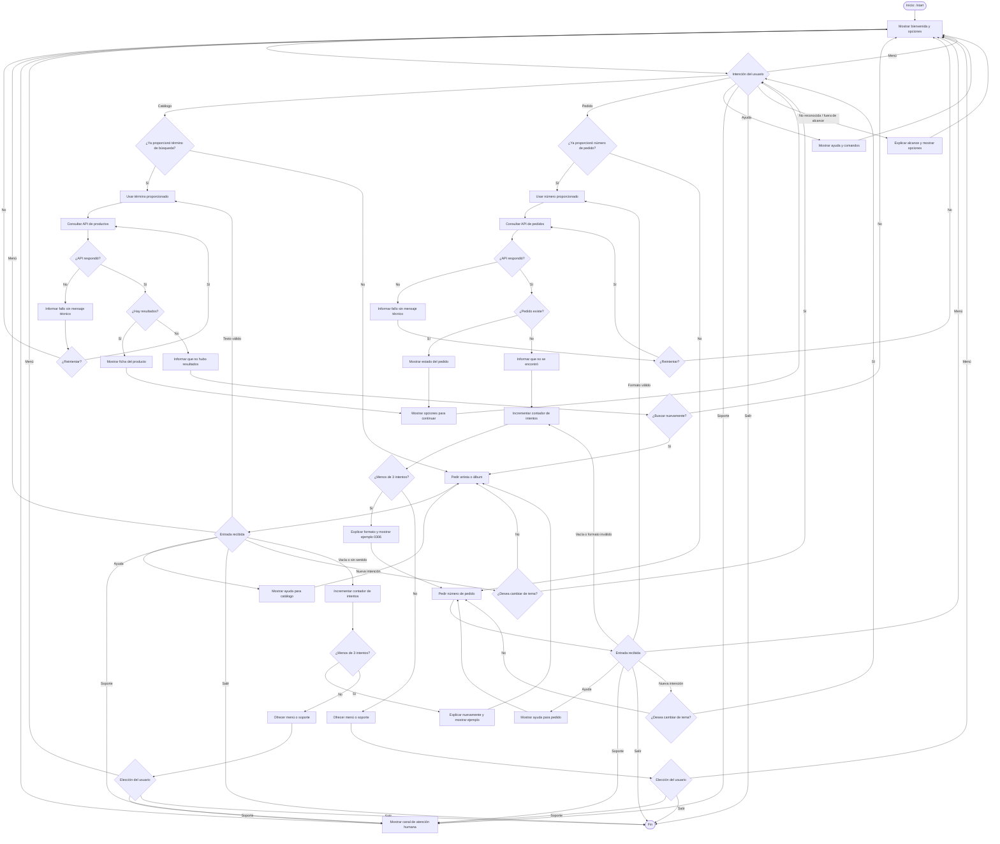

# Diseño Conversacional - MusicHub Bot

## 1. Lista de Chequeo de Diseño Conversacional

### ¿Quién usará el chatbot?: 
El chatbot será utilizado principalmente por clientes de la tienda en línea MusicHub y personas interesadas en música que buscan información rápida sobre discos, vinilos o el estado de sus pedidos.

El usuario no necesita conocimientos técnicos para utilizar el bot.

---

### ¿Qué problema o problemas resuelve?: 
MusicHub Bot automatiza consultas frecuentes relacionadas con el catálogo de productos y el estado de pedidos, reduciendo el tiempo de espera del usuario y facilitando el acceso a la información de la tienda.

El bot funcionará como una primera línea de atención para consultas sencillas.

Puede ayudar principalmente a:

- Buscar discos y vinilos en el catálogo.
- Mostrar información básica de un producto.
- Consultar el estado de un pedido.
- Orientar al usuario cuando no sabe cómo continuar.
- Indicar un canal de atención humana cuando la consulta se encuentra fuera de su alcance.

El bot no realizará pagos, descuentos, modificaciones ni cancelaciones de pedidos.

---

### ¿Qué necesidades específicas tienen?: 
Los usuarios necesitan principalmente:

- Saber si un artista o álbum se encuentra disponible.
- Consultar información de un producto, como artista, álbum, año, formato y precio.
- Conocer el estado actual de un pedido.
- Recibir orientación cuando no saben cómo utilizar el bot.
- Poder corregir una entrada incorrecta sin reiniciar completamente la conversación.
- Cambiar de consulta cuando sea necesario.
- Volver al menú principal.
- Pedir ayuda.
- Finalizar la interacción.
- Saber cómo contactar con una persona cuando el bot no puede resolver su consulta.

---

### ¿Qué preguntas se pueden hacer?: 
- "¿Tienen discos de Daft Punk?"
- "Busco Random Access Memories."
- "¿Cuánto cuesta el álbum?"
- "Quiero buscar un vinilo."
- "¿Qué pasó con mi pedido?"
- "¿Dónde está mi pedido 0306?"
- "Quiero revisar mi pedido."
- "¿Qué puedes hacer?"
- "Necesito ayuda."
- "Quiero hablar con una persona."

Aunque se podrán utilizar los siguientes comandos:

- `/start` - Iniciar la interacción.
- `/catalogo` - Buscar discos o vinilos.
- `/pedido` - Consultar el estado de un pedido.
- `/ayuda` - Mostrar las funciones disponibles.
- `/menu` - Volver al menú principal.
- `/soporte` - Mostrar las opciones de atención humana.
- `/salir` - Finalizar la interacción.

---

### ¿Qué tipo de respuesta espero en cada caso?: 
#### Consulta de catálogo

El bot mostrará una ficha de producto en texto con los datos disponibles:

- Artista.
- Álbum.
- Año.
- Formato.
- Precio.

Ejemplo:

> **Random Access Memories**  
> Artista: Daft Punk  
> Año: 2013  
> Formato: Vinilo  
> Precio: $35.00

---

#### Consulta de pedido

El bot devolverá una respuesta breve indicando el número del pedido y su estado actual.

Ejemplo:

> Tu pedido #0306 está actualmente **Procesando** 📦.

El bot únicamente mostrará información que pueda verificar mediante el servicio correspondiente.

No prometerá enviar notificaciones futuras ni proporcionar información que no esté disponible mediante la API.

---

#### Ayuda

El bot mostrará una lista breve con las acciones y comandos disponibles.

Ejemplo:

> Puedo ayudarte a buscar productos o consultar el estado de un pedido.
>
> `/catalogo` - Buscar discos y vinilos  
> `/pedido` - Consultar un pedido  
> `/menu` - Volver al menú  
> `/soporte` - Atención humana  
> `/salir` - Terminar

---

#### Atención humana

Cuando el bot no pueda resolver una solicitud, mostrará el canal de atención humana configurado por la tienda.

Ejemplo:

> Esta consulta necesita atención de una persona.
>
> Puedes utilizar el canal de atención de MusicHub para recibir ayuda.
>
> También puedes escribir `/menu` para volver al menú principal.

El bot no indicará que está transfiriendo automáticamente la conversación a un agente si técnicamente no existe esa integración.

La derivación consiste en proporcionar al usuario el canal de contacto humano definido por la tienda, que puede ser un link, correo, teléfono u otro medio disponible.

---

### Perfil de usuario 
- **Edad:** aproximadamente entre 18 y 55 años.
- **Ocupación:** no se limita a una ocupación específica; puede incluir estudiantes, trabajadores y compradores habituales por Internet.
- **Intereses:** música, artistas, álbumes, coleccionismo de formatos físicos y compras en línea.
- **Nivel tecnológico:** básico o intermedio en el uso de aplicaciones de mensajería y comercio electrónico.

El usuario no necesita memorizar instrucciones complejas ni conocer términos técnicos.

---

### ¿Cuáles son los escenarios alternativos?: 
Se contemplan los siguientes casos:

1. El producto buscado no existe.
2. El número de pedido no existe.
3. El número de pedido tiene un formato incorrecto.
4. El usuario envía una entrada vacía o sin sentido.
5. La API no responde o presenta un fallo.
6. El usuario cambia de tema mientras el bot espera un dato.
7. El usuario solicita algo fuera del alcance del bot.
8. El usuario solicita ayuda durante una operación.
9. El usuario desea regresar al menú.
10. El usuario desea finalizar la conversación.
11. El usuario introduce varias veces un dato incorrecto.
12. El usuario solicita hablar con una persona.

Para evitar ciclos infinitos, los errores de entrada tendrán un máximo de tres intentos.

Se sigué este orden:

- **Primer intento:** indicar nuevamente qué dato se necesita.
- **Segundo intento:** repetir la indicación incluyendo un ejemplo.
- **Tercer intento:** dejar de solicitar el mismo dato y ofrecer `/menu` o `/soporte`.

---

### Cambio de tema durante una conversación

Si el usuario cambia claramente de intención mientras el bot espera un dato, el bot confirmará si desea abandonar la operación actual.

Ejemplo:

**Bot:** Escribe el nombre del artista o álbum que buscas.

**Usuario:** Mejor quiero revisar mi pedido.

**Bot:** ¿Quieres cancelar la búsqueda del catálogo y consultar un pedido?

**Usuario:** Sí.

**Bot:** De acuerdo. Escribe el número de tu pedido. Debe contener 4 dígitos.

Si el usuario no confirma el cambio, continuará en la operación anterior.

---

### Reutilización de información proporcionada

Si el usuario proporciona desde el inicio el dato necesario para completar una intención, el bot no deberá solicitarlo nuevamente.

Ejemplo:

**Usuario:** Quiero revisar mi pedido 0306.

El bot puede identificar el número `0306` y realizar directamente la consulta.

No sería necesario preguntar nuevamente:

> ¿Cuál es el número de tu pedido?

De la misma forma:

**Usuario:** Quiero buscar discos de Daft Punk.

El bot podrá utilizar directamente `Daft Punk` como término de búsqueda.

---

### UI, Accesibilidad: 
Para facilitar la interacción:

- Los mensajes serán breves y estarán estructurados por líneas.
- Se utilizará lenguaje sencillo y sin términos técnicos.
- Se realizará una pregunta principal por mensaje.
- Los emojis se utilizarán de forma moderada para apoyar visualmente el contenido.
- Los emojis no serán el único medio para comunicar información.
- Los comandos principales estarán visibles en el menú y en la ayuda.
- Los mensajes de error explicarán cómo corregir el problema.
- Se podrán utilizar botones de Telegram cuando una selección tenga opciones conocidas.
- El usuario también podrá utilizar comandos escritos aunque existan botones.
- No se mostrarán errores técnicos internos de las APIs.

---

### ¿Cómo haré para validar mi prototipo?: 
Simulación "Mago de Oz" y validación con las heurísticas de Grice en la revisión por pares.

#### Mago de Oz

Una persona representará al bot y responderá únicamente de acuerdo con el diseño y el diagrama de flujo, sin improvisar.

Se comprobarán situaciones como:

- Camino feliz.
- Entrada vacía o sin sentido.
- Número de pedido incorrecto.
- Producto inexistente.
- Pedido inexistente.
- Cambio de tema.
- Fallo de API.
- Solicitud fuera del alcance.
- Uso de `/ayuda`.
- Uso de `/menu`.
- Uso de `/soporte`.
- Uso de `/salir`.
- Tres intentos incorrectos.

---

#### Heurísticas de Grice

Se analizarán los mensajes considerando:

- **Cantidad:** proporcionar solamente la información necesaria.
- **Calidad:** no afirmar información que el bot no pueda comprobar.
- **Relación:** responder de acuerdo con lo solicitado por el usuario.
- **Manera:** utilizar frases claras, breves y sin jerga técnica.

También se comprobará que:

- Cada intención tenga un cierre claro.
- El usuario pueda pedir ayuda.
- El usuario pueda volver al menú.
- El usuario pueda finalizar la conversación.
- El bot no prometa funciones que no posee.
- El bot no vuelva a pedir información que el usuario ya proporcionó.

---

### Pruebas de usabilidad y desempeño

Durante las pruebas se observará:

- Si el usuario comprende qué puede hacer el bot desde el mensaje inicial.
- Si puede completar una consulta sin recibir instrucciones externas.
- Si comprende los mensajes de error.
- Si puede corregir una entrada inválida.
- Si puede cambiar de tema.
- Si puede volver al menú.
- Si puede solicitar ayuda.
- Si puede solicitar atención humana.
- Si puede finalizar la conversación.
- Si el bot evita ciclos infinitos.
- Si las consultas a las APIs responden en un tiempo razonable.

En caso de fallo de una API, el bot mostrará un mensaje comprensible y permitirá reintentar o volver al menú.

---

### Privacidad: 
El bot solicitará únicamente los datos necesarios para completar las consultas.

#### Para consultar el catálogo

Se utilizará:

- Nombre del artista.
- Nombre del álbum.
- Término de búsqueda.

#### Para consultar un pedido

Se utilizará:

- Número de pedido generado por WooCommerce.

Estos datos se utilizarán únicamente para realizar las consultas correspondientes.

El bot no solicitará:

- Contraseñas.
- Datos bancarios.
- Números de tarjetas.
- Direcciones completas.
- Credenciales de acceso.

Los datos utilizados durante el flujo se mantendrán solamente mientras sean necesarios para completar la interacción.

Al finalizar o reiniciar el flujo, los datos temporales utilizados por el bot deberán descartarse.

El prototipo no contempla almacenar permanentemente los términos de búsqueda ni los números de pedido.

Los registros técnicos utilizados para depuración deberán evitar almacenar información personal innecesaria.

---

## 2. Inventario de Intenciones

| Intención | Ejemplo de enunciado | Frecuencia | Prioridad | Dato / API |
| :--- | :--- | :--- | :--- | :--- |
| Iniciar interacción | `/start`, "Hola" | Alta | 1 | Mensaje estático de bienvenida |
| Consultar catálogo | `/catalogo` , "¿Tienen discos de Daft Punk?" | Alta | 1 | `GET /api/products` |
| Estado de un pedido | `/pedido` , "¿Dónde está mi pedido 0306?" | Alta | 1 | `GET /api/orders/{id}` |
| Solicitar ayuda | `/ayuda`, "¿Qué puedes hacer?" | Media | 2 | Mensaje estático de ayuda |
| Volver al menú | `/menu`, "Quiero volver" | Media | 2 | Reinicio del flujo actual |
| Solicitar soporte humano | `/soporte`, "Quiero hablar con una persona" | Baja | 2 | Información del canal de atención humana |
| Finalizar interacción | `/salir`, "Salir" | Baja | 2 | Finalización del flujo |

### Datos requeridos por intención

| Intención | Dato requerido |
| :--- | :--- |
| Consultar catálogo | Artista, álbum o término de búsqueda |
| Estado de un pedido | Número de pedido de 4 dígitos |
| Solicitar ayuda | Ninguno |
| Volver al menú | Ninguno |
| Solicitar soporte humano | Ninguno |
| Finalizar interacción | Ninguno |

---

## 3. Reglas Generales de Conversación

Las siguientes reglas se aplicarán durante todo el flujo:

1. `/ayuda` debe poder utilizarse mientras el bot espera información.
2. `/menu` cancela el flujo actual y devuelve al usuario al menú principal.
3. `/salir` finaliza la interacción.
4. `/soporte` muestra el canal disponible para recibir atención humana.
5. Si el usuario cambia de intención, el bot debe preguntar si desea abandonar la operación actual.
6. Los datos que el usuario ya proporcionó no deben volver a solicitarse.
7. Los errores de entrada tendrán un máximo de tres intentos.
8. Después del tercer intento se ofrecerá `/menu` o `/soporte`.
9. Los errores internos de las APIs no se mostrarán mediante códigos técnicos.
10. El bot no prometerá funciones que no estén implementadas.
11. Después de resolver una consulta, el usuario podrá realizar otra sin tener que reiniciar el bot.
12. La derivación humana no implica una transferencia automática si dicha funcionalidad no existe; se proporcionará un canal de contacto real.
13. Si una consulta está fuera del alcance del bot, se explicará brevemente qué sí puede hacer y se ofrecerá `/soporte`.

---

## 4. Diálogo de Muestra (Camino Feliz)

La intención principal seleccionada para el camino feliz será **consultar catálogo**.

**Usuario:** Hola.

**Bot:** ¡Hola! Bienvenido al bot de MusicHub 🎵. 

Puedo ayudarte a buscar discos y vinilos en la tienda o consultar el estado de un pedido.

Puedes usar:
`/catalogo` - Buscar discos y vinilos en la tienda
`/pedido` - Revisar el estado de tu compra
`/ayuda` - Ver las opciones disponibles

¿Qué deseas hacer?

**Usuario:** `/catalogo`

**Bot:** ¡Genial! Escribe el nombre del artista o álbum que buscas.

**Usuario:** Daft Punk

**Bot:** Encontré esto en la tienda: \
**Random Access Memories** - Daft Punk (2013) \
Formato: Vinilo \
Precio: $35.00 \
¿Deseas hacer otra consulta?

`/catalogo` - Hacer otra búsqueda  
`/pedido` - Revisar un pedido  
`/menu` - Volver al menú  
`/soporte` - Atención humana  
`/salir` - Terminar

**Usuario:** `/salir`

**Bot:** ¡Que disfrutes la música! 🎵  
Escribe `/start` cuando quieras volver.

---

## 5. Escenarios Alternativos

### 5.1 Entrada vacía o sin sentido

**Usuario:** asdf

**Bot:** No pude entender ese mensaje.

Puedes usar:

`/catalogo` - Buscar un producto  
`/pedido` - Consultar un pedido  
`/ayuda` - Ver las opciones disponibles

---

### 5.2 Número de pedido con formato incorrecto

**Usuario:** 30

**Bot:** El número de pedido no tiene el formato esperado.

Debe contener 4 dígitos. Por ejemplo: `0306`.

Inténtalo nuevamente.

---

### 5.3 Producto no encontrado

**Bot:** No encontré productos relacionados con **"Daft Punk XYZ"**.

Puedes intentar nuevamente utilizando el nombre del artista o del álbum.

También puedes escribir `/menu` para volver al menú principal.

---

### 5.4 Pedido inexistente

**Bot:** No encontré un pedido con el número **0306**.

Revisa el número e inténtalo nuevamente.

---

### 5.5 Fallo de la API

**Bot:** En este momento no puedo consultar la información de la tienda.

Puedes intentarlo nuevamente o escribir `/menu` para regresar al menú principal.

---

### 5.6 Cambio de tema

**Bot:** Escribe el nombre del artista o álbum que buscas.

**Usuario:** Mejor quiero revisar mi pedido.

**Bot:** ¿Quieres cancelar la búsqueda del catálogo y consultar un pedido?

**Usuario:** Sí.

**Bot:** De acuerdo. Escribe el número de tu pedido. Debe contener 4 dígitos.

---

### 5.7 Solicitud fuera del alcance

**Usuario:** ¿Me puedes hacer un descuento?

**Bot:** No puedo aplicar descuentos ni modificar compras.

Puedo ayudarte a buscar productos con `/catalogo` o consultar un pedido con `/pedido`.

Si necesitas atención adicional, puedes utilizar `/soporte`.

---

### 5.8 Tres intentos incorrectos

Después del tercer intento:

**Bot:** Parece que estamos teniendo problemas con ese dato.

Para no hacerte repetir la misma información, puedes:

- Escribir `/menu` para volver al menú principal.
- Escribir `/soporte` para consultar las opciones de atención humana.

---

### 5.9 Solicitud de atención humana

**Usuario:** `/soporte`

**Bot:** Esta consulta puede requerir atención de una persona.

Puedes utilizar el canal de atención humana configurado por MusicHub para recibir ayuda.

También puedes escribir `/menu` para volver al menú principal.

> **Nota de implementación:** el mensaje deberá incluir el canal real definido para la tienda, por ejemplo, un enlace de mensajería, correo electrónico, teléfono u otro medio de contacto disponible.

---

### 5.10 Ayuda durante un flujo

**Bot:** Escribe el número de tu pedido.

**Usuario:** `/ayuda`

**Bot:** Para consultar un pedido necesito su número de 4 dígitos.

Por ejemplo: `0306`.

También puedes utilizar:

`/menu` - Volver al menú principal  
`/soporte` - Atención humana  
`/salir` - Terminar

---
## 6. Diagrama de Flujo

---

## 7. Evaluación Pareja B - MusicHub Bot

### 1. Alcance y descubribilidad

**Veredicto:** Parcial

**Evidencia:** El mensaje inicial explica `/catalogo` y `/pedido`, pero no deja claro qué cosas no puede hacer el bot ni menciona `/ayuda` desde el inicio.

**Mejora:** Agregar una bienvenida que incluya las funciones disponibles y el comando de ayuda.

---

### 2. Grice: cantidad, relación y manera

**Veredicto:** Resuelto

**Evidencia:** Los mensajes son breves, claros y relacionados con la consulta anterior.

**Mejora:** Usar siempre el mismo término, por ejemplo “pedido”, en lugar de alternar entre pedido, orden y compra.

---

### 3. Grice: calidad y relleno de datos

**Veredicto:** Parcial

**Evidencia:** El bot dice “Te avisaremos cuando sea enviado”, pero el diseño no incluye un sistema de notificaciones.

**Mejora:** Cambiarlo por: “Puedes volver a consultar el estado de tu pedido con `/pedido`”.

---

### 4. Manejo de errores

**Veredicto:** Parcial

**Evidencia:** El diagrama contempla producto inexistente y pedido inválido, pero no maneja entrada sin sentido, cambio de tema, fallo de API, tres intentos ni derivación a humano.

**Mejora:** Agregar esas ramas al diagrama y permitir reintentar antes de ofrecer ayuda humana.

---

### 5. Reglas de producto

**Veredicto:** Parcial

**Evidencia:** Existen `/ayuda` y `/salir`, pero no aparecen claramente disponibles durante todos los pasos del flujo.

**Mejora:** Permitir `/ayuda`, `/salir` y volver al menú principal desde cualquier punto.

---

## 8. Cambios Realizados a partir de la Retroalimentación

| Cambio aplicado | Origen de la observación |
| :--- | :--- |
| Se amplió el mensaje inicial para mostrar las principales funciones del bot e incluir `/ayuda`. | Evaluación Pareja B - Pregunta 1 |
| Se utilizó de manera consistente el término **pedido**, evitando alternarlo con "orden" o "compra". | Evaluación Pareja B - Pregunta 2 |
| Se eliminó la frase "Te avisaremos cuando sea enviado", debido a que no existe un sistema de notificaciones. | Evaluación Pareja B - Pregunta 3 y retroalimentación del ingeniero |
| Se agregaron ramas para entradas vacías o sin sentido. | Evaluación Pareja B - Pregunta 4 y retroalimentación del ingeniero |
| Se agregó el manejo de cambios de tema durante una operación. | Evaluación Pareja B - Pregunta 4 y retroalimentación del ingeniero |
| Se agregó una rama para fallos de las APIs con opción de reintentar o regresar al menú. | Evaluación Pareja B - Pregunta 4 y retroalimentación del ingeniero |
| Se estableció un máximo de tres intentos para evitar ciclos infinitos al ingresar datos incorrectos. | Evaluación Pareja B - Pregunta 4 y retroalimentación del ingeniero |
| Después de tres intentos incorrectos se ofrecen `/menu` y `/soporte`. | Evaluación Pareja B - Pregunta 4 y retroalimentación del ingeniero |
| Se incorporó `/soporte` como intención explícita para representar la derivación a atención humana. | Evaluación Pareja B - Pregunta 4 y requisito de derivación |
| Se aclaró que la derivación humana consiste en mostrar un canal real de contacto y no en fingir una transferencia automática. | Ajuste para mantener coherencia entre el diseño y la implementación |
| Se hicieron accesibles `/ayuda`, `/menu`, `/soporte` y `/salir` durante los principales puntos de entrada de datos. | Evaluación Pareja B - Pregunta 5 y retroalimentación del ingeniero |
| El menú mostrado después de resolver una consulta vuelve al nodo de selección en lugar de finalizar inmediatamente la conversación. | Retroalimentación del ingeniero |
| Una búsqueda sin resultados permite volver a intentar la búsqueda. | Retroalimentación del ingeniero |
| Se amplió la lista de chequeo incluyendo ocupación, método de validación, pruebas de usabilidad y desempeño y una política de retención de datos más concreta. | Retroalimentación del ingeniero |
| Se agregó la reutilización de datos cuando el usuario ya proporciona el término de búsqueda o número de pedido en su mensaje inicial. | Criterio de la revisión entre pares |---

