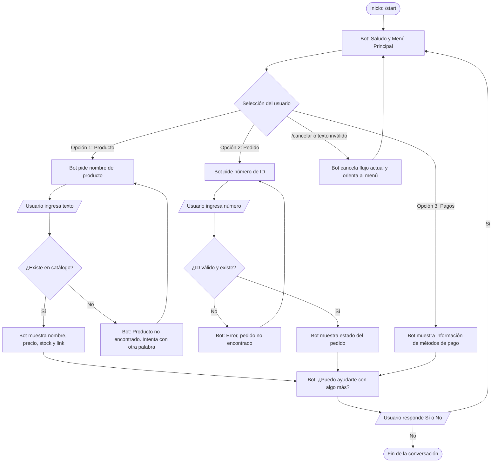

## 1. Investigación del Usuario y Lista de Chequeo

* **¿Quién usará el chatbot?**  
  Clientes de CET STORE: profesionales y/o entusiastas de la tecnología, especialmente interesados en periféricos, componentes y almacenamiento de computadoras.

* **¿Qué problema o problemas resuelve?**  
  Proporcionará atención 24/7 a los clientes ante dudas frecuentes sobre productos (disponibilidad, precio, etc.), consultas sobre sus pedidos (estado) e información sobre formas de pago.

* **¿Qué necesidades específicas tienen?**  
  Conocer disponibilidad de stock en tiempo real, verificar si su orden de compra ya fue procesada/despachada y acceder a enlaces rápidos de compra sin tener que buscar manualmente en la página web.

* **¿Qué preguntas se pueden hacer?**  
  - ¿Cuál es el estado de mi pedido #512?
  - ¿Cuáles son los métodos de pago?
  - ¿Tienen disponible Memorias RAM de 16 GB?

* **¿Qué tipo de respuesta espero en cada caso?**  
  - Para productos: Botones o listas con enlaces directos a la tienda web.
  - Para pedidos: Número entero (ID del pedido).
  - Para pagos: Texto con información clara.

* **¿Cuál es su edad, ocupación, intereses, nivel de experiencia con tecnología?**  
  Entre 18 y 40 años. Nivel tecnológico medio-alto. Valoran respuestas rápidas y directas, sin exceso de formalidades.

* **¿Cuáles son los escenarios alternativos (errores, datos faltantes, cambio de tema)?**  
  - Se ingresa un ID de pedido que no existe.
  - El producto consultado no existe en el catálogo o no hay stock.
  - El usuario abandona o cancela la operación a la mitad.

* **UI, Accesibilidad:**  
  Menú enumerado y botones para que el usuario sepa exactamente qué debe escribir o solicitar sin adivinar comandos.

* **¿Cómo haré para validar mi prototipo?**  
  Técnica de Mago de Oz y evaluación con Heurísticas de Grice (Actividad 4).

* **Privacidad (Recolectar datos: para qué, cuáles y cuándo eliminarlos):**  
  Se recolecta el ID de Telegram y el número de pedido temporalmente para consultar la API. Los datos de sesión se eliminan al finalizar la consulta o al usar el comando de cancelación.

---

## 2. Inventario de Intenciones

| Intención | Ejemplo de enunciado | Frecuencia | Prioridad | Dato / API |
| :--- | :--- | :--- | :--- | :--- |
| **Buscar productos** | "¿Tienen mouse RGB con entrada USB?" | Alta | 1 | Término / API WooCommerce |
| **Consultar Pedidos** | "Estado de mi pedido 2048" | Alta | 1 | ID Pedido (entero) / API WooCommerce |
| **Consultar formas de pago** | "¿Aceptan transferencias bancarias?" | Media | 2 | Ninguno / Texto informativo |
| **Cancelar interacción** | "/cancelar", "salir" | Baja | 3 | Ninguno / Lógica del bot |
| **Solicitar ayuda** | "/ayuda" | Baja | 3 | Ninguno / Lógica del bot |

---

## 3. Diálogo de Muestra (Camino Feliz)

**Usuario:** `/start`  
**Bot:** Hola, bienvenido a CET STORE. Soy CETBOT, ¿cómo te ayudo hoy?  
1. Consultar un producto  
2. Consultar estado de mi pedido  
3. Métodos de pago  

**Usuario:** 1  
**Bot:** ¿Qué producto o componente estás buscando? Escribe el nombre o la categoría y te traeré la información importante.  

**Usuario:** SSD KINGSTON 1TB  
**Bot:** Encontré estos excelentes productos para ti:  
- **SSD KINGSTON 1TB** — $85.00 (15 unidades disponibles)  
Enlace directo: https://tiendapr21064.duckdns.org/producto/ssd-kingston-1tb  

¿Puedo ayudarte con algo más?  

**Usuario:** No  
**Bot:** Gracias por preferir CET STORE. Presiona `/start` cuando necesites ayuda otra vez.

---

## 4. Diagrama de Flujo de la Conversación

---

## 5. Revisión entre pares - Revisado por HB21009.

### 1. Alcance y descubribilidad
* **Veredicto:** Parcial
* **Evidencia:** El mensaje inicial de bienvenida (nodo B) presenta con claridad los servicios soportados (productos, pedidos y pagos). No obstante, no especifica qué tareas quedan fuera de su alcance (como garantías o soporte técnico) ni expone directamente al usuario los comandos globales de escape (`/ayuda` y `/cancelar`).
* **Mejora propuesta:** Reescribir el mensaje de bienvenida para explicitar tanto lo que el bot no gestiona como la existencia de los comandos de ayuda y cancelación desde el primer contacto.

### 2. Grice en el guion — cantidad, relación y manera
* **Veredicto:** Parcial
* **Evidencia:** La respuesta con la ficha técnica del producto (nodo G) entrega datos concretos y relevantes. Sin embargo, en el mensaje donde se solicita el término de búsqueda (nodo D), la redacción es redundante e incumple la máxima de manera al no orientar al usuario sobre el formato o sintaxis esperada.
* **Mejora propuesta:** Modificar la solicitud de búsqueda agregando ejemplos concisos de palabras clave (por ejemplo: *SSD, RAM, Mouse*) y recordando la opción de cancelar la operación.

### 3. Grice — calidad y validación de datos
* **Veredicto:** No resuelto
* **Evidencia:** La consulta de órdenes solo requiere el identificador numérico de la compra, lo cual resulta insuficiente para comprobar la identidad del cliente sobre la API. Además, el flujo no implementa extracción de entidades (*slot filling*): si el usuario escribe de entrada *«Estado de mi pedido 2048»*, el bot ignora el dato y le vuelve a pedir el ID en el paso de captura (nodo J).
* **Mejora propuesta:** Exigir un segundo factor de autenticación (como el correo electrónico vinculado a la orden) e incorporar una regla condicional previa para que, si el identificador ya fue provisto en la consulta inicial, se procese directamente sin volver a solicitarlo.

### 4. Manejo de errores
* **Veredicto:** No resuelto
* **Evidencia:** Cuando la búsqueda de una orden falla en la validación (nodo K), el bot emite un mensaje de error y retorna en bucle infinito a pedir el dato, sin registrar un contador de reintentos máximos ni ofrecer derivación a un canal de soporte humano.
* **Mejora propuesta:** Implementar una compuerta con tope de tres intentos consecutivos; si se supera dicho límite, el bot debe proporcionar los datos de contacto de atención técnica/humana y redirigir al menú inicial.

### 5. Reglas del producto
* **Veredicto:** Parcial
* **Evidencia:** Aunque `/cancelar` existe en el diseño, únicamente se procesa dentro del menú principal. Si el usuario escribe `/cancelar` mientras el bot espera la palabra clave de un producto o el identificador de un pedido (nodos de entrada libre E y J), el sistema lo procesa erróneamente como un término de búsqueda o un ID no válido.
* **Mejora propuesta:** Configurar el comando `/cancelar` como una interrupción global evaluada con prioridad en cualquier paso de captura interactiva, permitiendo al usuario abortar la tarea en cualquier punto.
