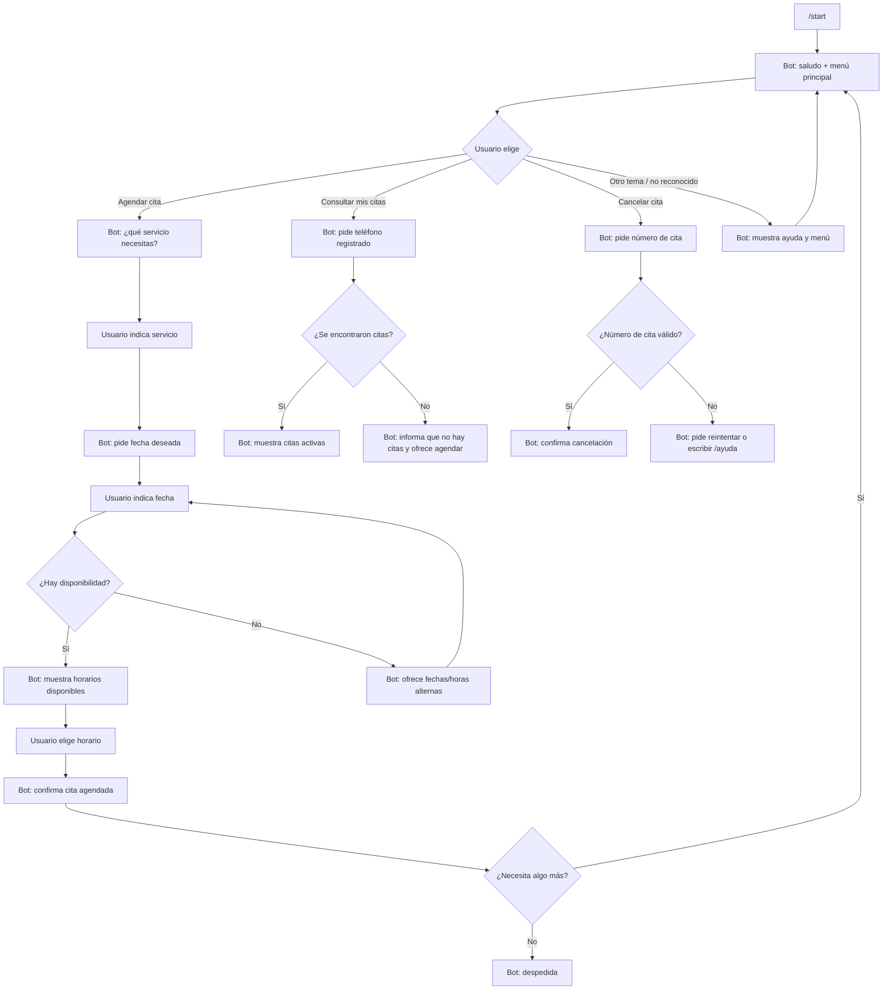

# Documento de diseño conversacional — CitasBot

**Curso:** CET 115 — Comercio Electrónico, ciclo II/2026
**Bot:** Clínica Sonrisa Sana — reservas de citas
**Sesión:** 1 de 2 (Diseño y puesta en marcha)

---

## 1. Lista de chequeo

**¿Quién usará el chatbot?**
Pacientes actuales y nuevos de la clínica dental Sonrisa Sana que quieren agendar, consultar o cancelar una cita sin llamar por teléfono.

**¿Qué problema o problemas resuelve?**
Elimina la espera telefónica para agendar citas, permite consultar disponibilidad y gestionar citas fuera del horario de atención de la recepción, y reduce las inasistencias mediante recordatorios.

**¿Qué necesidades específicas tienen?**
- Agendar una cita rápido, sin llamar.
- Saber qué horarios hay disponibles antes de comprometerse.
- Poder cancelar o reprogramar sin fricción.
- Recibir confirmación clara de la cita (fecha, hora, servicio).

**¿Qué preguntas se pueden hacer?**
Agendar cita, consultar mis citas, cancelar cita, reprogramar cita, consultar servicios y precios, consultar ubicación/horario de atención, hablar con un humano.

**¿Qué tipo de respuesta espero en cada caso?**
- Servicio deseado → selección de lista (limpieza, consulta general, urgencia).
- Fecha deseada → texto/fecha en formato día-mes.
- Horario → selección de lista (entre las opciones disponibles).
- Número de cita (para cancelar/consultar) → número.
- Nombre y teléfono (primera vez) → texto/número.

**¿Cuál es su edad, ocupación, intereses, nivel de experiencia con tecnología?**
Adultos de 18 a 65 años, ocupaciones variadas (estudiantes, empleados, adultos mayores). Se asume nivel tecnológico medio-bajo: preferir botones y comandos cortos sobre lenguaje libre, evitar tecnicismos.

**¿Cuáles son los escenarios alternativos?**
- El usuario pide una fecha sin disponibilidad → el bot ofrece fechas/horas alternas.
- El usuario escribe un número de cita inválido → el bot pide reintentar o escribir /ayuda.
- El usuario cambia de tema a mitad de un flujo (por ejemplo, empieza a agendar y luego pregunta precios) → el bot responde la nueva pregunta y ofrece retomar el flujo anterior.
- El usuario no responde en el formato esperado (texto libre en vez de botón) → el bot reintenta interpretar la respuesta y, si no puede, repite la pregunta con las opciones.
- El usuario quiere cancelar el proceso en cualquier punto → comando /cancelar siempre disponible.

**¿UI, Accesibilidad?**
Uso de teclado de respuesta (botones) de Telegram para reducir errores de tipeo y evitar que el usuario tenga que recordar comandos. Mensajes cortos, sin jerga médica. Todo el flujo funciona también si el usuario solo escribe texto (sin usar botones).

**¿Cómo haré para validar mi prototipo?**
Prueba de Mago de Oz con dos guiones (camino feliz y camino con fricción) en la Actividad 4, seguida de revisión con las heurísticas de Grice. Antes de producción, prueba de usabilidad con 3-5 usuarios reales midiendo tiempo para completar una reserva y tasa de errores.

**Pruebas de usabilidad, desempeño**
Se mide: tiempo para completar el agendamiento de una cita, número de veces que el usuario tuvo que repetir una respuesta, y si el usuario logró cancelar/consultar sin ayuda externa.

**¿Privacidad?**
**Recolectar datos: para qué, cuáles y cuándo eliminarlos**
Se recolecta: nombre, número de teléfono y motivo de consulta, únicamente para gestionar la cita y enviar el recordatorio. No se solicitan datos médicos sensibles dentro del chat. Los datos de contacto se eliminan de la base de citas 90 días después de la fecha de la cita, salvo que el paciente tenga otra cita futura agendada.

---

## 2. Inventario de intenciones

| Intención | Ejemplo de enunciado | Frecuencia | Prioridad | Dato / API |
|---|---|---|---|---|
| Consultar disponibilidad | ¿tienen espacio el jueves? | Alta | 1 | API de agenda |
| Agendar una cita | quiero una cita con el odontólogo | Alta | 1 | API de agenda |
| Consultar mis citas | ¿cuándo es mi próxima cita? | Media | 2 | API de citas (por paciente) |
| Cancelar una cita | quiero cancelar mi cita | Media | 2 | API de citas |
| Reprogramar una cita | necesito cambiar la hora de mi cita | Media | 2 | API de citas |
| Consultar servicios y precios | ¿cuánto cuesta una limpieza? | Baja | 3 | Catálogo de servicios |
| Consultar ubicación y horario | ¿dónde están ubicados? | Baja | 3 | Dato estático |
| Hablar con un humano | quiero hablar con alguien | Baja | 3 | Escalamiento a recepción |

---

## 3. Diagrama de flujo



**Notas del diagrama:**
- El comando `/cancelar` está disponible en cualquier paso del flujo y regresa al usuario al menú principal (B).
- El comando `/ayuda` está disponible en cualquier paso y muestra las opciones sin perder el progreso del flujo actual.
- Cualquier respuesta fuera de formato dispara un reintento con la misma pregunta, no un error genérico.

---

## 4. Diálogo de muestra (camino feliz) — intención principal: Agendar una cita

```
Usuario: Hola
Bot: Hola, soy CitasBot de Clínica Sonrisa Sana. Puedo ayudarte a agendar,
     consultar o cancelar una cita. ¿Qué necesitas?

Usuario: Quiero agendar una cita
Bot: Claro. ¿Qué servicio necesitas: limpieza, consulta general o urgencia?

Usuario: Limpieza
Bot: Perfecto. ¿Qué día te gustaría? (ejemplo: jueves 11 de septiembre)

Usuario: El jueves 11 de septiembre
Bot: Tengo espacio a las 9:00 am y a las 3:00 pm ese día. ¿Cuál prefieres?

Usuario: 3:00 pm
Bot: Confirmado: limpieza dental el jueves 11 de septiembre a las 3:00 pm.
     Te enviaré un recordatorio un día antes. ¿Necesitas algo más?

Usuario: No, gracias
Bot: Perfecto, ¡nos vemos el jueves! Escribe /start cuando quieras agendar
     otra cita.
```

De este guion salen dos datos obligatorios (servicio y fecha), una llamada a la API de agenda para consultar y confirmar disponibilidad, y un cierre que ofrece continuar. Los escenarios alternativos (fecha sin cupo, número de cita inválido, cambio de tema) están representados en el diagrama de flujo de la sección 3, no en este guion.

---

## 5. Revisión entre pares — Actividad 4

### 1. Alcance y descubribilidad

**Veredicto:** Resuelto.

**Evidencia:** La bienvenida explica de forma breve las funciones principales del bot: agendar, consultar y cancelar citas. El diagrama incluye un menú principal y las notas establecen que `/ayuda` permite consultar las opciones en cualquier momento. Estos elementos orientan al usuario para comenzar y descubrir las funciones disponibles.

**Mejora concreta:** Mencionar `/ayuda` desde la bienvenida y hacer visibles las funciones complementarias del inventario, como consultar precios, reprogramar y contactar con recepción.

### 2. Grice: cantidad, relación y manera

**Veredicto:** Resuelto.

**Evidencia:** El diálogo sigue una secuencia comprensible: servicio, fecha, horario y confirmación. Los mensajes son breves, hacen una pregunta a la vez y mantienen relación con las respuestas del usuario. El lenguaje es cotidiano y el cierre resume la cita y ofrece continuar.

**Mejora concreta:** Unificar la indicación del formato de fecha entre la lista de chequeo y el diálogo para que el usuario tenga una referencia consistente.

### 3. Grice: calidad y relleno de datos

**Veredicto:** Parcial.

**Evidencia:** Las funciones principales tienen una fuente de información definida en el inventario, como la API de agenda para consultar disponibilidad y reservar. Falta precisar cómo se enviarán los recordatorios y cómo se aprovecharán los datos que el usuario proporcione desde su primer mensaje. La identificación del paciente se menciona en la lista de chequeo, pero todavía no aparece en el flujo.

**Mejora concreta:** Incorporar un paso que compruebe los datos disponibles y solicite únicamente los faltantes, incluyendo la identificación del paciente cuando corresponda. Definir el mecanismo de recordatorios antes de ofrecerlos en la confirmación.

### 4. Manejo de errores

**Veredicto:** Parcial.

**Evidencia:** El documento contempla situaciones frecuentes: fecha sin disponibilidad, número de cita inválido, respuestas fuera de formato y cambio de tema. También ofrece alternativas de horario, reintentos y ayuda. Algunas de estas respuestas están descritas en la lista de chequeo y las notas, pero necesitan completarse en el diagrama. No se especifica todavía el límite de tres intentos ni el momento de derivar a recepción.

**Mejora concreta:** Completar las ramas de error con una secuencia de ayuda: reformular con un ejemplo, ofrecer botones y, al tercer intento fallido, dar la opción de contactar con recepción. Representar también cómo se retoma el proceso después de un cambio de tema.

### 5. Reglas de producto

**Veredicto:** Parcial.

**Evidencia:** Las notas permiten usar `/cancelar` y `/ayuda` en cualquier paso, y el agendamiento termina con una confirmación clara y una oferta de continuar. Falta incluir la opción de volver al paso anterior y aclarar que la cancelación de una cita requiere la autorización del usuario antes de ejecutarse. Los otros flujos pueden aprovechar el mismo cierre del agendamiento.

**Mejora concreta:** Incorporar `/volver`, conectar todas las intenciones con “¿Necesitas algo más?” y agregar una confirmación previa a la cancelación:

> ¿Deseas cancelar tu cita del [fecha] a las [hora]?
>
> [Sí, cancelar cita] [No, conservar cita]

### Cambios que deben incorporarse al diseño

1. Mencionar `/ayuda` en la bienvenida y mostrar las funciones complementarias. **Origen:** mejora propuesta en la pregunta 1.
2. Aprovechar los datos proporcionados por el usuario y solicitar únicamente los faltantes. **Origen:** observación de la pregunta 3.
3. Completar las ramas de recuperación con ayuda progresiva, límite de tres intentos y contacto con recepción. **Origen:** observación de la pregunta 4.
4. Agregar `/volver`, confirmación previa a la cancelación y una oferta de continuar en todos los cierres. **Origen:** observación de la pregunta 5.
