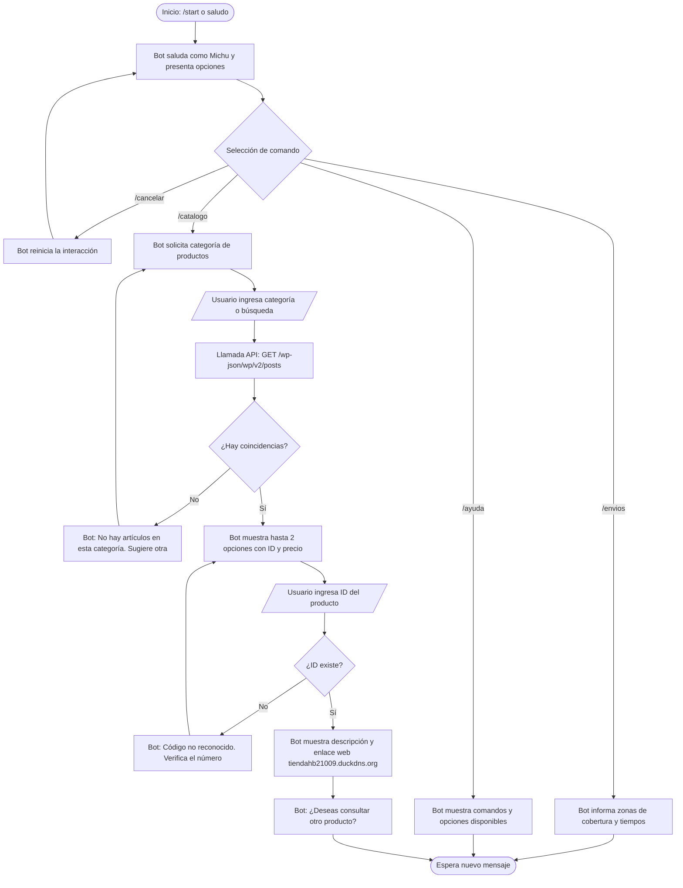

#  Diseño Conversacional - Michu Bot

Documento de diseño para el asistente virtual en Telegram, correspondiente a la **Sesión 1 del Laboratorio 5** (CET115 - 2026).

---

## 1. Investigación del Usuario y Lista de Chequeo

### ¿Quién usará el chatbot?
Clientes y dueños de mascotas, principalmente entre 18 y 45 años, interesados en adquirir alimentos, accesorios y juguetes para gatos en El Salvador.

### ¿Qué problema o problemas resuelve?
El chatbot reduce los tiempos de espera al facilitar consultas frecuentes sobre productos y servicios de la tienda. Permite consultar el catálogo, precios, disponibilidad referencial y detalles de los artículos directamente desde Telegram, evitando que el usuario tenga que ingresar inicialmente al navegador web. Facilita además el acceso directo a la tienda en línea cuando el cliente desea ver fotografías ampliadas o finalizar el proceso de pago.

### ¿Qué necesidades específicas tienen?
* Consultar productos para felinos (rascadores, arenas, alimentos y juguetes).
* Conocer precios y descripciones básicas sin fricción.
* Obtener enlaces directos hacia la tienda web oficial para ver fotos y continuar con la compra.
* Conocer información sobre cobertura de entregas y atención al cliente.

### ¿Qué preguntas se pueden hacer?
* "¿Tienen rascadores para gato?"
* "Ver catálogo de juguetes"
* "¿Cuánto cuesta el rascador torre?"
* "¿Hacen envíos a San Salvador?"
* "Quiero ver los detalles del producto 12"

### ¿Qué tipo de respuesta espera en cada caso?
* **Categoría o búsqueda:** Texto libre o comandos rápidos (`/catalogo`, `/envios`, `/ayuda`).
* **Identificador de producto:** Número entero (ej. `12` o `#12`).
* **Ficha de producto:** Mensaje formateado con nombre, precio, descripción básica, disponibilidad y enlace directo HTTP hacia la tienda web.
* **Consulta de envíos:** Mensaje informativo sobre zonas de cobertura, tiempos estimados y condiciones de despacho.
* **Consulta no reconocida:** Mensaje de rescate con las opciones y comandos disponibles.

### Perfil demográfico y tecnológico
* **Perfil:** Estudiantes y profesionales que utilizan Telegram como medio frecuente de comunicación.
* **Nivel tecnológico:** Medio-alto en aplicaciones de mensajería; prefieren interacciones directas, opciones concretas y comandos claros.

### Escenarios alternativos y de fricción
1. **Producto no encontrado:** El bot informa la falta de coincidencias y ofrece volver al menú de categorías.
2. **Entrada numérica o ID inexistente:** El bot indica que el código no fue reconocido y solicita verificar el número.
3. **Comando desconocido:** El bot no se bloquea y reitera las opciones válidas disponibles.
4. **Consulta fuera de alcance (ej. productos para perros):** El bot aclara que la tienda está orientada a productos felinos y lista las categorías reales.
5. **Comando de reinicio:** El usuario puede enviar `/cancelar` o `/start` en cualquier punto para reiniciar la interacción.

### UI y Accesibilidad
* Mensajes directos menores a 3 párrafos por respuesta.
* Uso de emojis temáticos (🐱, 📦, 🏷️, 🚚) para mejorar la lectura rápida.
* Enlaces web directos hacia `https://tiendahb21009.duckdns.org` para visualización de fotos completas.

### Privacidad y Manejo de Datos
* **Datos recolectados:** Telegram User ID y nombre público para personalizar el saludo y mantener el contexto de la conversación.
* **Finalidad:** Gestión temporal del contexto de la conversación. No se solicitan datos bancarios ni contraseñas.
* **Seguridad:** Las credenciales del bot se manejan fuera del código fuente en archivos de variables de entorno protegidos.

---

## 2. Inventario de Intenciones

| Intención | Ejemplo de enunciado | Frecuencia | Prioridad | Dato / Endpoint API |
| :--- | :--- | :--- | :--- | :--- |
| **Inicio / Menú** | `/start` | Alta | 1 | Lógica interna del bot |
| **Buscar productos** | "¿Tienen rascadores?" o `/catalogo` | Alta | 1 | `GET /wp-json/wp/v2/posts?search={query}` |
| **Consultar categoría** | "Ver juguetes" | Alta | 1 | `GET /wp-json/wp/v2/categories` |
| **Detalle de producto** | "¿Cuánto cuesta el rascador #12?" | Alta | 1 | `GET /wp-json/wp/v2/posts/{id}` |
| **Cobertura y envíos** | "¿Hacen envíos?" o `/envios` | Media | 2 | Contenido local predefinido |
| **Ayuda** | `/ayuda` | Baja | 3 | Lógica interna del bot |
| **Cancelación / Reinicio** | `/cancelar` | Baja | 3 | Lógica interna del bot |

---

## 3. Diálogo de Muestra (Camino Feliz con Enlace Web)

* **Usuario:** `/start`
* **Bot:** ¡Hola! 🐱 Soy **Michu**, tu asistente virtual de **Tienda Michuno Gatuno**. Te ayudo a encontrar los mejores accesorios para tu michi. ¿Qué buscas hoy? Puedes usar `/catalogo`, `/envios` o `/ayuda`.
* **Usuario:** `/catalogo`
* **Bot:** 📦 Catálogo de productos: ¿Qué categoría deseas consultar? (Opciones: *Rascadores*, *Juguetes*, *Alimento*).
* **Usuario:** Rascadores
* **Bot:** 🔎 Encontré estas opciones disponibles en la tienda:
  1. **Rascador Torre 3 Niveles** - $35.00 USD (ID: #12)
  2. **Rascador de Cartón Corrugado** - $8.50 USD (ID: #15)  
  ¿Deseas ver detalles de alguno? Escribe "Detalle 12" o "Detalle 15".
* **Usuario:** Detalle 12
* **Bot:** 🐱 **Rascador Torre 3 Niveles (ID #12):**
  * Incluye hamaca, postes de sisal y juguete colgante.
  * Altura: 1.20 m. Stock disponible.
  * Puedes ver fotos y comprarlo aquí:
    https://tiendahb21009.duckdns.org
  ¿Te ayudo con otra consulta?
* **Usuario:** No, gracias.
* **Bot:** ¡De acuerdo! Escribe `/catalogo` cuando quieras volver a consultar. ¡Que tengas un excelente día! 🐾

---

## 4. Diagrama de Flujo Conversacional (Mermaid)

---

## 5.Actividad 4 - Revisión entre Pares Evaluado por : PR21064
**1. Alcance y descubribilidad:** Resuelto.
* **Evidencia:** El mensaje de bienvenida está claro y ofrece los comandos exactos (`/catalogo`, `/envios`, etc.). Como sugerencia, podrías usar botones interactivos en el futuro en lugar de que el usuario digite completamente el comando.

**2. Grice en el guion (Cantidad, relación, manera):** Parcial.
* **Evidencia:** Se pide al usuario que escriba "Detalle 12" o "Rascadores", lo cual da pauta a errores humanos. Como sugerencia, es mejor utilizar IDs numéricos (en lugar de "Detalle 12", solo "12") o usar opciones numeradas (1. Rascadores).

**3. Grice — Calidad y APIs:** Resuelto.
* **Evidencia:** Mapeaste súper bien cada intención con los endpoints reales de la API de WordPress. El bot promete exactamente lo que puede cumplir y no se inventa datos.

**4. Manejo de errores (Guion con fricción):** Parcial.
* **Evidencia:** En el diagrama de flujo, si alguien mete un ID falso, el bot da error y lo vuelve a pedir (se hace un bucle infinito). Para mejorar esto y cumplir con lo que pide la guía, te sugiero agregar una pequeña condición en el diagrama que corte a los 3 intentos fallidos y le pase al usuario un contacto de soporte humano.

**5. Reglas de producto:** Parcial.
* **Evidencia:** Aunque en la descripción mencionas que se puede usar `/cancelar` en cualquier momento, en tu diagrama de flujo esa opción solo sale desde el menú principal. Estaría genial que modifiques el diagrama para que se note que el `/cancelar` es una salida global sin importar en qué paso esté trabado el usuario.

