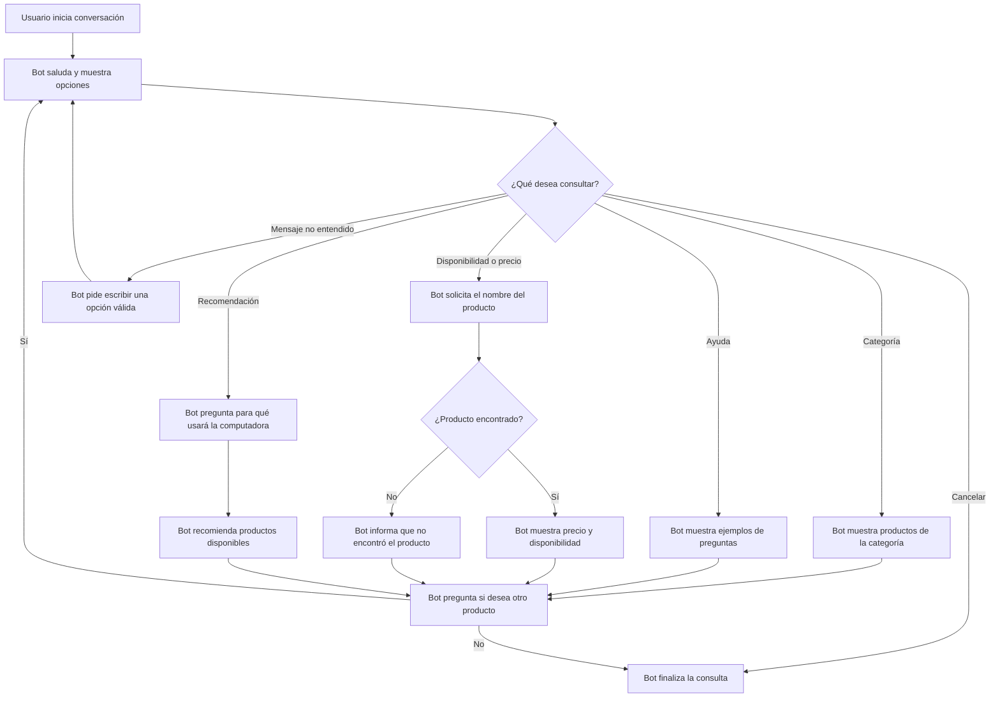

# Diseño conversacional - Tienda de computadoras

## Lista de chequeo

- **¿Quién usará el chatbot?** Clientes interesados en comprar computadoras, accesorios o consultar productos de la tienda.
- **¿Qué problema resuelve?** Ayuda a encontrar productos y conocer su disponibilidad sin tener que esperar atención de una persona.
- **¿Qué necesidades específicas tienen?** Saber si hay existencias, consultar precios y pedir recomendaciones según el uso que darán al equipo.
- **¿Qué preguntas se pueden hacer?** “¿Tienen laptops?”, “¿Cuánto cuesta una memoria RAM?”, “Necesito una computadora para estudiar” y “¿Tienen impresoras?”.
- **¿Qué tipo de respuesta espero en cada caso?** Texto para describir productos; número para precio y existencias; selección de una lista para elegir categoría o tipo de uso.
- **Edad, ocupación, intereses y experiencia con tecnología:** Personas de 16 años en adelante, estudiantes, profesionales y público general. Su experiencia tecnológica puede ser básica, por lo que el bot debe usar palabras sencillas.
- **Escenarios alternativos:** Producto no encontrado, producto sin existencias, mensaje no entendido, usuario que cambia de tema o que desea cancelar la consulta.
- **UI y accesibilidad:** Mensajes cortos, opciones numeradas, lenguaje sencillo y precios expresados claramente en dólares.
- **¿Cómo validar el prototipo?** Probar el diálogo con compañeros y pedirles que consulten un producto, precio y disponibilidad.
- **Pruebas de usabilidad y desempeño:** Verificar que el usuario pueda encontrar un producto sin ayuda y que el bot responda de forma clara y rápida.
- **Privacidad:** El bot no solicitará datos personales para consultar el catálogo. Si el usuario brinda información, se utilizará solo para responder su consulta y no se almacenará.

## Inventario de intenciones

| Intención | Ejemplo de enunciado | Frecuencia | Prioridad | Dato / API |
|---|---|---:|---:|---|
| Consultar disponibilidad | “¿Tienen laptops?” | Alta | 1 | API de catálogo: nombre del producto y existencias. |
| Consultar precio | “¿Cuánto cuesta una laptop Lenovo?” | Alta | 1 | API de catálogo: precio del producto. |
| Buscar por categoría | “Quiero ver memorias RAM” | Alta | 1 | API de catálogo: productos por categoría. |
| Pedir recomendación | “Necesito una computadora para estudiar” | Media | 2 | Catálogo: equipos según uso y presupuesto. |
| Consultar accesorios | “¿Tienen mouse inalámbrico?” | Media | 2 | API de catálogo: accesorios disponibles. |
| Pedir ayuda | “Ayuda” o “Menú” | Media | 2 | No requiere API; muestra las opciones disponibles. |
| Cancelar consulta | “Cancelar” | Baja | 2 | No requiere API; termina la consulta actual. |

## Diagrama de flujo de la conversación

## Diálogo de muestra - camino feliz

**Usuario:** Hola.

**Bot:** ¡Hola! Soy el asistente de la tienda de computadoras. Puedo consultar productos, precios y disponibilidad. ¿Qué necesitas?

**Usuario:** Quiero saber si tienen laptops.

**Bot:** Sí. Tenemos laptops Lenovo, HP y Asus. ¿Buscas una laptop para estudiar, trabajar o jugar?

**Usuario:** Para estudiar.

**Bot:** Te recomiendo la laptop Lenovo IdeaPad con 8 GB de RAM y 512 GB SSD. Tiene un precio de $650 y está disponible. ¿Deseas consultar otro producto?

**Usuario:** No, gracias.

**Bot:** De nada. Cuando necesites consultar otro producto, escríbeme nuevamente.

---

**Veredicto Final Pareja B**

1-  ¿El mensaje de bienvenida explica en una o dos frases qué hace el bot y qué más puede pedir el usuario?
**Calificación: Parcial.** La bienvenida está bastante clara porque dice que el bot puede consultar productos, precios y disponibilidad. El problema es que no menciona de entrada que también puede recomendar equipos o buscar accesorios, y tampoco le da ejemplos al usuario para seguir conversando. Yo agregaría al final algo como: “También puedo recomendarte una computadora según el uso que le darás. Puedes preguntar por laptops, RAM, mouse o impresoras”.

2- ¿Los mensajes del bot cumplen con cantidad, relación y manera?
**Calificación: Resuelto.** El diálogo se entiende bien y las respuestas tienen sentido con lo que pregunta el usuario. Por ejemplo, cuando pregunta por laptops, el bot le dice qué marcas tiene y luego le pregunta para qué la necesita. No usa palabras complicadas ni hace varias preguntas al mismo tiempo. Como pequeña mejora, se podría aclarar que los modelos y precios dependen de la disponibilidad, para que no parezca que siempre tendrá exactamente los mismos productos.

3- ¿El bot promete solo información que puede verificar? ¿Evita pedir datos repetidos?
**Calificación: Parcial.** El diseño menciona que los precios y existencias saldrán de una API de catálogo, así que en teoría el bot puede verificar la información antes de responder. Sin embargo, en el flujo el bot pide el nombre del producto, aunque el usuario podría haber dado parte de esa información desde el inicio. También, para recomendar una computadora, solo pregunta el uso, pero el inventario menciona que la recomendación depende del uso y presupuesto. Sería mejor que el bot aproveche los datos que el usuario ya escribió y, para una recomendación, pregunte también cuánto piensa gastar.

4- ¿El diagrama maneja las cuatro situaciones de fricción y ofrece una reparación clara?
**Calificación: Parcial.** El diseño sí toma en cuenta cuando el mensaje no se entiende y cuando no se encuentra un producto, lo cual está bien. Pero faltan situaciones como que el usuario escriba algo vacío, cambie de tema mientras el bot le pide un producto, pida algo que la tienda no hace o que falle la API. Tampoco se indica qué pasa después de varios intentos incorrectos. Yo agregaría mensajes como: “No entendí tu consulta. Puedes escribir laptops, accesorios o ayuda”, y después de tres intentos ofrecer volver al menú o contactar a una persona.

5- ¿El usuario puede cancelar, volver atrás o pedir ayuda en cualquier momento? ¿Cada intención termina claramente?
**Calificación: Parcial.** El flujo incluye ayuda y cancelar, y después de mostrar productos o una recomendación el bot pregunta si el usuario quiere seguir consultando. Eso hace que la conversación tenga un cierre bastante claro. Sin embargo, ayuda y cancelar aparecen solo cuando el bot muestra el menú inicial; no se ve que el usuario pueda usarlos mientras está respondiendo otra pregunta. Sería bueno agregar en cada paso algo como: “Puedes escribir ayuda, volver o cancelar cuando quieras”, y al finalizar usar un mensaje como: “Listo, terminé la consulta. Escribe /start si necesitas buscar otro producto”.

**Notas del Mago de Oz**

 Guion 1 - Camino feliz
- **Turno 1:** El usuario saluda y el bot responde explicando que puede consultar productos, precios y disponibilidad. En este punto el flujo funciona bien, aunque podría mencionar también las recomendaciones y accesorios desde la bienvenida.
- **Turno 2:** El usuario pregunta si hay laptops. El bot responde que tiene laptops Lenovo, HP y Asus, y pregunta para qué la necesita. La conversación sigue de manera natural.
- **Turno 3:** El usuario indica que necesita una laptop para estudiar. El bot recomienda un equipo, muestra sus especificaciones, precio y disponibilidad. Este paso funciona, pero sería mejor que también pregunte el presupuesto antes de recomendar un producto.
- **Turno 4:** El usuario responde que no desea consultar otro producto. El bot se despide de forma clara. El camino feliz se completa sin problemas importantes.

Guion 2 - Camino con fricción

- **Turno 1 - Entrada vacía o sin sentido:** Si el usuario escribe “.” o “asdf”, el diagrama lo toma como mensaje no entendido y vuelve a mostrar las opciones. Esto ayuda, pero sería mejor mostrar ejemplos concretos como “Puedes consultar laptops, RAM, mouse o impresoras”.
- **Turno 2 - Producto mal escrito o inexistente:** El diagrama contempla que el producto no sea encontrado y el bot informa esa situación. Sin embargo, no ofrece alternativas para continuar, como sugerir productos parecidos o mostrar categorías disponibles.
- **Turno 3 - Cambio de tema:** Si el bot está esperando el nombre de un producto y el usuario cambia de tema, por ejemplo pregunta por accesorios, el diagrama no muestra cómo manejar ese cambio. Aquí el flujo se traba porque falta una rama para reconocer la nueva intención.
- **Turno 4 - Petición fuera de alcance:** Si el usuario pide un descuento o algo que el bot no puede hacer, el diseño no tiene una respuesta específica. Sería bueno agregar un mensaje como: “No puedo aplicar descuentos, pero puedo ayudarte a consultar precios y productos disponibles”. También se podría ofrecer atención humana si fuera necesario.
