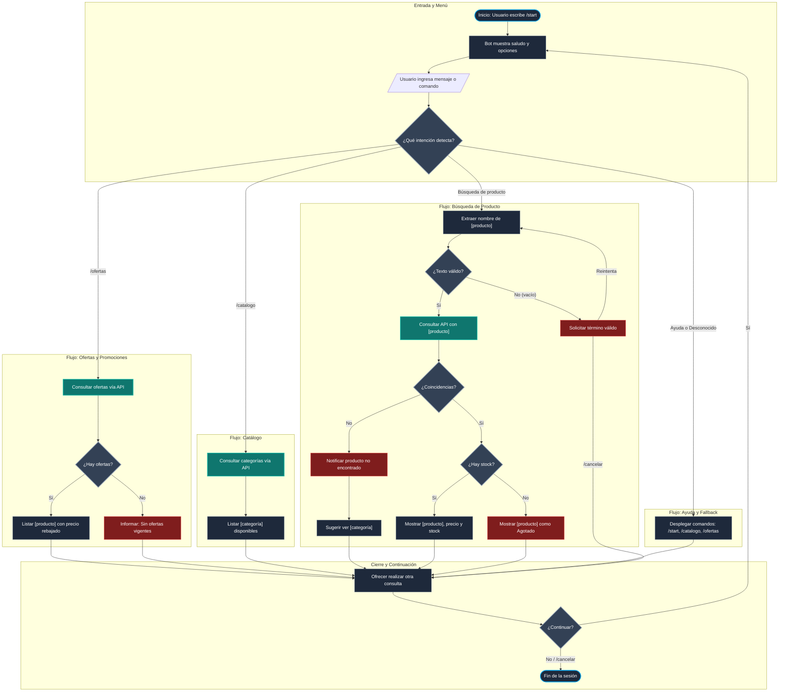

# Diseño Conversacional: Bot de Comercio Electrónico CET115

**Estudiante:** Carnet GT22004  
**Asignatura:** Comercio Electrónico (CET115 - Ciclo II / 2026)  
**Docente:** Ing. William Ernesto Vides Ortez  
**Entregable:** Guía 5  - Diseño y puesta en marcha del bot
---

## 1. Lista de Chequeo de Diseño Conversacional 

* **¿Quién usará el chatbot?:** Deportistas, entusiastas del entrenamiento y clientes de la tienda deportiva en línea que buscan equipamiento, calzado, indumentaria o suplementos, y desean consultar disponibilidad, precios u ofertas sin recorrer manualmente el sitio web.
* **¿Qué problema o problemas resuelve?:** Automatiza la atención de primer contacto para preguntas repetitivas sobre artículos deportivos, promociones de temporada y existencias, brindando respuestas inmediatas y evitando esperas de soporte.
* **¿Qué necesidades específicas tienen?:** Confirmar rápidamente si un artículo deportivo está en inventario, ver precios y descuentos activos con el comando `/ofertas`, y recibir el enlace directo para comprar en la tienda.
* **¿Qué preguntas se pueden hacer?:**
  * "¿Tienen disponible [producto]?"
  * "¿Cuáles son las ofertas de hoy?" 
  * "¿Qué precio tiene [producto]?"
  * "¿Qué categorías deportivas manejan?"
  * "¿Qué comandos puedo utilizar?"
* **¿Qué tipo de respuesta espero en cada caso?:**
  * *Consulta de artículo:* Texto estructurado con el nombre del [producto], precio regular/rebajado en USD, disponibilidad (en stock / agotado) y enlace web directo.
  * *Consulta de promociones (`/ofertas`):* Listado de [producto] en descuento, mostrando precio anterior, precio rebajado y disponibilidad.
  * *Consulta general de catálogo:* Lista de [categoría] deportivas disponibles.
  * *Navegación / Comandos:* Respuestas directas y concisas mediante comandos (`/start`, `/catalogo`, `/ofertas`, `/cancelar`).
* **¿Cuál es su edad, ocupación, intereses, nivel de experiencia con tecnología?:** Usuarios de 16 a 50 años, estudiantes, atletas o personas interesadas en el fitness y la actividad física, con nivel tecnológico básico a intermedio habituados al uso de aplicaciones de mensajería.
* **¿Cuáles son los escenarios alternativos (errores, datos faltantes, el usuario cambia de tema)?:**
  * *Sin promociones vigentes:* Si no hay artículos deportivos con rebaja al usar `/ofertas`, el bot notifica que no hay ofertas activas y sugiere ver el catálogo general.
  * *Sin coincidencias en búsqueda:* Si la búsqueda de [producto] no devuelve resultados, el bot informa la falta de existencias y lista las [categoría] deportivas principales.
  * *Entrada vacía o muy corta:* El bot solicita escribir el nombre del artículo deportivo de forma más descriptiva.
  * *Mensaje no reconocido (Fallback):* El bot responde con amabilidad explicando que no comprende la consulta y despliega los comandos disponibles.
  * *Interrupción o cambio de tema:* El usuario puede escribir `/cancelar` para anular la consulta actual y volver al inicio.
* **¿UI, Accesibilidad?:** Mensajes breves y fáciles de leer en pantalla móvil, uso de viñetas para características y opciones guiadas sin tecnicismos.
* **¿Cómo haré para validar mi prototipo? (Pruebas de usabilidad, desempeño):** Validación con la técnica de Mago de Oz en la revisión entre pares, evaluando la claridad y pertinencia turno a turno según las heurísticas de Grice.
* **¿Privacidad? (Recolectar datos: para qué, cuáles y cuándo eliminarlos):** Solo se procesa el identificador de chat de Telegram y la palabra clave del [producto] deportivo consultado. No se solicitan datos personales ni métodos de pago en el chat, y los estados temporales de sesión se liberan al terminar la conversación.

---

## 2. Inventario de Intenciones

| Intención | Ejemplo de enunciado | Frecuencia | Prioridad | Dato / API |
| :--- | :--- | :--- | :--- | :--- |
| `saludo_inicio` | `/start`, `hola`, `buenas tardes` | Alta | 1 | Ninguno |
| `consultar_catalogo` | `ver productos`, `/catalogo`, `¿qué venden?` | Alta | 1 | API de catálogo (Categorías/Productos) |
| `consultar_ofertas` | `/ofertas`, `descuentos deportivos`, `promociones de hoy` | Alta | 1 | API de catálogo (filtro on_sale) |
| `buscar_producto` | `¿tienen [producto]?`, `precio de [producto]`, `buscar [producto]` | Alta | 1 | Término de búsqueda / API de catálogo |
| `ayuda_menu` | `/help`, `ayuda`, `¿cómo funciona?` | Media | 2 | Ninguno |
| `cancelar_accion` | `/cancelar`, `salir`, `olvídalo` | Baja | 2 | Ninguno |

---

## 3. Diálogo de Muestra (Camino Feliz)

**Usuario:** `/start`

**Bot:** ¡Hola! 👋 Soy tu asistente en la tienda deportiva.\nEscribe el nombre de un producto, o usa /ofertas para descuentos y /catalogo para ver categorías.

**Usuario:** `/ofertas`

**Bot:** 🔥 **Promociones Deportivas Actuales:**

1. **[producto]**
   * **Categoría:** [categoría]
   * **Precio de oferta:** $0.00 USD *(Antes: $0.00 USD)*
   * **Disponibilidad:** En existencia
   * **Enlace:** `https://gt22004.duckdns.org/producto/[producto]`

2. **[producto]**
   * **Categoría:** [categoría]
   * **Precio de oferta:** $0.00 USD *(Antes: $0.00 USD)*
   * **Disponibilidad:** En existencia
   * **Enlace:** `https://gt22004.duckdns.org/producto/[producto]`

¿Deseas consultar detalles de algún [producto] o revisar una [categoría] deportiva?

**Usuario:** ¿Tienen disponible [producto]?

**Bot:** Sí, tenemos disponible el artículo.
* **Producto:** [producto]
* **Categoría:** [categoría]
* **Precio:** $0.00 USD
* **Disponibilidad:** En existencia
* **Enlace directo:** `https://gt22004.duckdns.org/producto/[producto]`

¿Deseas buscar otro artículo o consultar alguna otra sección?

**Usuario:** No, eso sería todo, gracias.

**Bot:** Con gusto. Si necesitas consultar algo más adelante, escribe `/start`, `/catalogo` o `/ofertas`. ¡Mucho éxito en tu entrenamiento!

---

## 4. Diagrama de Flujo Conversacional

---
# Observaciones - MC21105 - David Alexander Méndez Cuéllar

## 1. Resultado Mago de Oz

| Entrada del Usuario | Intención Real / Contexto | Motivo del Fallo en el Diseño |
| :--- | :--- | :--- |
| `guantes` | Búsqueda general de producto | El flujo original asume que la API siempre devuelve un único producto exacto o nada; no contempla la presentación estructurada cuando existen múltiples coincidencias para que el usuario elija. |
| `.` | Entrada vacía o carácter huérfano | El bucle de reintento en validación de texto carece de salida por escape o límite de intentos, atrapando al usuario si insiste con entradas cortas o inválidas. |
| `error 500 / caída de red` | Fallo de conexión con la API de WooCommerce/DuckDNS | El diseño asume respuestas siempre exitosas (200 OK) y no define un nodo de error de infraestructura que informe al usuario y permita reintentar. |

---

## 2. Respuesta de las 5 preguntas

### 1. Alcance y descubribilidad
* **Veredicto:** Resuelto.
* **Evidencia:** El mensaje de bienvenida delimita con claridad el alcance de la tienda deportiva (búsqueda de productos, catálogo y promociones), permitiendo entender la función principal desde el inicio.
* **Mejora:** Incluir en el saludo inicial todos los comandos de control declarados en el inventario (`/catalogo`, `/ofertas`, `/help`, `/cancelar`) para evitar que el usuario deba adivinarlos.

### 2. Grice en el guion — cantidad, relación, manera
* **Veredicto:** Parcial.
* **Evidencia:** La ficha de producto individual cumple con los datos requeridos (nombre, categoría, precio, stock y enlace), pero ante términos genéricos que arrojan varios resultados no se definió cómo dosificar la información sin saturar la pantalla.
* **Mejora:** Implementar un turno breve de desambiguación cuando existan múltiples coincidencias: listar de 3 a 5 artículos numerados con nombre, precio y enlace directo para que el usuario decida el siguiente paso.

### 3. Grice — calidad, y relleno de datos
* **Veredicto:** Parcial.
* **Evidencia:** Los enlaces directos y la consulta de stock apuntan correctamente a la tienda en DuckDNS, pero el flujo no prevé la contingencia de fallos técnicos o caídas de conectividad con la API.
* **Mejora:** Agregar una rama de contingencia técnica que informe con veracidad: *«Tuvimos un problema temporal de conexión con el catálogo. Por favor, intenta de nuevo en unos momentos.»*

### 4. Manejo de errores
* **Veredicto:** Parcial.
* **Evidencia:** El diseño contempla el caso de producto no encontrado sugiriendo categorías, pero carece de un fallback estándar para mensajes fuera de dominio y mantiene un bucle rígido ante términos de búsqueda vacíos.
* **Mejora:** Crear un nodo global de fallback que capture mensajes no reconocidos sugiriendo comandos activos, y habilitar la intercepción de `/cancelar` dentro de la solicitud de reintento de texto.

### 5. Reglas de producto
* **Veredicto:** Parcial.
* **Evidencia:** Se definen intenciones para `/cancelar` y `/help`, pero el diagrama solo permitía cancelar en fases finales o en la entrada de búsqueda, dejando el comando inerte si el usuario deseaba interrumpir otra sección. Además, en el cierre faltaba el nodo explícito para capturar la decisión del usuario.
* **Mejora:** Estandarizar la intercepción global de `/cancelar` y `/help` en cualquier punto de la conversación, e insertar el nodo de entrada de usuario previo a la evaluación de cierre (`¿Continuar? Sí / No`).

