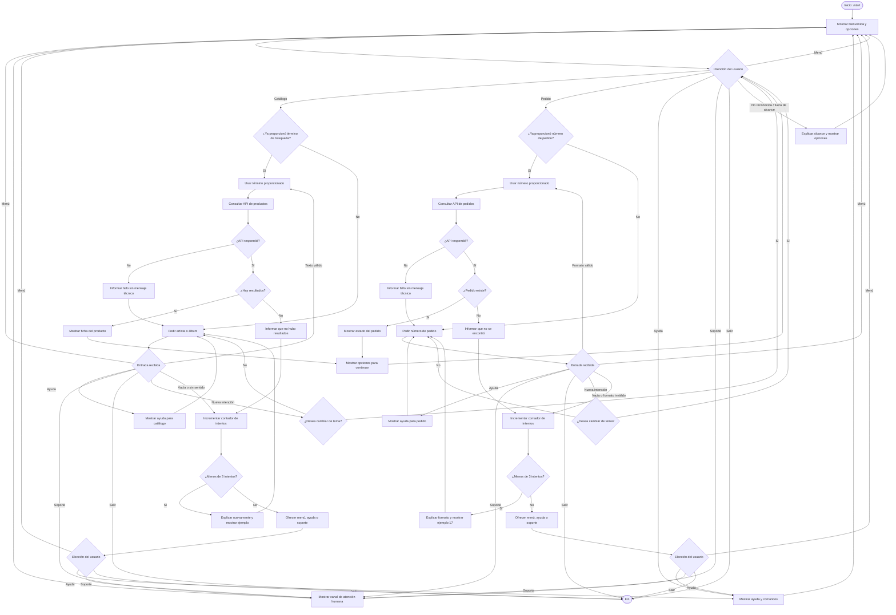

# Diseño Conversacional - MusicHub Bot

## 1. Lista de Chequeo de Diseño Conversacional

### ¿Quién usará el chatbot?
El chatbot será utilizado principalmente por clientes de la tienda en línea MusicHub y personas interesadas en música que buscan información rápida sobre discos, vinilos o el estado de sus pedidos.

El usuario no necesita conocimientos técnicos para utilizar el bot.

---

### ¿Qué problema o problemas resuelve?
MusicHub Bot automatiza consultas frecuentes relacionadas con el catálogo de productos y el estado de pedidos, reduciendo el tiempo de espera del usuario y facilitando el acceso a la información de la tienda.

El bot funcionará como una primera línea de atención para consultas sencillas.

Puede ayudar principalmente a:

- Buscar discos y vinilos en el catálogo.
- Mostrar información disponible de un producto.
- Consultar el estado de un pedido.
- Orientar al usuario cuando no sabe cómo continuar.
- Indicar un canal de atención humana cuando la consulta se encuentra fuera de su alcance.

El bot no realizará pagos, descuentos, modificaciones ni cancelaciones de pedidos.

---

### ¿Qué necesidades específicas tienen?
Los usuarios necesitan principalmente:

- Saber si un artista o álbum se encuentra disponible.
- Consultar información de un producto, como artista, álbum, año, formato, género, idioma, precio y disponibilidad.
- Conocer el estado actual de un pedido.
- Recibir orientación cuando no saben cómo utilizar el bot.
- Poder corregir una entrada incorrecta sin reiniciar completamente la conversación.
- Cambiar de consulta cuando sea necesario.
- Volver al menú principal.
- Pedir ayuda.
- Finalizar la interacción.
- Saber cómo contactar con una persona cuando el bot no puede resolver su consulta.

---

### ¿Qué preguntas se pueden hacer?
Algunos ejemplos de consultas que el usuario puede realizar son:

- Buscar productos mediante `/catalogo`.
- Buscar directamente con un término, por ejemplo `/catalogo Chloe`.
- Consultar un pedido mediante `/pedido`.
- Consultar directamente un pedido, por ejemplo `/pedido 17`.
- Consultar las funciones disponibles mediante `/ayuda`.
- Solicitar atención humana mediante `/soporte`.
- Volver al menú mediante `/menu`.
- Finalizar mediante `/salir`.

Los comandos disponibles son:

- `/start` - Iniciar la interacción.
- `/catalogo` - Buscar discos o vinilos.
- `/pedido` - Consultar el estado de un pedido.
- `/ayuda` - Mostrar las funciones disponibles.
- `/menu` - Volver al menú principal.
- `/soporte` - Mostrar el canal de atención humana.
- `/salir` - Finalizar la interacción.

---

### ¿Qué tipo de respuesta espero en cada caso?

#### Consulta de catálogo

El bot mostrará una ficha de producto en texto utilizando la información disponible en el catálogo:

- Artista.
- Álbum o nombre del producto.
- Año.
- Formato.
- Género.
- Idioma.
- Precio.
- Disponibilidad.

Ejemplo:

> **Ungodly Hour (Chrome Edition) – Vinilo**
> Artista: Chloe x Halle
> Año: 2021
> Formato: LP
> Género: Pop, R&B
> Idioma: Inglés
> Precio: $49.99
> Stock: Disponible

---

#### Consulta de pedido

El bot devolverá una respuesta breve indicando el identificador del pedido y su estado actual.

Ejemplo:

> 📦 Pedido #17
>
> Estado: En espera

El número de pedido será un identificador numérico positivo generado por WooCommerce y no tendrá una longitud fija.

El bot únicamente mostrará información que pueda verificar mediante el servicio correspondiente.

No prometerá enviar notificaciones futuras ni proporcionar información que no esté disponible mediante la API.

---

#### Ayuda

El bot mostrará una lista breve con las acciones y comandos disponibles.

Ejemplo:

> Puedo ayudarte a buscar productos o consultar el estado de un pedido.
>
> `/catalogo` - Buscar discos y vinilos
> `/pedido` - Consultar un pedido
> `/menu` - Volver al menú
> `/soporte` - Atención humana
> `/salir` - Terminar

---

#### Atención humana

Cuando el bot no pueda resolver una solicitud, mostrará el canal real de atención humana disponible.

Ejemplo:

> Esta consulta puede requerir atención de una persona.
>
> Puedes comunicarte mediante el correo:
>
> `hv21011@ues.edu.sv`
>
> También puedes escribir `/menu` para volver al menú principal.

El bot no indicará que está transfiriendo automáticamente la conversación a un agente si técnicamente no existe esa integración.

La derivación consiste en proporcionar al usuario un canal de contacto humano real.

---

### Perfil de usuario

- **Edad:** aproximadamente entre 18 y 55 años.
- **Ocupación:** no se limita a una ocupación específica; puede incluir estudiantes, trabajadores y compradores habituales por Internet.
- **Intereses:** música, artistas, álbumes, coleccionismo de formatos físicos y compras en línea.
- **Nivel tecnológico:** básico o intermedio en el uso de aplicaciones de mensajería y comercio electrónico.

El usuario no necesita memorizar instrucciones complejas ni conocer términos técnicos.

---

### ¿Cuáles son los escenarios alternativos?

Se contemplan los siguientes casos:

1. El producto buscado no existe.
2. El número de pedido no existe.
3. El número de pedido tiene un formato incorrecto.
4. El usuario envía una entrada vacía o sin sentido.
5. La API no responde o presenta un fallo.
6. El usuario cambia de tema mientras el bot espera un dato.
7. El usuario solicita algo fuera del alcance del bot.
8. El usuario solicita ayuda durante una operación.
9. El usuario desea regresar al menú.
10. El usuario desea finalizar la conversación.
11. El usuario introduce varias veces un dato incorrecto.
12. El usuario solicita hablar con una persona.

Para evitar ciclos infinitos, los errores de entrada tendrán un máximo de tres intentos.

Se sigue este orden:

- **Primer intento:** indicar nuevamente qué dato se necesita.
- **Segundo intento:** repetir la indicación incluyendo un ejemplo.
- **Tercer intento:** dejar de solicitar el mismo dato y ofrecer `/menu`, `/ayuda` o `/soporte`.

---

### Cambio de tema durante una conversación

Si el usuario cambia claramente de intención mientras el bot espera un dato, el bot confirmará si desea abandonar la operación actual.

Ejemplo:

**Usuario:** `/catalogo`

**Bot:** Escribe el nombre del artista o álbum que deseas buscar.

**Usuario:** `/pedido 17`

**Bot:** Estabas buscando en el catálogo. ¿Deseas cambiar a la consulta de pedidos?

El usuario podrá responder mediante las opciones **Sí** o **No**.

Si confirma el cambio, el bot utilizará el número de pedido que ya fue proporcionado y realizará la consulta.

Si no confirma el cambio, continuará con la búsqueda anterior.

---

### Reutilización de información proporcionada

Si el usuario proporciona desde el inicio el dato necesario junto con el comando correspondiente, el bot no deberá solicitarlo nuevamente.

Ejemplo:

**Usuario:** `/pedido 17`

El bot utilizará directamente el número `17` para realizar la consulta.

No será necesario preguntar nuevamente:

> ¿Cuál es el número de tu pedido?

De la misma forma:

**Usuario:** `/catalogo Chloe`

El bot utilizará directamente `Chloe` como término de búsqueda.

Esto evita solicitar nuevamente información que el usuario ya proporcionó.

---

### UI, Accesibilidad

Para facilitar la interacción:

- Los mensajes serán breves y estarán estructurados por líneas.
- Se utilizará lenguaje sencillo y sin términos técnicos.
- Se realizará una pregunta principal por mensaje.
- Los emojis se utilizarán de forma moderada para apoyar visualmente el contenido.
- Los emojis no serán el único medio para comunicar información.
- Los comandos principales estarán visibles en el menú y en la ayuda.
- Los mensajes de error explicarán cómo corregir el problema.
- Se podrán utilizar botones de Telegram cuando una selección tenga opciones conocidas.
- El usuario también podrá utilizar comandos escritos aunque existan botones.
- No se mostrarán errores técnicos internos de las APIs.

---

### ¿Cómo haré para validar mi prototipo?

Simulación "Mago de Oz" y validación con las heurísticas de Grice en la revisión por pares.

#### Mago de Oz

Una persona representará al bot y responderá únicamente de acuerdo con el diseño y el diagrama de flujo, sin improvisar.

Se comprobarán situaciones como:

- Camino feliz.
- Entrada vacía o sin sentido.
- Número de pedido incorrecto.
- Producto inexistente.
- Pedido inexistente.
- Cambio de tema.
- Fallo de API.
- Solicitud fuera del alcance.
- Uso de `/ayuda`.
- Uso de `/menu`.
- Uso de `/soporte`.
- Uso de `/salir`.
- Tres intentos incorrectos.

---

#### Heurísticas de Grice

Se analizarán los mensajes considerando:

- **Cantidad:** proporcionar solamente la información necesaria.
- **Calidad:** no afirmar información que el bot no pueda comprobar.
- **Relación:** responder de acuerdo con lo solicitado por el usuario.
- **Manera:** utilizar frases claras, breves y sin jerga técnica.

También se comprobará que:

- Cada intención tenga un cierre claro.
- El usuario pueda pedir ayuda.
- El usuario pueda volver al menú.
- El usuario pueda finalizar la conversación.
- El bot no prometa funciones que no posee.
- El bot no vuelva a pedir información que el usuario ya proporcionó.

---

### Pruebas de usabilidad y desempeño

Durante las pruebas se observará:

- Si el usuario comprende qué puede hacer el bot desde el mensaje inicial.
- Si puede completar una consulta sin recibir instrucciones externas.
- Si comprende los mensajes de error.
- Si puede corregir una entrada inválida.
- Si puede cambiar de tema.
- Si puede volver al menú.
- Si puede solicitar ayuda.
- Si puede solicitar atención humana.
- Si puede finalizar la conversación.
- Si el bot evita ciclos infinitos.
- Si las consultas a las APIs responden en un tiempo razonable.

En caso de fallo de una API, el bot mostrará un mensaje comprensible y permitirá reintentar o volver al menú.

---

### Privacidad

El bot solicitará únicamente los datos necesarios para completar las consultas.

#### Para consultar el catálogo

Se utilizará:

- Nombre del artista.
- Nombre del álbum.
- Término de búsqueda.

#### Para consultar un pedido

Se utilizará:

- Identificador numérico del pedido generado por WooCommerce.

Estos datos se utilizarán únicamente para realizar las consultas correspondientes.

El bot no solicitará:

- Contraseñas.
- Datos bancarios.
- Números de tarjetas.
- Direcciones completas.
- Credenciales de acceso.

Los datos utilizados durante el flujo se mantendrán solamente mientras sean necesarios para completar la interacción.

Al finalizar o reiniciar el flujo, los datos temporales utilizados por el bot deberán descartarse.

El prototipo no contempla almacenar permanentemente los términos de búsqueda ni los números de pedido.

Los registros técnicos utilizados para depuración deberán evitar almacenar información personal innecesaria.

---

## 2. Inventario de Intenciones

| Intención | Ejemplo de enunciado | Frecuencia | Prioridad | Dato / API |
| :--- | :--- | :--- | :--- | :--- |
| Iniciar interacción | `/start` | Alta | 1 | Mensaje estático de bienvenida |
| Consultar catálogo | `/catalogo`, `/catalogo Chloe` | Alta | 1 | WooCommerce Store API |
| Estado de un pedido | `/pedido`, `/pedido 17` | Alta | 1 | WooCommerce REST API |
| Solicitar ayuda | `/ayuda` | Media | 2 | Mensaje estático de ayuda |
| Volver al menú | `/menu` | Media | 2 | Reinicio del flujo actual |
| Solicitar soporte humano | `/soporte` | Baja | 2 | Correo de atención humana |
| Finalizar interacción | `/salir` | Baja | 2 | Finalización del flujo |

### Datos requeridos por intención

| Intención | Dato requerido |
| :--- | :--- |
| Consultar catálogo | Artista, álbum o término de búsqueda |
| Estado de un pedido | Identificador numérico positivo del pedido |
| Solicitar ayuda | Ninguno |
| Volver al menú | Ninguno |
| Solicitar soporte humano | Ninguno |
| Finalizar interacción | Ninguno |

---

## 3. Reglas Generales de Conversación

Las siguientes reglas se aplicarán durante todo el flujo:

1. `/ayuda` debe poder utilizarse mientras el bot espera información.
2. `/menu` cancela el flujo actual y devuelve al usuario al menú principal.
3. `/salir` finaliza la interacción.
4. `/soporte` muestra el canal disponible para recibir atención humana.
5. Si el usuario cambia de intención mientras existe un flujo pendiente, el bot debe preguntar si desea abandonar la operación actual.
6. Los datos que el usuario ya proporcionó junto con la intención correspondiente no deben volver a solicitarse.
7. Los errores de entrada tendrán un máximo de tres intentos.
8. Después del tercer intento se ofrecerán `/menu`, `/ayuda` y `/soporte`.
9. Los errores internos de las APIs no se mostrarán mediante códigos técnicos.
10. El bot no prometerá funciones que no estén implementadas.
11. Después de resolver una consulta, el usuario podrá realizar otra sin tener que reiniciar el bot.
12. La derivación humana no implica una transferencia automática; se proporcionará un canal de contacto real.
13. Si una consulta está fuera del alcance del bot, se explicará brevemente qué sí puede hacer y se ofrecerá `/soporte`.

---

## 4. Diálogo de Muestra (Camino Feliz)

La intención principal seleccionada para el camino feliz será **consultar catálogo**.

**Usuario:** `/start`

**Bot:** ¡Hola! Qué gusto verte por MusicHub Bot 🎵.

Puedo ayudarte a buscar discos y vinilos o consultar el estado de un pedido.

Puedes utilizar:

`/catalogo` - Buscar discos y vinilos
`/pedido` - Consultar un pedido
`/ayuda` - Ver las opciones disponibles
`/soporte` - Atención humana
`/salir` - Terminar

**Usuario:** `/catalogo`

**Bot:** Escribe el nombre del artista o álbum que deseas buscar.

Por ejemplo: `Chloe`

**Usuario:** Chloe

**Bot:** Encontré productos relacionados con la búsqueda.

El bot mostrará la información disponible del producto, por ejemplo:

> **Ungodly Hour (Chrome Edition) – Vinilo**
> Artista: Chloe x Halle
> Año: 2021
> Formato: LP
> Género: Pop, R&B
> Idioma: Inglés
> Precio: $49.99
> Stock: Disponible

Después de completar la consulta, el bot mostrará opciones para continuar:

`/catalogo` - Buscar otro producto
`/pedido` - Consultar un pedido
`/menu` - Volver al menú
`/salir` - Terminar

**Usuario:** `/salir`

**Bot:** Gracias por usar MusicHub Bot 🎵.

Puedes escribir `/start` cuando quieras volver.

---

## 5. Escenarios Alternativos

### 5.1 Entrada vacía o sin sentido

Si el bot espera un dato específico y recibe una entrada que no permite continuar, explicará nuevamente qué información necesita.

Ejemplo:

**Bot:** ¿Cuál es el número de tu pedido?

**Usuario:** abc

**Bot:** El número de pedido debe contener solamente números.

Por ejemplo: `17`.

El error contará como un intento incorrecto.

---

### 5.2 Número de pedido con formato incorrecto

El identificador de un pedido debe ser un número entero positivo.

No se exige una cantidad fija de dígitos.

Ejemplo de entrada incorrecta:

**Usuario:** abc

**Bot:** El número de pedido debe contener solamente números.

Por ejemplo: `17`.

Otro ejemplo incorrecto sería un valor negativo o vacío.

---

### 5.3 Producto no encontrado

**Usuario:** `/catalogo ArtistaQueNoExiste123`

**Bot:** No encontré productos relacionados con "ArtistaQueNoExiste123".

Puedes intentar con el nombre del álbum o del artista.

El usuario podrá realizar otro intento sin reiniciar la conversación.

---

### 5.4 Pedido inexistente

**Usuario:** `/pedido 999999`

**Bot:** No encontré un pedido con el número #999999.

Revisa el número e inténtalo nuevamente.

El usuario podrá proporcionar otro identificador de pedido.

---

### 5.5 Fallo de la API

Si el servicio externo no responde, el bot no mostrará códigos HTTP, excepciones ni mensajes técnicos al usuario.

**Bot:** En este momento no puedo consultar la información de la tienda.

Puedes intentarlo nuevamente o escribir `/menu`.

Un fallo de la API no debe contarse como un error cometido por el usuario.

---

### 5.6 Cambio de tema

Si existe una operación pendiente y el usuario intenta iniciar otra intención, el bot solicitará confirmación antes de abandonar el flujo actual.

Ejemplo:

**Usuario:** `/catalogo`

**Bot:** Escribe el nombre del artista o álbum que deseas buscar.

**Usuario:** `/pedido 17`

**Bot:** Estabas buscando en el catálogo.

¿Deseas cambiar a la consulta de pedidos?

El bot mostrará las opciones:

`Sí` | `No`

#### Si responde Sí

El bot cambia de intención y utiliza el dato que el usuario ya proporcionó.

En este caso, utilizará directamente el número `17` sin volver a preguntarlo.

#### Si responde No

El bot conserva el flujo anterior y vuelve a solicitar el artista o álbum.

---

### 5.7 Solicitud fuera del alcance

**Usuario:** ¿Me puedes hacer un descuento?

**Bot:** Esa acción se encuentra fuera de las funciones disponibles.

Puedo ayudarte a buscar productos con `/catalogo` o consultar un pedido con `/pedido`.

También puedes utilizar `/soporte` si necesitas atención humana.

El bot no afirmará que puede aplicar descuentos, realizar pagos, modificar pedidos o ejecutar otras acciones que no estén implementadas.

---

### 5.8 Tres intentos incorrectos

Los errores de entrada tendrán un máximo de tres intentos.

Durante los primeros intentos, el bot explicará nuevamente qué dato necesita y proporcionará un ejemplo cuando sea útil.

Después del tercer intento:

**Bot:** Parece que estamos teniendo problemas con ese dato.

Puedes utilizar:

- `/menu` para volver al menú principal.
- `/ayuda` para revisar las opciones disponibles.
- `/soporte` para recibir atención humana.

El flujo actual dejará de solicitar repetidamente el mismo dato.

---

### 5.9 Solicitud de atención humana

**Usuario:** `/soporte`

**Bot:** Si necesitas ayuda adicional o tu consulta está fuera del alcance de MusicHub Bot, puedes comunicarte con nuestro canal de soporte:

`hv21011@ues.edu.sv`

Por seguridad, no deben enviarse contraseñas ni datos bancarios.

También puedes escribir `/menu` para volver al menú principal.

La derivación consiste únicamente en proporcionar un canal real de contacto.

El bot no afirmará que transfirió automáticamente la conversación a una persona.

---

### 5.10 Ayuda durante un flujo

El comando `/ayuda` estará disponible aunque exista una operación pendiente.

Ejemplo:

**Usuario:** `/pedido`

**Bot:** ¿Cuál es el número de tu pedido?

Por ejemplo: `17`.

**Usuario:** `/ayuda`

**Bot:** Mostrará las funciones y comandos disponibles.

La consulta de pedido seguirá pendiente, por lo que posteriormente el usuario podrá escribir:

**Usuario:** `17`

y continuar con la consulta sin tener que iniciar nuevamente el flujo.

---

### 5.11 Volver al menú durante un flujo

El usuario podrá cancelar el flujo actual mediante `/menu`.

Ejemplo:

**Usuario:** `/catalogo`

**Bot:** Escribe el nombre del artista o álbum que deseas buscar.

**Usuario:** `/menu`

El bot descartará el flujo pendiente y volverá a mostrar el menú principal.

---

### 5.12 Finalizar la interacción

El comando `/salir` finalizará la interacción actual y descartará cualquier flujo pendiente.

**Usuario:** `/salir`

**Bot:** Gracias por usar MusicHub Bot 🎵.

Puedes escribir `/start` cuando quieras volver.

---

## 6. Diagrama de Flujo

---

## 7. Evaluación Pareja B - MusicHub Bot

### 1. Alcance y descubribilidad

**Veredicto:** Parcial

**Evidencia:** El mensaje inicial explica `/catalogo` y `/pedido`, pero no deja claro qué cosas no puede hacer el bot ni menciona `/ayuda` desde el inicio.

**Mejora:** Agregar una bienvenida que incluya las funciones disponibles y el comando de ayuda.

---

### 2. Grice: cantidad, relación y manera

**Veredicto:** Resuelto

**Evidencia:** Los mensajes son breves, claros y relacionados con la consulta anterior.

**Mejora:** Usar siempre el mismo término, por ejemplo “pedido”, en lugar de alternar entre pedido, orden y compra.

---

### 3. Grice: calidad y relleno de datos

**Veredicto:** Parcial

**Evidencia:** El bot dice “Te avisaremos cuando sea enviado”, pero el diseño no incluye un sistema de notificaciones.

**Mejora:** Cambiarlo por: “Puedes volver a consultar el estado de tu pedido con `/pedido`”.

---

### 4. Manejo de errores

**Veredicto:** Parcial

**Evidencia:** El diagrama contempla producto inexistente y pedido inválido, pero no maneja entrada sin sentido, cambio de tema, fallo de API, tres intentos ni derivación a humano.

**Mejora:** Agregar esas ramas al diagrama y permitir reintentar antes de ofrecer ayuda humana.

---

### 5. Reglas de producto

**Veredicto:** Parcial

**Evidencia:** Existen `/ayuda` y `/salir`, pero no aparecen claramente disponibles durante todos los pasos del flujo.

**Mejora:** Permitir `/ayuda`, `/salir` y volver al menú principal desde cualquier punto.

---

## 8. Cambios Realizados a partir de la Retroalimentación

| Cambio aplicado | Origen de la observación |
| :--- | :--- |
| Se amplió el mensaje inicial para mostrar las principales funciones del bot e incluir `/ayuda`. | Evaluación Pareja B - Pregunta 1 |
| Se utilizó de manera consistente el término **pedido**, evitando alternarlo innecesariamente con "orden" o "compra". | Evaluación Pareja B - Pregunta 2 |
| Se eliminó la frase "Te avisaremos cuando sea enviado", debido a que no existe un sistema de notificaciones. | Evaluación Pareja B - Pregunta 3 y retroalimentación del ingeniero |
| Se agregaron escenarios para entradas vacías o sin sentido. | Evaluación Pareja B - Pregunta 4 y retroalimentación del ingeniero |
| Se agregó el manejo de cambios de tema durante una operación, incluyendo confirmación antes de abandonar el flujo actual. | Evaluación Pareja B - Pregunta 4 y retroalimentación del ingeniero |
| Se agregó una rama para fallos de las APIs con una respuesta comprensible para el usuario. | Evaluación Pareja B - Pregunta 4 y retroalimentación del ingeniero |
| Los fallos de la API no se consideran intentos incorrectos del usuario. | Ajuste de coherencia del flujo |
| Se estableció un máximo de tres intentos para evitar ciclos infinitos al ingresar datos incorrectos. | Evaluación Pareja B - Pregunta 4 y retroalimentación del ingeniero |
| Después de tres intentos incorrectos se ofrecen `/menu`, `/ayuda` y `/soporte`. | Evaluación Pareja B - Pregunta 4 y retroalimentación del ingeniero |
| Se incorporó `/soporte` como intención explícita para representar la derivación a atención humana. | Evaluación Pareja B - Pregunta 4 y requisito de derivación |
| Se definió `hv21011@ues.edu.sv` como canal real de atención humana. | Ajuste necesario para concretar la derivación |
| Se aclaró que la derivación humana consiste en mostrar un canal real de contacto y no en fingir una transferencia automática. | Ajuste para mantener coherencia entre el diseño y la implementación |
| Se hicieron accesibles `/ayuda`, `/menu`, `/soporte` y `/salir` durante los principales puntos del flujo. | Evaluación Pareja B - Pregunta 5 y retroalimentación del ingeniero |
| El menú mostrado después de resolver una consulta permite iniciar otra operación sin reiniciar el bot. | Retroalimentación del ingeniero |
| Una búsqueda sin resultados permite volver a intentarlo utilizando el mismo límite de intentos. | Retroalimentación del ingeniero |
| Se amplió la lista de chequeo incluyendo ocupación, método de validación, pruebas de usabilidad y desempeño y una política de retención de datos más concreta. | Retroalimentación del ingeniero |
| Se agregó la reutilización de datos cuando el usuario proporciona el término de búsqueda o identificador del pedido junto con el comando correspondiente. | Criterio de la revisión entre pares |
| Se corrigió la regla del número de pedido: se utiliza un identificador numérico positivo generado por WooCommerce, sin exigir una longitud fija. | Ajuste derivado de la integración con el servicio real |
| Se incorporaron botones **Sí** y **No** para confirmar cambios de intención. | Ajuste de usabilidad del flujo conversacional |
