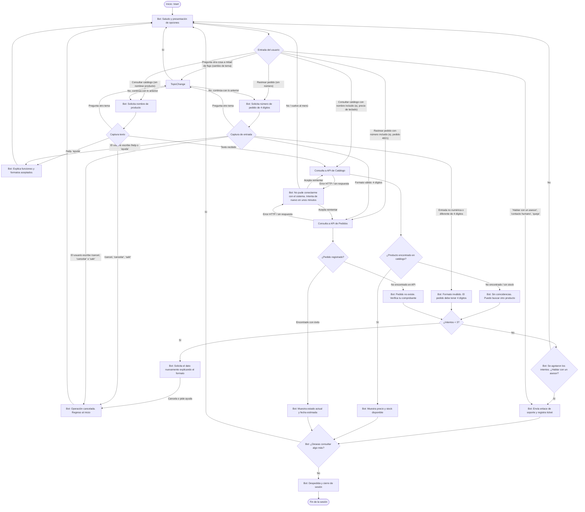

# Documento de Diseño Conversacional

**Materia:** Comercio Electrónico (CET 115 - Ciclo II / 2026)  
**Estudiante:** BH23004  
**Etapa:** Sesión 1 - Diseño y puesta en marcha del bot

---

## 1. Lista de Chequeo de Diseño Conversacional

### Perfil e Investigación del Usuario

- **¿Quién usará el chatbot?:** Clientes y compradores de la tienda en línea que requieren asistencia ágil desde la aplicación móvil o de escritorio de Telegram.
- **Edad, ocupación e intereses:** Personas entre 18 y 55 años; estudiantes, trabajadores y profesionales que compran por internet y valoran la inmediatez en el soporte.
- **Nivel de experiencia técnica:** Básico a intermedio. Están familiarizados con interfaces de mensajería instantánea, pero requieren indicaciones claras para evitar confusiones de sintaxis.

### Definición del Problema y Necesidades

- **¿Qué problemas resuelve?:**
  1. Reduce la saturación en los canales de atención humana resolviendo consultas repetitivas de forma desatendida las 24 horas.
  2. Elimina la fricción de navegación web para comprobar el estado logístico de una orden o la existencia de un producto.
- **¿Qué necesidades específicas atiende?:**
  - Consulta de estatus de pedidos (tracking de despacho).
  - Búsqueda de disponibilidad y precio de artículos en catálogo.
  - Punto de contacto directo hacia soporte humano en casos de incidencias.

### Interacción y Tipos de Datos

- **¿Qué preguntas se pueden hacer?:**
  - "¿Dónde viene mi pedido?" / "Rastrear orden 4821"
  - "¿Tienen laptops disponibles?" / "Precio de teclado mecánico"
  - "Hablar con un asesor" / "Ayuda" / "Cancelar"
- **¿Qué tipo de respuesta se espera en cada caso?:**
  - **Identificador de pedido:** Dato numérico entero estricto de 4 dígitos (`integer`).
  - **Búsqueda de productos:** Cadena de texto libre con el nombre del artículo o categoría (`string`).
  - **Confirmaciones / Selección:** Palabras clave (`Sí`, `No`) o selección por teclado en pantalla.

### Escenarios Alternativos y Manejo de Errores

- **Entrada de formato inválido:** Si el usuario ingresa letras o un número de orden que no contiene 4 dígitos, el bot explica el formato esperado y solicita el dato nuevamente. Tras **3 intentos fallidos**, ofrece hablar con un asesor o volver al menú principal.
- **Recurso no encontrado:** Si la orden no existe en la base de datos o el producto no tiene stock, el bot notifica la ausencia y ofrece reintentar (máximo 3 intentos) o volver al menú principal; puede desviar a soporte humano.
- **Fallo del backend / API:** Si la API de Pedidos o de Catálogo no responde o devuelve un error HTTP, el bot informa con un mensaje no técnico ("no pude conectarme con el sistema en este momento") y ofrece reintentar o regresar al menú.
- **Desvío / Cambio de tema:** Si el usuario saluda o pregunta otra cosa durante un flujo activo, el bot pregunta si desea cancelar la operación en curso antes de cambiar de contexto. Si acepta, retoma desde el menú principal la nueva solicitud; si no, continúa pidiendo el dato que faltaba. Los comandos `/help` y `/cancel` se interceptan incluso mientras el bot espera un dato.
- **Comandos globales de escape:** En cualquier etapa (incluida la captura de datos), las palabras "cancelar", "salir" o el comando `/cancel` abortan la operación y regresan al menú principal; `/help` o "ayuda" muestran las funciones disponibles sin perder el contexto.

### UI y Accesibilidad

- Textos concisos estructurados en un máximo de dos a tres oraciones por mensaje.
- Uso de negritas en datos clave (números de guía, estado, precios) para facilitar la lectura rápida en dispositivos móviles.

### Validación del Prototipo

- **Pruebas de usabilidad:** Sesión con dinámica del Mago de Oz evaluando un camino feliz y un camino con fricción (errores intencionales de entrada).
- **Pruebas de desempeño:** Verificación del tiempo de respuesta HTTP de la Telegram Bot API (< 1.5 segundos por respuesta).

### Privacidad y Gestión de Datos

- **Datos recolectados:** `chat_id` de Telegram (requerido para el enrutamiento de mensajes) y número de orden consultado.
- **Finalidad:** Realizar consultas a la API de logística y catálogo.
- **Política de retención:** Los datos de sesión se procesan en memoria volátil. No se almacenan nombres personales, direcciones ni datos bancarios en bases de datos locales; la información de sesión se descarta al concluir el flujo o ejecutar cancelación.

---

## 2. Inventario de Intenciones

| Intención            | Ejemplo de enunciado                                      | Frecuencia | Prioridad | Dato / API                                |
| :------------------- | :-------------------------------------------------------- | :--------- | :-------- | :---------------------------------------- |
| `saludo_inicio`      | `/start`, `hola`, `iniciar`                               | Alta       | 1         | Ninguno                                   |
| `consultar_pedido`   | `¿Dónde está mi paquete?`, `Rastrear pedido 4821`         | Alta       | 1         | API de Pedidos (`id_pedido`: 4 dígitos)   |
| `consultar_catalogo` | `¿Tienen monitores?`, `Ver catálogo`, `Precio de teclado` | Alta       | 1         | API de Catálogo (`query_producto`: texto) |
| `solicitar_soporte`  | `Hablar con un asesor`, `Contacto humano`, `Queja`        | Media      | 2         | API de Tickets / Enlace de soporte        |
| `ayuda`              | `/help`, `ayuda`, `¿qué puedes hacer?`                    | Media      | 2         | Ninguno                                   |
| `cancelar_flujo`     | `/cancel`, `cancelar`, `salir`, `volver`                  | Media      | 1         | Ninguno (Reinicio de estado en memoria)   |

---

## 3. Diálogo de Muestra (Camino Feliz - Consulta de Pedido)

- **Usuario:** `/start`
- **Bot:** ¡Hola! Soy el asistente virtual de la tienda. Puedo ayudarte a rastrear tu pedido o consultar productos en nuestro catálogo. ¿Qué deseas hacer hoy?
- **Usuario:** Rastrear mi pedido
- **Bot:** Con gusto. Por favor escribe tu número de pedido (son 4 dígitos numéricos, lo encuentras en tu correo de compra).
- **Usuario:** 4821
- **Bot:** Tu pedido #4821 se encuentra **en tránsito** con el servicio de encomienda local y su entrega está programada para mañana antes de las 5:00 PM. ¿Deseas realizar otra consulta?
- **Usuario:** No, gracias
- **Bot:** ¡Ha sido un gusto ayudarte! Si necesitas algo más adelante, solo escribe /start. ¡Feliz día!

---

## 4. Diagrama de Flujo de la Conversación

**Notas del diagrama:**

- **Contador de intentos:** `ErrFormat` (formato inválido) y `NoProd` (no encontrado) comparten la subrutina `CheckAttempts`; al tercero, el bot ofrece derivar a un asesor (`CallSupport`) o volver al menú, evitando bucles infinitos.
- **Intercepción global:** durante cualquier captura de datos (`ReadOrder`, `ReadProd`) y en cada espera de entrada, `/cancel` y `/help` se detectan _antes_ de validar el formato del dato, por lo que niega el problema del dato tratado como inválido.
- **Slot filling:** si la intención llegó con el dato ya incluido ("rastrear pedido 4821", "precio de teclado"), el flujo salta directamente a la consulta a la API, sin volver a pedir el dato.
- **Fallo de API:** tanto la API de Pedidos como la de Catálogo tienen una rama `ApiFail` con mensaje no técnico, opción de reintentar o regresar al menú.
- **Cambio de tema:** mientras el bot espera un dato, una entrada que corresponde a otra intención llega a `TopicChange`, que confirma si se abandona la operación actual antes de redirigir al menú.
