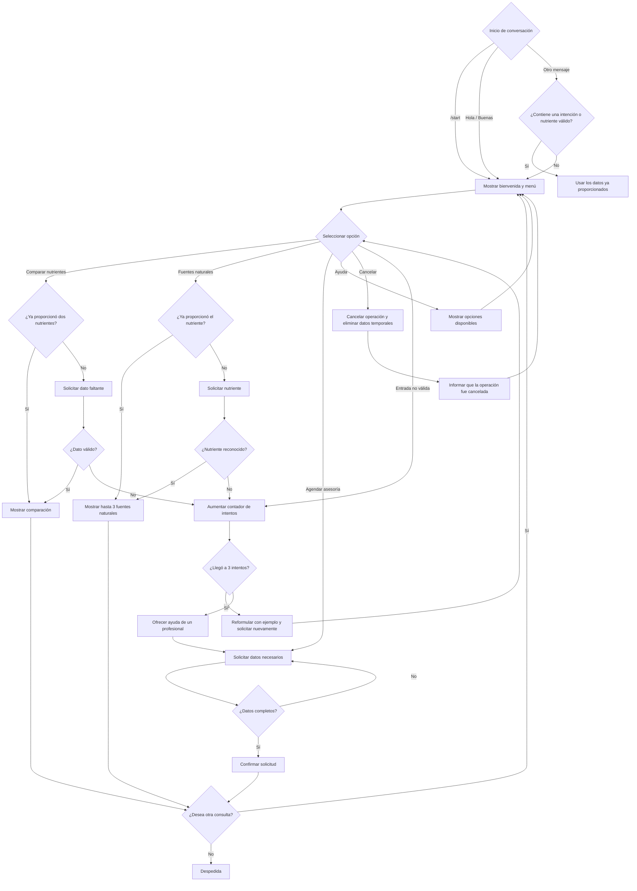

# Diseño conversacional — NutriGuía

## 1. Lista de chequeo

### ¿Quién usará el chatbot?
Personas mayores de 18 años interesadas en nutrición, vitaminas, minerales y alimentación consciente.

### ¿Qué problema resuelve?
Resuelve dudas rápidas sobre nutrientes, sus funciones y fuentes naturales. También orienta al usuario para solicitar una asesoría nutricional.

### ¿Qué necesidades específicas tienen?
- Obtener información clara y rápida.
- Comparar vitaminas o nutrientes.
- Consultar fuentes naturales.
- Solicitar una asesoría profesional.

### ¿Qué preguntas se pueden hacer?
- ¿Cuál es la diferencia entre vitamina B y vitamina B12?
- ¿Qué alimentos contienen vitamina K?
- ¿Cómo puedo obtener vitamina D naturalmente?
- ¿Para qué sirve la vitamina C?
- ¿Cómo solicito una asesoría?

### ¿Qué tipo de respuesta se espera?
- Texto breve.
- Listas cortas de hasta tres elementos.
- Comparaciones entre nutrientes.
- Opciones de selección.

### ¿Cuál es su edad, ocupación, intereses y nivel tecnológico?
Personas mayores de 18 años, estudiantes, trabajadores o profesionales interesados en nutrición y bienestar, con conocimientos básicos o intermedios de tecnología.

### ¿Cuáles son los escenarios alternativos?
- Nutriente no reconocido.
- Información incompleta.
- Usuario cambia de tema.
- Solicita ayuda.
- Cancela la operación.
- Realiza una consulta médica fuera del alcance del bot.
- El usuario supera tres intentos con datos inválidos.

### ¿UI y accesibilidad?
Se utilizarán mensajes cortos, lenguaje sencillo, listas de máximo tres elementos y comandos como `/start`, `/ayuda` y `/cancelar`. También se aceptarán saludos comunes como "Hola" o "Buenas" para mostrar el menú principal.

### ¿Cómo se validará el prototipo?
Mediante pruebas con usuarios, solicitándoles comparar nutrientes, consultar fuentes naturales, pedir ayuda, cancelar operaciones y probar entradas incorrectas.

### Pruebas de usabilidad y desempeño
Se evaluará claridad de los mensajes, facilidad de uso, manejo de errores, límite de intentos y tiempo de respuesta.

### ¿Privacidad?
No se solicitarán datos personales para consultas informativas. Solo se pedirán datos básicos cuando el usuario desee solicitar una asesoría. Si el usuario cancela una operación, los datos temporales de esa sesión serán descartados.

### ¿Qué datos se recolectarán, para qué y cuándo se eliminarán?
Se utilizará el nombre del nutriente y el tipo de consulta para generar las respuestas. Para una asesoría podrán solicitarse datos básicos de contacto. Los datos temporales se eliminarán al finalizar o cancelar la sesión cuando ya no sean necesarios.

---

## 2. Inventario de intenciones

| Intención | Ejemplo de enunciado | Frecuencia | Prioridad | Dato / API |
|---|---|---|---|---|
| Diferenciar nutrientes | ¿Cuál es la diferencia entre vitamina B y B12? | Alta | 1 | API nutricional |
| Consultar fuentes naturales | ¿Qué alimentos contienen vitamina K? | Alta | 1 | API nutricional |
| Consultar función de un nutriente | ¿Para qué sirve la vitamina C? | Alta | 1 | API nutricional |
| Agendar asesoría | Quiero solicitar una asesoría | Baja | 2 | Sistema de citas |
| Solicitar ayuda | ¿Qué puedes hacer? | Media | 2 | No requiere API |
| Cancelar operación | Cancelar | Baja | 2 | No requiere API |

---

## 3. Diagrama de flujo de la conversación

---

## 4. Diálogo de muestra — Camino feliz

**Usuario:** Hola

**Bot:** ¡Hola! Soy NutriGuía, tu Asesor Virtual de Nutrición Natural. Puedo ayudarte a:

1. Comparar nutrientes.
2. Consultar fuentes naturales.
3. Solicitar una asesoría nutricional.

¿Qué deseas hacer?

**Usuario:** Quiero consultar fuentes naturales de vitamina B12.

**Bot:** Algunas fuentes de vitamina B12 son:

1. Pescados.
2. Carnes.
3. Huevos.

Esta información tiene fines educativos y no sustituye una recomendación profesional.

¿Deseas realizar otra consulta?

**Usuario:** No.

**Bot:** Gracias por utilizar NutriGuía.

---

## 5. Cambios realizados tras la revisión entre pares

1. **Se aceptaron saludos comunes como "Hola" o "Buenas" para iniciar la conversación.**  
   Origen: en el Guion 1 se detectó que el flujo solo aceptaba `/start`.

2. **Se limitaron las listas de fuentes naturales a un máximo de tres elementos por mensaje.**  
   Origen: observación de Grice sobre cantidad y facilidad de lectura en dispositivos móviles.

3. **Se agregó una validación para reutilizar nutrientes que el usuario ya haya escrito en su mensaje inicial.**  
   Origen: observación de Grice sobre relleno de datos y evitar preguntas repetidas.

4. **Se agregó un límite de tres intentos para datos inválidos y una derivación a asesoría profesional al tercer fallo.**  
   Origen: en el Guion 2 se detectó un ciclo infinito al ingresar nutrientes no reconocidos.

5. **Se agregó eliminación de datos temporales al cancelar una operación.**  
   Origen: observación de reglas de producto y privacidad.

