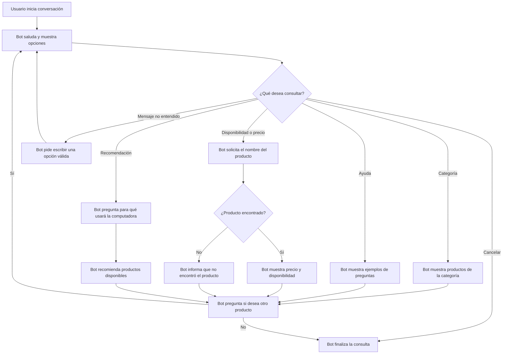

# Diseño conversacional - Tienda de computadoras

## Lista de chequeo

- **¿Quién usará el chatbot?** Clientes interesados en comprar computadoras, accesorios o consultar productos de la tienda.
- **¿Qué problema resuelve?** Ayuda a encontrar productos y conocer su disponibilidad sin tener que esperar atención de una persona.
- **¿Qué necesidades específicas tienen?** Saber si hay existencias, consultar precios y pedir recomendaciones según el uso que darán al equipo.
- **¿Qué preguntas se pueden hacer?** “¿Tienen laptops?”, “¿Cuánto cuesta una memoria RAM?”, “Necesito una computadora para estudiar” y “¿Tienen impresoras?”.
- **¿Qué tipo de respuesta espero en cada caso?** Texto para describir productos; número para precio y existencias; selección de una lista para elegir categoría o tipo de uso.
- **Edad, ocupación, intereses y experiencia con tecnología:** Personas de 16 años en adelante, estudiantes, profesionales y público general. Su experiencia tecnológica puede ser básica, por lo que el bot debe usar palabras sencillas.
- **Escenarios alternativos:** Producto no encontrado, producto sin existencias, mensaje no entendido, usuario que cambia de tema o que desea cancelar la consulta.
- **UI y accesibilidad:** Mensajes cortos, opciones numeradas, lenguaje sencillo y precios expresados claramente en dólares.
- **¿Cómo validar el prototipo?** Probar el diálogo con compañeros y pedirles que consulten un producto, precio y disponibilidad.
- **Pruebas de usabilidad y desempeño:** Verificar que el usuario pueda encontrar un producto sin ayuda y que el bot responda de forma clara y rápida.
- **Privacidad:** El bot no solicitará datos personales para consultar el catálogo. Si el usuario brinda información, se utilizará solo para responder su consulta y no se almacenará.

## Inventario de intenciones

| Intención | Ejemplo de enunciado | Frecuencia | Prioridad | Dato / API |
|---|---|---:|---:|---|
| Consultar disponibilidad | “¿Tienen laptops?” | Alta | 1 | API de catálogo: nombre del producto y existencias. |
| Consultar precio | “¿Cuánto cuesta una laptop Lenovo?” | Alta | 1 | API de catálogo: precio del producto. |
| Buscar por categoría | “Quiero ver memorias RAM” | Alta | 1 | API de catálogo: productos por categoría. |
| Pedir recomendación | “Necesito una computadora para estudiar” | Media | 2 | Catálogo: equipos según uso y presupuesto. |
| Consultar accesorios | “¿Tienen mouse inalámbrico?” | Media | 2 | API de catálogo: accesorios disponibles. |
| Pedir ayuda | “Ayuda” o “Menú” | Media | 2 | No requiere API; muestra las opciones disponibles. |
| Cancelar consulta | “Cancelar” | Baja | 2 | No requiere API; termina la consulta actual. |

## Diagrama de flujo de la conversación

## Diálogo de muestra - camino feliz

**Usuario:** Hola.

**Bot:** ¡Hola! Soy el asistente de la tienda de computadoras. Puedo consultar productos, precios y disponibilidad. ¿Qué necesitas?

**Usuario:** Quiero saber si tienen laptops.

**Bot:** Sí. Tenemos laptops Lenovo, HP y Asus. ¿Buscas una laptop para estudiar, trabajar o jugar?

**Usuario:** Para estudiar.

**Bot:** Te recomiendo la laptop Lenovo IdeaPad con 8 GB de RAM y 512 GB SSD. Tiene un precio de $650 y está disponible. ¿Deseas consultar otro producto?

**Usuario:** No, gracias.

**Bot:** De nada. Cuando necesites consultar otro producto, escríbeme nuevamente.
