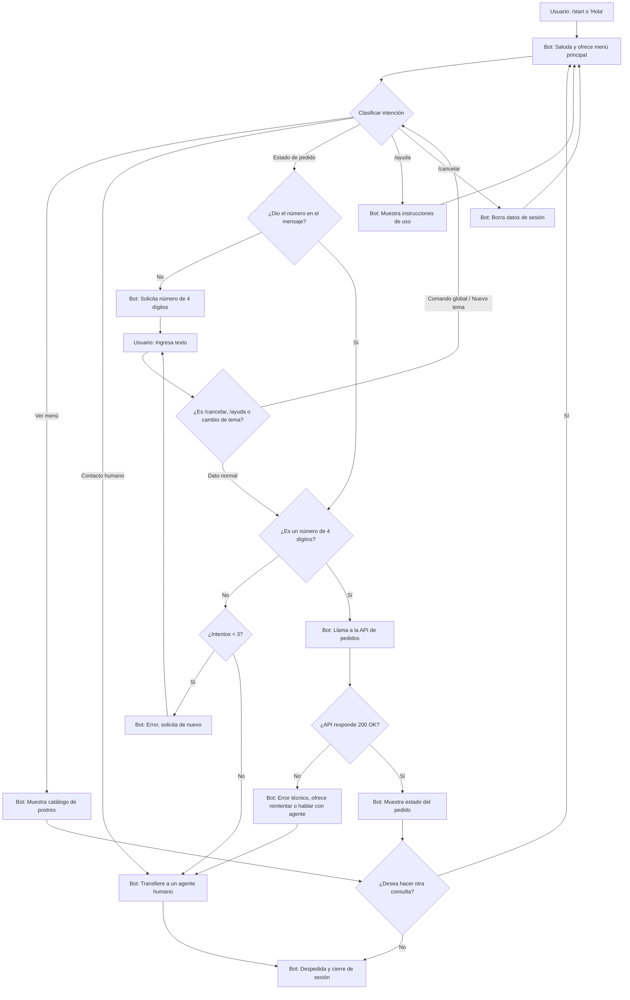

# Diseño Conversacional - Bot Tienda de Postres SP21013

## Lista de Chequeo
* **¿Quién usará el chatbot?** Clientes de San Salvador (18-50 años, con experiencia básica en apps de mensajería) que buscan adquirir postres artesanales bajo demanda.
* **¿Qué problema o problemas resuelve?** Automatizar la atención de consultas sobre precios y disponibilidad 24/7 sin tiempos de espera.
* **¿Qué necesidades específicas tienen?** Respuestas rápidas, información clara sobre el menú y seguimiento de sus compras.
* **¿Qué preguntas se pueden hacer?** "¿Tienen pastel de chocolate?", "¿Cuánto vale el envío?", "¿Dónde está mi orden?", "Quiero hablar con alguien".
* **¿Qué tipo de respuesta espero en cada caso?** Texto estructurado, selección de listas (menú) y números (precios).
* **¿Cuál es su edad, ocupación, intereses, nivel de experiencia con tecnología?** 18 a 50 años, estudiantes o profesionales ocupados, nivel de experiencia tecnológica de básico a intermedio.
* **¿Cuáles son los escenarios alternativos?** Ingresar un número de pedido incorrecto, superar el límite de intentos, fallo del servidor/API, cambiar de tema a mitad del flujo, o usar comandos globales (`/ayuda`, `/cancelar`).
* **¿UI, Accesibilidad?** Uso de mensajes cortos, botones integrados en Telegram (menús inline) y emojis para lectura ágil.
* **¿Cómo haré para validar mi prototipo?** Pruebas de usabilidad "Mago de Oz" y evaluación de pares usando las heurísticas de Grice.
* **¿Privacidad?** Solo se recolectará el número de orden y el ID del chat temporalmente. Los datos de la sesión se descartan al finalizar la consulta o usar `/cancelar`.

## Inventario de Intenciones
| Intención | Ejemplo de enunciado | Frecuencia | Prioridad | Dato / API |
| :--- | :--- | :--- | :--- | :--- |
| Consultar catálogo | "¿Qué postres tienen hoy?" | Alta | 1 | API de catálogo |
| Estado de pedido | "¿Dónde está mi pedido 1234?" | Alta | 1 | API de pedidos |
| Contacto humano | "Quiero hablar con alguien" | Media | 2 | Transferencia a agente |
| Ayuda | "/ayuda" | Baja | 3 | Flujo interno |
| Cancelar | "/cancelar" | Baja | 3 | Flujo interno |

## Diálogo de Muestra (Camino Feliz)

**Usuario:** Hola

**Bot:** ¡Hola! Soy el asistente virtual de Postres SP21013. Puedo mostrarte nuestro menú, consultar tu orden o comunicarte con alguien. Puedes escribir /ayuda o /cancelar en cualquier momento. ¿Qué necesitas?

**Usuario:** El estado de mi pedido

**Bot:** Claro. ¿Cuál es tu número de pedido de 4 dígitos?

**Usuario:** 1234

**Bot:** ¡Genial! Tu pedido 1234 (Pastel de Chocolate Supremo) va en camino y llega hoy por la tarde. ¿Deseas hacer otra consulta?

**Usuario:** No, gracias

**Bot:** ¡Gracias por preferir Postres SP21013! Adiós.

## Diagrama de Flujo

## Cambios aplicados tras la revisión entre pares (Pareja B: JO20004)

*   **Se permitió iniciar la conversación con un saludo natural:** Se modificó el diagrama de flujo para aceptar entradas comunes como "Hola" o "Buenos días", sin limitar el inicio exclusivamente al comando `/start`. *(Origen: Observación del Guion 1 - Camino feliz)*.
*   **Se mejoró la descubribilidad de las opciones:** Se añadió al mensaje de bienvenida la mención explícita de la opción de contacto humano y el uso del comando `/ayuda`. *(Origen: Observación de la Pregunta 1 - Alcance y descubribilidad)*.
*   **Se optimizó la longitud de los mensajes:** Se acortó ligeramente el texto del bot en el turno donde solicita el número de pedido para hacerlo más ágil. *(Origen: Observación de la Pregunta 2 - Grice: cantidad, relación y manera)*.
*   **Se evitó la redundancia al pedir datos:** Se incorporó una validación en el diagrama de flujo para no volver a solicitar el número de orden si el usuario ya lo proporcionó en su primer mensaje. *(Origen: Observación de la Pregunta 3 - Grice: calidad y relleno de datos)*.
*   **Se integraron flujos de error y navegación global:** Se agregaron las ramas faltantes al diagrama de flujo para manejar entradas inválidas con un tope de 3 intentos, comandos globales (`/ayuda`, `/cancelar`) y la derivación estructurada a un agente humano. *(Origen: Observaciones de la Pregunta 4 - Manejo de errores y Pregunta 5 - Reglas de producto)*.

## Cambios aplicados tras la retroalimentación del docente
* **Se cerraron los callejones sin salida:** Se agregó el rombo de decisión ¿Desea hacer otra consulta? para regresar al menú principal o terminar la interacción. *(Origen: Problemas lógicos generales 2 y 3)*.
* **Se completó el ciclo del diálogo de muestra:** Se añadieron los turnos finales de despedida en el guion. *(Origen: Comentario directo sobre el diálogo incompleto)*.
* **Se implementó un interceptor global y cambio de tema:** Se añadió el nodo F_Global antes de validar el formato, garantizando que /cancelar, /ayuda o un cambio de tema funcionen en cualquier punto del flujo. *(Origen: Problemas lógicos generales 4 y 8)*.
* **Se agregó la rama de fallo del sistema (API):** Se incluyó la validación ¿API responde 200 OK? para manejar caídas del servidor y ofrecer derivación a soporte. *(Origen: Problema lógico general 7)*.
* **Se conectó explícitamente el contacto humano:** Se integró el nodo de transferencia a agente en el diagrama, resolviendo una promesa del inventario que estaba huérfana. *(Origen: Problema lógico general 6)*.
