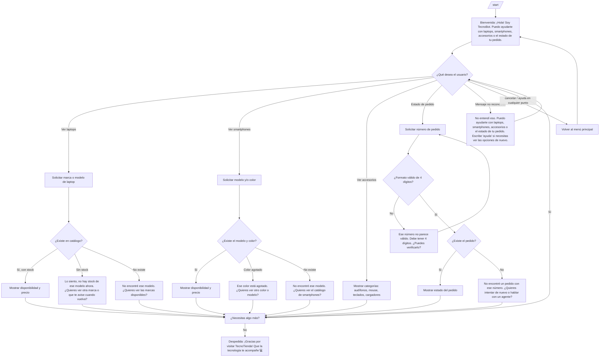

# Diseño Conversacional — TecnoBot

**Curso:** CET 115 — Comercio Electrónico
**Laboratorio 5 — Sesión 1**
**Bot:** Tienda de tecnología (laptops, smartphones, accesorios y componentes de PC)

---

## Actividad 1 — Diseño de conversación efectiva

### Lista de chequeo

**¿Quién usará el chatbot?**
Personas que compran tecnología en línea: clientes que buscan un dispositivo específico (laptop, smartphone, tablet), usuarios que quieren un accesorio o componente puntual (mouse, audífonos, cargador, RAM), y compradores que ya hicieron un pedido y quieren saber su estado.

**¿Qué problema o problemas resuelve?**
- Reduce el tiempo de espera para saber si un producto específico (modelo, marca, especificación) está disponible, sin tener que llamar o escribir a un vendedor.
- Da seguimiento al estado de un pedido sin depender de que un agente humano revise manualmente.
- Ayuda a comparar disponibilidad y precio antes de decidir la compra.

**¿Qué necesidades específicas tienen?**
- Saber si hay stock de un producto puntual antes de decidir comprar (ej. una laptop de cierta marca, un smartphone de cierta capacidad de almacenamiento).
- Conocer especificaciones básicas (RAM, almacenamiento, color) disponibles de un modelo.
- Dar seguimiento a un pedido ya realizado.

**¿Qué preguntas se pueden hacer?**
- "¿Tienen laptops HP disponibles?"
- "¿Qué colores hay del smartphone Galaxy A55?"
- "¿Cuánto cuesta un mouse inalámbrico Logitech?"
- "¿Dónde está mi pedido 5678?"

**¿Qué tipo de respuesta espero en cada caso?**
- Producto / especificación (marca, modelo, color, capacidad): selección de lista o texto corto.
- Número de pedido → texto/número (4 dígitos).
- Confirmaciones (sí/no, continuar) → selección de botón.

**¿Cuál es su edad, ocupación, intereses, nivel de experiencia con tecnología?**
- Edad: principalmente 18–45 años, con un segmento secundario de 45–60 años comprando equipo para trabajo u oficina.
- Ocupación: estudiantes, profesionales, freelancers, gamers.
- Intereses: tecnología, productividad, videojuegos, trabajo remoto.
- Nivel tecnológico: medio a alto. Interacción simplificada mediante botones guiados, ya que algunos usuarios pueden no conocer términos técnicos avanzados.

**¿Cuáles son los escenarios alternativos (errores, datos faltantes, el usuario cambia de tema)?**
- El usuario pregunta por un producto que no existe o está agotado.
- El usuario escribe un número de pedido inexistente o con formato incorrecto (letras, menos de 4 dígitos).
- El usuario cambia de intención a mitad del flujo (ej. está dando su número de pedido y de repente pregunta por una laptop).
- El usuario escribe algo que el bot no reconoce (mensaje ambiguo o fuera de dominio).
- El usuario pide ayuda o cancelar en cualquier punto del flujo.

**¿UI, Accesibilidad?**
- Uso de *inline keyboards* de Telegram para las opciones principales (Laptops 💻, Smartphones 📱, Accesorios 🎧, Estado de pedido 📦), reduciendo la necesidad de escribir texto libre.
- Mensajes cortos, sin jerga técnica innecesaria ni abreviaciones de sistema (nunca mostrar errores tipo "Error 404").
- Texto siempre legible sin depender de imágenes; si se envía una foto de producto, se incluye descripción en texto.

**¿Cómo haré para validar mi prototipo?**
Mediante la técnica del Mago de Oz (Actividad 4): un compañero simula ser el bot siguiendo únicamente el guion y el diagrama de flujo de este documento, mientras otro actúa como usuario real, sin mejorar ni improvisar respuestas. Esto permite detectar huecos en el diseño antes de programarlo.

**Pruebas de usabilidad, desempeño**
- Verificar que un usuario nuevo pueda completar el flujo de "consultar disponibilidad de una laptop" sin ayuda externa.
- Medir cuántos turnos toma llegar a una respuesta útil.
- Revisar que el bot ofrezca continuar o cerrar la conversación después de cada intención resuelta.

**¿Privacidad?**
- Datos que se recolectan: número de pedido (para consultarlo en la API), y si el usuario decide comprar, nombre y dirección de envío (fuera del alcance de este bot inicial, se derivaría a un checkout externo).
- Para qué: únicamente para responder la consulta del usuario en el momento; el bot no almacena historial de conversación más allá de la sesión activa.
- No se solicitan ni almacenan datos de pago (tarjetas) dentro del chat.
- Cuándo se eliminan: los datos de sesión (contexto de la conversación) se descartan al cerrar o expirar el chat; no se conserva un historial permanente salvo el registro de pedidos que ya existe en el sistema de la tienda (ajeno al bot).

---

### Inventario de intenciones

| Intención | Ejemplo de enunciado | Frecuencia | Prioridad | Dato / API |
|---|---|---|---|---|
| Consultar disponibilidad de laptops | "¿tienen laptops HP disponibles?" | Alta | 1 | API de catálogo (laptops) |
| Estado de un pedido | "¿dónde está mi pedido 5678?" | Alta | 1 | API de pedidos |
| Consultar disponibilidad de smartphones | "¿qué colores hay del Galaxy A55?" | Alta | 1 | API de catálogo (smartphones) |
| Consultar precio de un producto | "¿cuánto cuesta un mouse Logitech?" | Media | 2 | API de catálogo |
| Cancelar / pedir ayuda | "cancelar", "ayuda", "menú" | Baja | 1 | Control de flujo interno |

---

### Diagrama de flujo

---
