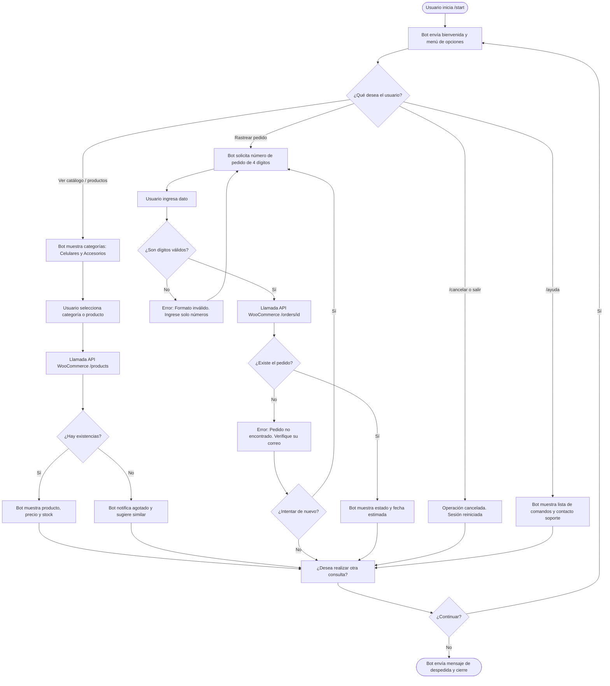

# Documento de Diseño Conversacional - Tienda MC21105

- **Estudiante:** David Alexander Mendez Cuellar
- **Carnet:** MC21105
- **Materia:** Comercio Electrónico (CET 115) - Ciclo II / 2026
- **Tienda vinculada:** Tienda MC21105 (tienda.mc21105.duckdns.org)
- **Especialidad:** Celulares y Accesorios tecnológicos (smartphones, cargadores, cables USB-C, audífonos, fundas)

---

## 1. Lista de Chequeo de Diseño de Conversación Efectiva

### ¿Quién usará el chatbot?
Clientes finales, compradores recurrentes y usuarios que navegan la tienda en línea de celulares y accesorios tecnológicos buscando atención inmediata y resolución ágil de dudas pre-compra y post-compra sin navegar por menús web complejos.

### ¿Qué problema o problemas resuelve?
- **Disponibilidad inmediata:** Consultas 24/7 sobre stock, compatibilidad de accesorios y especificaciones de smartphones.
- **Seguimiento autoservicio:** Consulta en tiempo real del estado de entrega de pedidos realizados en WooCommerce mediante su identificador numérico.
- **Reducción de fricción:** Evita la saturación de los canales de soporte humano para consultas repetitivas de catálogo y despacho.

### ¿Qué necesidades específicas tienen los usuarios?
- Respuestas directas y concisas en la app de mensajería (Telegram) que ya utilizan habitualmente.
- Claridad en la compatibilidad de accesorios (ej. si un cargador o cable USB-C es compatible con su dispositivo).
- Certeza sobre el estado y fecha estimada de entrega de sus órdenes.

### ¿Qué preguntas se pueden hacer?
- "¿Tienen cargadores de carga rápida disponibles?"
- "¿Cuáles fundas o cases tienen para smartphones?"
- "¿Cuánto cuesta el cable USB-C?"
- "¿Dónde viene mi pedido #1045?"
- "¿Cuáles son los métodos de pago o políticas de envío?"

### ¿Qué tipo de respuesta espera el bot en cada caso?
- **Categoría o Producto:** Selección a partir de botones o texto estructurado (ej. "celulares", "cargadores", "fundas").
- **Número de pedido:** Valor numérico entero positivo (ej. `1045` o `1234`).
- **Confirmaciones:** Selección binaria estructurada (Sí / No) o comandos de control (`/cancelar`, `/ayuda`).

### ¿Cuál es el perfil del usuario (edad, ocupación, intereses, nivel tecnológico)?
- **Rango de edad:** 18 a 45 años.
- **Ocupación:** Estudiantes universitarios, profesionales jóvenes y entusiastas de la tecnología.
- **Intereses:** Dispositivos móviles, accesorios de calidad, entregas puntuales y soporte eficiente.
- **Nivel tecnológico:** Medio a avanzado (familiarizados con el uso cotidiano de mensajería instantánea y compras digitales).

### ¿Cuáles son los escenarios alternativos contemplados?
- **ID de pedido con formato inválido:** El usuario ingresa letras o símbolos en lugar de dígitos numéricos; el bot solicita la corrección con un ejemplo claro.
- **Pedido no encontrado en WooCommerce:** El bot informa que el número no existe en la base de datos y ofrece revisar el correo de confirmación o contactar a soporte.
- **Producto sin existencias:** El bot notifica la falta de stock actual y sugiere artículos sustitutos o similares.
- **Interrupción o cancelación:** El usuario escribe `/cancelar` o solicita cambiar de intención a mitad de un flujo; el bot reinicia el contexto limpiamente.
- **Mensajes fuera de dominio (fallback):** Si el mensaje no coincide con ninguna intención, el bot despliega un menú de opciones válidas sin romperse.

### UI y Accesibilidad
- **Mensajes concisos:** Respuestas no mayores a 3 líneas por turno para evitar fatiga visual en pantallas móviles.
- **Legibilidad:** Uso consistente de tipografía estándar de Telegram, listas con viñetas para enumerar productos y negritas para resaltar datos clave (precio, ID, estado).
- **Control y navegación:** Comandos visibles (`/start`, `/catalogo`, `/pedido`, `/ayuda`, `/cancelar`) y botones de respuesta rápida para reducir errores de tipeo en teclados virtuales.

### Validación del prototipo (Usabilidad y Desempeño)
- **Pruebas de Usabilidad:** Dinámica de Mago de Oz con revisión entre pares (evaluación según máximas conversacionales de Paul Grice: Cantidad, Calidad, Relación y Modo).
- **Pruebas de Desempeño y Carga:** Medición de latencia en consultas a la API de Telegram y verificación del ciclo de respuesta mediante Long Polling (tiempo de respuesta objetivo < 1.5 segundos).

### Privacidad y Gestión de Datos
- **Principio de minimización:** Únicamente se solicita el ID de pedido y el ID de chat de Telegram necesario para enviar la notificación.
- **No almacenamiento de credenciales ni secretos:** Los tokens de acceso se almacenan exclusivamente en variables de entorno del servidor (`.env`) fuera del control de versiones.
- **Política de retención:** Los identificadores de consulta se procesan en memoria volátil durante la sesión conversacional y no se persisten datos de pago o tarjetas de crédito en el bot.

---

## 2. Inventario de Intenciones

| Intención | Ejemplo de enunciado | Frecuencia | Prioridad | Dato / API |
| :--- | :--- | :--- | :--- | :--- |
| `iniciar_bot` | /start, Hola, Buenas tardes | Alta | 1 | Telegram Bot API (`getMe`, `sendMessage`) |
| `consultar_catalogo` | ¿Qué accesorios tienen?, ver celulares | Alta | 1 | API WooCommerce (`/wp-json/wc/v3/products`) |
| `consultar_disponibilidad` | ¿Tienen cable USB-C disponible?, ¿hay stock? | Alta | 1 | API WooCommerce (`stock_status`, `stock_quantity`) |
| `estado_pedido` | ¿Dónde está mi pedido?, rastrear compra | Alta | 1 | API WooCommerce (`/wp-json/wc/v3/orders/{id}`) |
| `solicitar_ayuda` | /ayuda, ¿qué puedes hacer?, soporte humano | Media | 2 | Plantilla interna de comandos y contacto |
| `cancelar_operacion` | /cancelar, salir, regresar al menú | Media | 2 | Manejador de estado en sesión |

---

## 3. Diálogo de Muestra (Camino Feliz - Consulta de Pedido)

- **Usuario:** `/start`
- **Bot:** ¡Hola! Bienvenido a Tienda MC21105. Puedes consultar nuestro catálogo de teléfonos y accesorios o el estado de tus pedidos. ¿En qué te puedo ayudar hoy?
- **Usuario:** Quisiera ver el estado de mi pedido
- **Bot:** Con gusto te ayudo a rastrearlo. Por favor, ingresa el número de tu pedido (son 4 dígitos y se encuentra en el correo de confirmación de tu compra).
- **Usuario:** `1045`
- **Bot:** Tu pedido **#1045** (1x Cable USB-C Carga Rápida + 1x Case Antigolpes) se encuentra en estado: **Enviado**. La entrega estimada es el día de mañana antes de las 4:00 PM. ¿Te gustaría consultar algo más?
- **Usuario:** No, muchas gracias, eso sería todo.
- **Bot:** ¡Excelente! Fue un placer atenderte en Tienda MC21105. Si necesitas algo más, solo escribe `/ayuda` o `/start`. ¡Que tengas un gran día!

---

## 4. Diagrama de Flujo Conversacional (Mermaid)

---
# Observaciones - GT22004 - José García
## 1. REsultado Mago de Oz

| Entrada del Usuario | Intención Real / Contexto | Motivo del Fallo en el Diseño |
| :--- | :--- | :--- |
| `celulares(prductos)` | Selección de categoría en catálogo | El flujo asume que al seleccionar categoría se llama a `/products`, pero no define la estructura de respuesta cuando el usuario pide un listado general de una categoría sin un producto específico. |
| `.` | Carácter suelto / entrada vacía | No existe tratamiento para entradas no alfanuméricas o caracteres huérfanos. |
| `quiero hablar con el superior` | Entrada fuera de dominio  | Mismo caso de fallback ausente: no existe un mensaje de escape estándar que redirija al menú principal ante intenciones no reconocidas. |

## 2. Respuesta de las 5 preguntas

### 1. Alcance y descubribilidad
* **Veredicto:** Resuelto.
* **Evidencia:** El mensaje de bienvenida delimita con claridad en dos frases el alcance exacto del bot (catálogo y pedidos), permitiendo entender la función principal sin confusión.
* **Mejora:** Complementar el mensaje añadiendo comandos visibles o ejemplos: Escribe /catalogo, /pedido o /ayuda para ver las opciones disponibles.
### 2. Grice en el guion — cantidad, relación, manera
* **Veredicto:** Parcial.
* **Evidencia:** En catálogo da información insuficiente (lista categorías pero no despliega productos al elegir).
* **Mejora:** Turnos breves con datos directos: *«En Celulares tenemos: 1. Modelo X ($120), 2. Modelo Y ($250). ¿Cuál te interesa?»*
### 3. Grice — calidad, y relleno de datos
* **Veredicto:** Parcial.
* **Evidencia:** Los datos de stock coinciden con la API, pero si el usuario envía el producto desde el primer turno, el diagrama fuerza a navegar las categorías antes de consultar.
* **Mejora:** Extraer entidad en el primer mensaje y saltar directo a la consulta de la API sin obligar a elegir categoría.
### 4. Manejo de errores 
* **Veredicto:** parcial
* **Evidencia:** No hay ramas para entradas fuera de dominio (generó "diseño no contempla"), pero tiene mensajes de error en pedidos y responde claramente lo que requiere
* **Mejora:** Crear un nodo global de Fallback: *«No pude entenderte  escribe /inicio para volver al menú.»*
### 5. Reglas de producto
* **Veredicto:** Parcial.
* **Evidencia:** escribir "catálogo" durante la consulta de pedido provocó error de formato y atrapó al usuario en un bucle. pero si cuenta con comandos /cancelar /help
* **Mejora:** Priorizar la intercepción de /cancelar, /help e intenciones antes de validar formatos, liberando el flujo: «Operación cancelada. ¿Qué deseas consultar ahora?»
