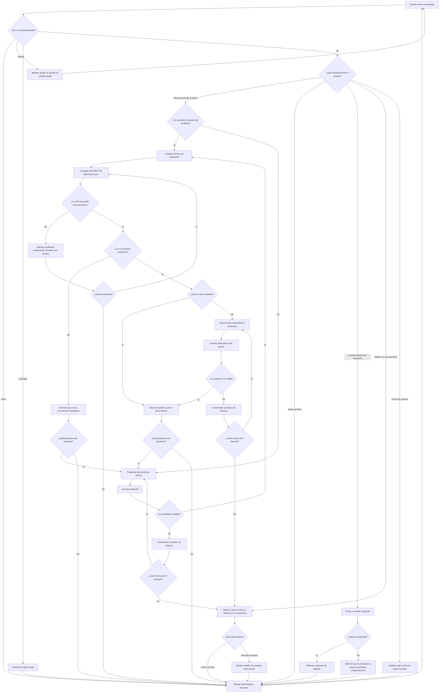

# Diseño conversacional - FerreBot

## 1. Descripción general

**FerreBot** es un chatbot de Telegram diseñado para una tienda de ferretería que utiliza WooCommerce.

Su objetivo principal es permitir que los clientes busquen productos y consulten sus precios de forma rápida desde Telegram, sin necesidad de recorrer manualmente todo el catálogo de la tienda web.

En esta versión, el bot consultará la API REST de WooCommerce para obtener información real del catálogo. Además, utilizará un modelo de OpenAI mediante su API para responder consultas abiertas relacionadas con herramientas y ferretería.

FerreBot seguirá un enfoque híbrido:

- Las búsquedas de productos y precios se resolverán con la API de WooCommerce.
- Los comandos y acciones de control se resolverán mediante reglas.
- Las consultas abiertas relacionadas con ferretería se enviarán a OpenAI mediante su API.
- Los temas fuera de alcance se rechazarán de forma clara.
- Si el usuario no puede completar una interacción después de varios intentos, se ofrecerá derivación a una persona.

---

# 2. Lista de chequeo

## ¿Quién usará el chatbot?

El chatbot estará dirigido principalmente a clientes generales de la ferretería que desean consultar productos, precios o hacer preguntas básicas relacionadas con herramientas.

No se espera que el usuario tenga conocimientos técnicos avanzados ni que conozca comandos complejos.

---

## ¿Qué problema resuelve?

Actualmente, un cliente que desea conocer el precio de un producto debe buscarlo manualmente en el sitio web de la ferretería o consultar directamente con una persona.

FerreBot permitirá realizar esta consulta directamente desde Telegram escribiendo el nombre del producto.

También podrá responder preguntas generales relacionadas con herramientas y ferretería mediante OpenAI, siempre que no se trate de precios, existencias o información que deba verificarse en WooCommerce.

Esto busca reducir el tiempo necesario para encontrar información básica del catálogo y resolver dudas sencillas.

---

## ¿Qué necesidades específicas tienen los usuarios?

Los usuarios necesitan:

- Buscar productos de manera rápida.
- Consultar el precio de un producto.
- Obtener resultados claros y fáciles de entender.
- Saber cuando un producto no existe.
- Elegir entre varios productos cuando existen coincidencias similares.
- Hacer preguntas generales relacionadas con herramientas.
- Poder realizar otra búsqueda.
- Poder cancelar una búsqueda.
- Obtener ayuda cuando no sepan cómo utilizar el bot.
- Poder solicitar atención humana si el bot no puede resolver el problema.

---

## ¿Qué preguntas se pueden hacer?

Ejemplos de consultas que el usuario podría realizar:

- ¿Cuánto cuesta un martillo?
- Busco pintura blanca.
- Quiero buscar un taladro.
- ¿Cuál es el precio de un serrucho?
- Buscar martillo.
- ¿Para qué sirve una llave Allen?
- ¿Qué herramienta puedo usar para apretar una tuerca?
- Quiero buscar un producto.
- Ayuda.
- Cancelar.
- Quiero hablar con una persona.

El bot tendrá dos tipos principales de respuesta:

1. Consultas sobre productos y precios: se responderán usando WooCommerce.
2. Consultas abiertas relacionadas con ferretería: se responderán usando OpenAI.

Si el usuario realiza una pregunta fuera de este alcance, FerreBot le explicará qué funciones tiene disponibles.

---

## ¿Qué tipo de respuesta se espera en cada caso?

| Situación | Tipo de respuesta |
|---|---|
| Inicio de conversación | Texto y opciones |
| Solicitud de producto | Texto |
| Producto encontrado | Nombre y precio |
| Varios productos encontrados | Lista de opciones |
| Producto no encontrado | Texto |
| Entrada incorrecta | Texto de orientación |
| Consulta abierta de ferretería | Texto generado por OpenAI |
| Solicitud de ayuda | Texto |
| Cancelación | Texto y regreso al inicio |
| Solicitud de atención humana | Texto de derivación |

---

## Perfil del usuario

### Edad

Aproximadamente entre 18 y 65 años.

### Ocupación

Diversa. El bot puede ser utilizado tanto por personas que realizan reparaciones en casa como por trabajadores, estudiantes o clientes que necesitan productos de ferretería.

### Intereses

- Herramientas.
- Materiales para reparaciones.
- Productos de ferretería.
- Consultar precios antes de realizar una compra.
- Resolver dudas básicas sobre el uso de herramientas.

### Nivel de experiencia con tecnología

Básico o intermedio.

Se espera que los usuarios tengan experiencia utilizando aplicaciones de mensajería como Telegram, pero no necesariamente conocimientos sobre comandos o programación.

---

# 3. Inventario de intenciones

| Intención | Ejemplo de enunciado | Frecuencia | Prioridad | Dato / API |
|---|---|---|---|---|
| Iniciar conversación | `/start` | Alta | 1 | No requiere API |
| Buscar producto | Quiero buscar un producto | Alta | 1 | API de productos de WooCommerce |
| Consultar precio | ¿Cuánto cuesta el martillo? | Alta | 1 | Nombre del producto / API de WooCommerce |
| Elegir entre resultados | Quiero el segundo | Media | 2 | Lista de resultados obtenidos |
| Producto no encontrado | Busco un producto que no existe | Media | 2 | API de WooCommerce |
| Consulta abierta de ferretería | ¿Para qué sirve una llave Allen? | Media | 2 | API de OpenAI |
| Solicitar ayuda | `/ayuda` o "ayuda" | Baja | 3 | No requiere API |
| Cancelar búsqueda | `/cancelar` o "cancelar" | Baja | 3 | No requiere API |
| Volver al inicio | Quiero regresar | Baja | 3 | No requiere API |
| Hablar con una persona | Quiero hablar con alguien | Baja | 3 | Derivación a humano |

---

# 4. Escenarios alternativos

Además del camino principal, el bot deberá manejar situaciones en las que la conversación no siga el recorrido esperado.

## Producto no encontrado

Si WooCommerce no devuelve ningún producto relacionado con la búsqueda, el bot informará al usuario y le permitirá realizar otra búsqueda.

Ejemplo:

**Usuario:** Llave especial XYZ

**Bot:** No encontré productos relacionados con "Llave especial XYZ". Puedes intentar escribir otro nombre o buscar un producto diferente.

---

## Varios productos encontrados

Si existen varios productos relacionados con el término ingresado, el bot mostrará una lista corta de opciones.

Ejemplo:

**Usuario:** Martillo

**Bot:**

Encontré varios productos:

1. Martillo de acero - $8.50
2. Martillo de goma - $6.75
3. Martillo de carpintero - $10.00

Selecciona una opción.

Si el usuario escribe una opción que no existe, el bot volverá a mostrar las opciones disponibles.

Después de tres selecciones inválidas consecutivas, el bot dejará de repetir la misma pregunta y ofrecerá volver al inicio o hablar con una persona.

---

## Entrada inválida

Si el usuario envía un mensaje vacío, un dato que no puede utilizarse como búsqueda o una respuesta que no corresponde con el estado actual de la conversación, el bot volverá a orientar al usuario.

Ejemplo:

**Bot:** Escribe el nombre del producto que deseas buscar.

El bot contará los intentos inválidos.

- Primer intento: volverá a explicar qué dato necesita.
- Segundo intento: dará un ejemplo más concreto.
- Tercer intento: ofrecerá volver al inicio o solicitar atención humana.

---

## Reutilización de datos ya proporcionados

Si el usuario incluye el nombre del producto en su primer mensaje, FerreBot no volverá a preguntarlo.

Ejemplo:

**Usuario:** Quiero buscar un taladro.

En este caso, el bot deberá utilizar directamente "taladro" como término de búsqueda y consultar WooCommerce.

---

## El usuario cambia de tema

Si el usuario cambia de intención mientras el bot espera un dato, FerreBot intentará reconocer la nueva intención.

Ejemplo:

**Usuario:** Mejor dime para qué sirve una llave Allen.

Si la nueva consulta está relacionada con ferretería, podrá enviarse a OpenAI.

Si el cambio de tema implica abandonar una búsqueda en curso, el bot confirmará o cancelará el estado anterior antes de continuar cuando sea necesario.

---

## Consulta abierta relacionada con ferretería

Las preguntas generales relacionadas con herramientas o reparaciones básicas podrán ser enviadas a OpenAI mediante su API.

Ejemplo:

**Usuario:** ¿Para qué sirve una llave Allen?

**Bot:** Una llave Allen se utiliza para apretar o aflojar tornillos con una cavidad hexagonal en la cabeza.

OpenAI no deberá inventar precios, existencias o disponibilidad de productos.

Si una consulta requiere información del catálogo, FerreBot deberá utilizar WooCommerce.

---

## Fuera de alcance

Si el usuario pregunta sobre un tema que no tiene relación con ferretería, productos o herramientas, FerreBot informará que no puede responder esa consulta.

Ejemplo:

**Usuario:** ¿Quién ganó el partido de ayer?

**Bot:** Esa consulta está fuera de mi alcance. Puedo ayudarte a buscar productos, consultar precios o responder preguntas básicas relacionadas con herramientas.

---

## Cancelación

El comando `/cancelar` estará disponible en cualquier punto de la conversación.

Al recibirlo, FerreBot cancelará el flujo actual y regresará al menú principal.

---

## Solicitud de ayuda

El comando `/ayuda` estará disponible en cualquier punto de la conversación.

El bot mostrará una explicación breve sobre sus funciones.

Ejemplo:

**Bot:**

Puedo ayudarte a:

- Buscar productos.
- Consultar precios.
- Responder preguntas básicas de ferretería.
- Cancelar una operación con `/cancelar`.
- Volver al inicio con `/start`.

---

## Error al consultar la API

Si la API de WooCommerce no responde, el bot deberá informar el problema sin mostrar errores técnicos al usuario.

Ejemplo:

**Bot:** No pude consultar el catálogo en este momento. ¿Quieres intentar nuevamente?

El término de búsqueda se conservará para que el usuario no tenga que escribirlo otra vez.

---

## Error al consultar OpenAI

Si OpenAI no responde, FerreBot informará que la consulta abierta no puede procesarse temporalmente.

Ejemplo:

**Bot:** No pude responder esa consulta en este momento. Puedes intentar nuevamente o usar `/ayuda`.

---

## Derivación a humano

Cuando el usuario solicite hablar con una persona o cuando falle tres veces consecutivas en una entrada requerida, FerreBot ofrecerá la derivación.

Ejemplo:

**Bot:** No logramos completar esta consulta. Si lo prefieres, puedes solicitar atención de una persona.

La derivación no implica que FerreBot invente un agente disponible. El bot únicamente indicará el medio de contacto definido para la tienda cuando ese dato esté configurado.

Para continuar con una persona, comunícate con:
WhatsApp: XXXXXXXX
---
# 5. Diagrama de flujo de la conversación

---

# 6. Diálogo de muestra - Camino feliz

**Usuario:** `/start`

**Bot:** ¡Hola! Soy FerreBot 🔧. Puedo ayudarte a buscar productos, consultar precios y responder preguntas básicas de ferretería.

Puedes escribir el nombre de un producto, usar `/ayuda` o hacer una pregunta relacionada con herramientas.

**Usuario:** Quiero buscar un martillo.

**Bot:** Encontré este producto:

**Martillo de acero**  
Precio: **$8.50**

¿Deseas buscar otro producto?

**Usuario:** No.

**Bot:** Entendido. Si necesitas otra consulta, puedes escribir `/start`.

Este ejemplo demuestra que, cuando el usuario ya proporciona el nombre del producto en su mensaje, FerreBot reutiliza ese dato y no vuelve a preguntarlo.

---

# 7. UI y accesibilidad

FerreBot utilizará una interfaz conversacional sencilla.

Los mensajes serán breves y directos para facilitar su comprensión.

Se tendrán en cuenta las siguientes consideraciones:

- Evitar lenguaje técnico innecesario.
- Mostrar instrucciones claras.
- Utilizar mensajes cortos.
- Utilizar botones cuando sea posible.
- Permitir regresar al inicio.
- Proporcionar ayuda mediante `/ayuda`.
- Permitir cancelar mediante `/cancelar`.
- Mantener `/ayuda` y `/cancelar` disponibles durante cualquier flujo.
- Mostrar listas numeradas cuando existan varias coincidencias.
- No depender únicamente de imágenes o colores para comunicar información.
- Mantener las respuestas comprensibles para usuarios con experiencia tecnológica básica.
- Evitar solicitar al usuario que memorice muchos comandos.

---

# 8. Validación del prototipo

El prototipo será validado mediante pruebas con usuarios que representen a clientes potenciales de la ferretería.

Se solicitará a cada participante realizar diferentes tareas sin explicarle previamente cómo funciona el bot.

Las tareas serán:

1. Iniciar una conversación.
2. Identificar qué puede hacer el bot.
3. Buscar un producto.
4. Consultar su precio.
5. Buscar un producto inexistente.
6. Seleccionar un producto entre varios resultados.
7. Probar una selección incorrecta.
8. Solicitar ayuda.
9. Cancelar una búsqueda.
10. Hacer una consulta abierta relacionada con ferretería.
11. Hacer una consulta fuera de alcance.
12. Forzar tres entradas inválidas para comprobar la derivación.

Durante las pruebas se observará:

- Si el usuario comprende el mensaje inicial.
- Si identifica fácilmente cómo buscar un producto.
- Si el bot reutiliza los datos que el usuario ya proporcionó.
- Si comprende las respuestas.
- Si sabe cómo continuar después de cada respuesta.
- Si `/ayuda` y `/cancelar` funcionan durante cualquier flujo.
- Si existen partes de la conversación que produzcan confusión.
- Si los mensajes de error orientan al usuario sin mostrar información técnica.

Los problemas encontrados serán utilizados para modificar el diseño conversacional.

---

# 9. Pruebas de usabilidad

Se evaluarán los siguientes aspectos:

- Facilidad para iniciar una búsqueda.
- Claridad del mensaje de bienvenida.
- Claridad de las instrucciones.
- Comprensión de los resultados.
- Facilidad para seleccionar un producto cuando existen varias coincidencias.
- Validación de opciones incorrectas.
- Facilidad para volver al inicio.
- Facilidad para cancelar una operación.
- Facilidad para obtener ayuda.
- Comprensión de los mensajes de error.
- Comportamiento después de tres intentos inválidos.
- Claridad de las respuestas generadas por OpenAI.

Una prueba será considerada exitosa si el usuario puede completar la búsqueda de un producto sin recibir instrucciones adicionales de otra persona.

---

# 10. Pruebas de desempeño

Se comprobarán los siguientes aspectos técnicos:

- Tiempo de respuesta del bot.
- Tiempo de respuesta de la API de WooCommerce.
- Tiempo de respuesta de OpenAI.
- Correcto funcionamiento de las búsquedas.
- Comportamiento cuando un producto no existe.
- Comportamiento cuando existen múltiples coincidencias.
- Comportamiento cuando la API no responde.
- Comportamiento cuando OpenAI no responde.
- Correcto funcionamiento con varias consultas consecutivas.
- Funcionamiento de los reintentos.
- Correcto funcionamiento de los comandos globales.

El bot deberá responder en un tiempo razonable para que la conversación no se sienta interrumpida.

---

# 11. Privacidad

FerreBot utilizará la menor cantidad posible de información personal.

Para buscar productos, consultar precios o responder preguntas generales no será necesario solicitar:

- Nombre completo.
- Dirección.
- Número de teléfono.
- Contraseñas.
- Información bancaria.
- Información de tarjetas.

El bot únicamente necesitará procesar información necesaria para mantener la conversación y realizar la búsqueda o consulta.

Las consultas abiertas se enviarán a la API de OpenAI para generar la respuesta. FerreBot no deberá solicitar ni incluir información personal que no sea necesaria para resolver la consulta.

---

# 12. Datos recolectados

Durante la interacción pueden procesarse los siguientes datos:

- Identificador del chat de Telegram.
- Texto enviado por el usuario.
- Nombre o término del producto buscado.
- Estado actual de la conversación.
- Número de intentos inválidos.

El identificador del chat se utilizará únicamente para poder enviar la respuesta al usuario.

Los términos de búsqueda se utilizarán para consultar los productos disponibles en WooCommerce.

El estado de conversación y el contador de intentos se utilizarán únicamente para mantener el flujo correcto.

En esta primera versión no se plantea almacenar permanentemente el historial completo de búsquedas o conversaciones.

Si posteriormente fuera necesario almacenar datos, se deberá definir un periodo de conservación y eliminar aquellos que ya no sean necesarios.

---

# 13. Alcance del bot

FerreBot tendrá inicialmente un alcance limitado.

Podrá:

- Iniciar una conversación.
- Buscar productos.
- Consultar precios.
- Mostrar productos similares.
- Informar cuando no existen resultados.
- Responder preguntas básicas relacionadas con herramientas y ferretería mediante OpenAI.
- Mostrar ayuda.
- Cancelar una búsqueda.
- Volver al inicio.
- Ofrecer derivación a atención humana cuando corresponda.

En esta primera versión no realizará:

- Compras.
- Pagos.
- Modificación de pedidos.
- Registro de clientes.
- Procesamiento de información bancaria.
- Confirmación de inventario si WooCommerce no proporciona ese dato.
- Respuestas sobre temas completamente ajenos a la ferretería.

Los precios, productos y disponibilidad nunca serán inventados por OpenAI. Cuando una consulta dependa del catálogo, FerreBot deberá utilizar WooCommerce.

Esta versión no ejecuta acciones irreversibles, por lo que no requiere confirmaciones de pagos, compras o cancelaciones de pedidos.
---

# 14. Evaluación de Diseño Conversacional (revisado por HV21011)

### 1. Alcance y descubribilidad:
* *Veredicto:* Parcial.
* *Evidencia:* El mensaje inicial dice "¿Qué deseas hacer?", pero no muestra botones ni los comandos exactos disponibles.
* *Mejora:* Reescribir el saludo, especificando funciones y comandos disponibles, por ejemplo: "¡Hola! Soy FerreBot. Puedo ayudarte a buscar productos. Selecciona una opción: /buscar, /ayuda".

### 2. Grice en el guion (cantidad, relación, manera):
* *Veredicto:* Resuelto.
* *Evidencia:* El diálogo de muestra es directo, hace una sola pregunta a la vez ("¿Qué producto buscas?") y no utiliza lenguaje técnico de WooCommerce.
* *Mejora:* Mantener este formato conciso en los mensajes de error.

### 3. Grice (calidad y relleno de datos):
* *Veredicto:* Parcial.
* *Evidencia:* Si en el primer turno el usuario dice directamente "Quiero buscar un taladro", el flujo igual lo obligaría a pasar por el nodo "¿Qué producto buscas?" en lugar de extraer el dato.
* *Mejora:* Agregar una condición en el diagrama que verifique si el producto ya fue mencionado en la intención inicial para saltar directo a la API.

### 4. Manejo de errores:
* *Veredicto:* No resuelto (incompleto).
* *Evidencia:* El diagrama tiene ramas para "Entrada válida = No" y "La API respondió = No", pero no aplica restricciones ni máximo de intentos.
* *Mejora:* Agregar un contador de fallos en el nodo de entrada inválida y derivar a un humano tras el tercer error consecutivo.

### 5. Reglas de producto:
* *Veredicto:* Resuelto.
* *Evidencia:* El bot contempla /cancelar y /ayuda desde el nodo de búsqueda, y cierra el ciclo adecuadamente preguntando "¿Deseas buscar otro producto?" para ofrecer continuidad.
* *Mejora:* Se recomienda /cancelar y /ayuda como comandos globales disponibles desde cualquier estado de la conversación.

---

# 15. Cambios realizados después de la revisión entre pares

- Se modificó el mensaje inicial para explicar de forma más clara qué puede hacer FerreBot y qué comandos están disponibles, a partir de la observación 1 de HV21011.
- Se agregó reutilización del nombre del producto cuando el usuario lo incluye en su mensaje inicial, a partir de la observación 3 de HV21011.
- Se agregó un máximo de tres intentos para entradas inválidas y derivación a atención humana, a partir de la observación 4 de HV21011.
- Se hicieron `/ayuda` y `/cancelar` comandos globales disponibles durante cualquier estado de la conversación, a partir de la observación 5 de HV21011.
- Se agregó validación cuando el usuario selecciona una opción de una lista de productos.
- Se modificó el manejo del fallo de WooCommerce para conservar el término de búsqueda y permitir reintentar.
- Se agregó la integración de OpenAI para consultas abiertas relacionadas con ferretería, manteniendo WooCommerce como fuente de verdad para productos y precios.
- Se agregó el manejo del caso en que OpenAI no responda.
