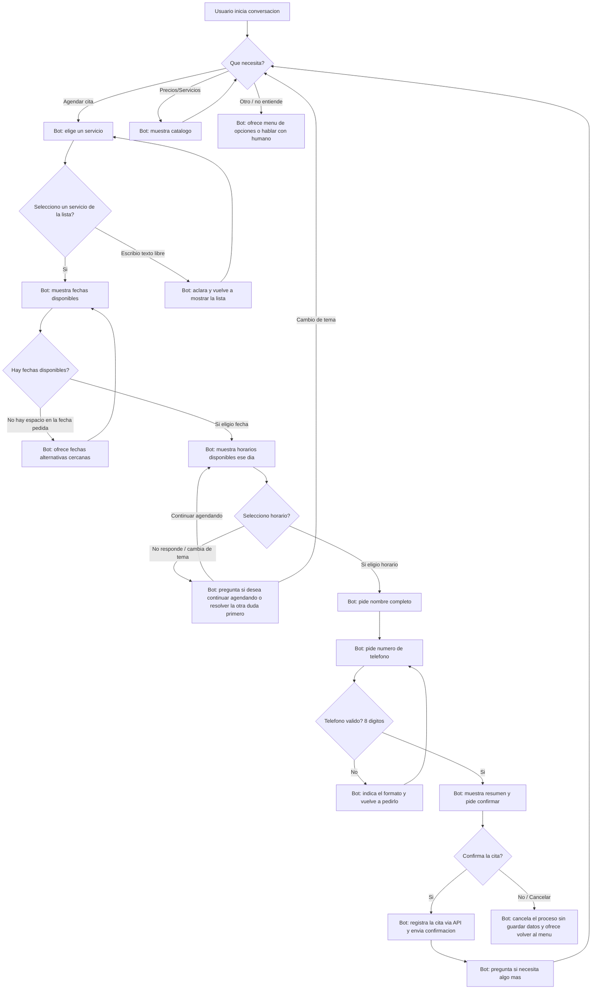

# Diseño conversacional — OdontoBot (Clínica Dental Sonrisa)

## 1. Lista de chequeo

**¿Quién usará el chatbot?**
Pacientes actuales de la clínica y personas interesadas en agendar una cita por primera vez. También personas que solo quieren consultar precios u horarios sin comprometerse todavía.

**¿Qué problema o problemas resuelve?**
Hoy agendar una cita requiere llamar por teléfono en horario de oficina o escribir por redes sociales y esperar respuesta. El bot permite agendar, consultar disponibilidad y resolver dudas frecuentes (precios, servicios, ubicación) a cualquier hora, sin depender de que alguien conteste el teléfono.

**¿Qué necesidades específicas tienen?**
- Conseguir una cita rápido, sin llamar.
- Saber el precio de un servicio antes de decidir si agendar.
- Poder cancelar o reprogramar sin tener que llamar.

**¿Qué preguntas se pueden hacer?**
¿Tienen espacio esta semana?, ¿cuánto cuesta una limpieza/extracción/ortodoncia?, ¿dónde están ubicados?, ¿a qué hora abren?, necesito cancelar mi cita, quiero hablar con alguien.

**¿Qué tipo de respuesta espero en cada caso?**
- Servicio deseado → selección de una lista (botones).
- Fecha preferida → selección de lista de fechas disponibles (no texto libre, para evitar formatos ambiguos).
- Hora → selección de lista de horarios disponibles ese día.
- Nombre completo → texto libre.
- Teléfono de contacto → número (se valida formato de 8 dígitos, formato El Salvador).
- Confirmación → selección Sí/No.

**¿Cuál es su edad, ocupación, intereses, nivel de experiencia con tecnología?**
Rango amplio: adolescentes acompañados de un adulto hasta adultos mayores. Ocupaciones variadas (estudiantes, empleados, adultos mayores jubilados). Nivel de experiencia tecnológica heterogéneo, por lo que el bot debe apoyarse en botones (no exigir comandos ni sintaxis) y usar frases simples, sin jerga clínica.

**¿Cuáles son los escenarios alternativos (errores, datos faltantes, el usuario cambia de tema)?**
- El usuario pide una fecha/hora que ya no está disponible.
- El usuario escribe texto libre en vez de tocar un botón (por ejemplo "el jueves" en lugar de elegir de la lista).
- El usuario deja de responder a mitad del flujo de agendamiento.
- El usuario cambia de tema en medio del agendamiento (por ejemplo pregunta un precio).
- El usuario quiere cancelar el proceso a la mitad.

**¿UI, Accesibilidad?**
Se usan botones (inline keyboard de Telegram) para todas las decisiones cerradas (servicio, fecha, hora, confirmar), reduciendo errores de tipeo y facilitando el uso a personas con poca experiencia digital. Los mensajes son cortos (máximo 2–3 líneas), sin abreviaturas ni tecnicismos odontológicos. Siempre hay una opción visible de "Cancelar" y "Hablar con alguien".

**¿Cómo haré para validar mi prototipo?**
Con la técnica de Mago de Oz: un compañero simula al bot leyendo únicamente el guion y el diagrama, sin improvisar, mientras otro hace de usuario con un guion de camino feliz y otro con fricción (dato faltante, cambio de tema). Se aplican las heurísticas de Grice para revisar que cada mensaje del bot sea claro, breve, relevante y no prometa algo que no puede cumplir.

**Pruebas de usabilidad, desempeño**
Se mide si el usuario logra completar el agendamiento sin ayuda externa, cuántos turnos necesita, y en qué punto del guion se confunde o abandona. Esto se recoge en la hoja de evaluación de la pareja B (peer-review-conversacion.md).

**¿Privacidad?**
El bot recolecta: nombre completo, número de teléfono, servicio solicitado y fecha/hora de la cita. Estos datos se usan únicamente para gestionar la cita y contactar al paciente en caso de cambios. No se comparten con terceros. Se conservan hasta 30 días después de la fecha de la cita y luego se eliminan de la base de datos del bot (la clínica mantiene su propio expediente clínico por separado, bajo sus políticas internas).

---

## 2. Inventario de intenciones

| Intención | Ejemplo de enunciado | Frecuencia | Prioridad | Dato / API |
|---|---|---|---|---|
| Agendar cita | "quiero agendar una cita" | Alta | 1 | API de citas (crear) |
| Consultar disponibilidad | "¿tienen espacio el jueves?" | Alta | 1 | API de citas (consultar horarios libres) |
| Consultar servicios y precios | "¿cuánto cuesta una limpieza?" | Alta | 2 | Catálogo de servicios (estático o API) |
| Cancelar o reprogramar cita | "necesito cancelar mi cita" | Media | 2 | API de citas (editar / eliminar) |
| Consultar horario y ubicación | "¿dónde están ubicados?" | Media | 3 | Información estática |
| Hablar con un humano | "quiero hablar con alguien" | Baja | 3 | Transferencia a agente / número de la clínica |

---

## 3. Diagrama de flujo (agendar cita, con escenarios alternativos)



---

## 4. Diálogo de muestra (camino feliz — agendar cita)

```
Usuario: Hola
Bot: ¡Hola! Bienvenido a Clínica Dental Sonrisa. Puedo ayudarte a agendar una cita,
     consultar precios o resolver dudas. ¿Qué necesitas?
     [Agendar cita] [Ver servicios y precios] [Hablar con alguien]

Usuario: (toca) Agendar cita
Bot: Perfecto. ¿Qué servicio necesitas?
     [Limpieza dental] [Extracción] [Ortodoncia] [Revisión general]

Usuario: (toca) Limpieza dental
Bot: Estas son las fechas disponibles esta semana para limpieza dental:
     [Martes 9] [Miércoles 10] [Jueves 11]

Usuario: (toca) Jueves 11
Bot: Estos son los horarios disponibles el jueves 11:
     [9:00 am] [11:00 am] [2:00 pm]

Usuario: (toca) 11:00 am
Bot: Muy bien. ¿Cuál es tu nombre completo?

Usuario: María Hernández

Bot: Gracias, María. ¿A qué número de teléfono te podemos contactar? (8 dígitos)

Usuario: 7123-4567

Bot: Confirmo tu cita:
     Servicio: Limpieza dental
     Fecha: jueves 11, 11:00 am
     Nombre: María Hernández
     Teléfono: 7123-4567
     ¿Confirmas la cita?
     [Sí, confirmar] [No, cancelar]

Usuario: (toca) Sí, confirmar
Bot: ¡Listo! Tu cita quedó agendada para el jueves 11 a las 11:00 am. Te enviaremos
     un recordatorio un día antes. ¿Necesitas algo más?
     [Ver servicios y precios] [Hablar con alguien] [No, gracias]
```

De este guion salen: tres datos obligatorios (servicio, fecha/hora, nombre y teléfono), una llamada a la API de citas para crear el registro, validación del formato del teléfono, y un cierre que confirma y ofrece continuar. Los escenarios alternativos (fecha sin espacio, teléfono inválido, cambio de tema, cancelación) están representados en el diagrama de flujo de la sección 3, no en este guion.

# Ejercicio de Laboratorio 5a
## Notas del Ejercicio (Mago de Oz)
### Guion 1, Camino Feliz
sin errores ni confusión. Único punto débil: turno de confirmación muy cargado. Cierre menciona recordatorio no respaldado
### Guion 2, Fricción
Texto libre en vez de botón: resuelto en un reintento.
Fecha sin disponibilidad: resuelto, ofrece alternativas.
Teléfono inválido: sin límite de intentos definido
Cambio de tema: solo cubierto en el paso de horario, no en el resto del flujo.
## Evaluación las 5 preguntas
- Alcance y descubribilidad — Resuelto. Bienvenida explica qué hace el bot y ofrece botones desde el primer turno.
- Grice — cantidad, relación, manera — Resuelto. Un dato por turno, lenguaje simple. Mejora: separar el bloque de confirmación (resumen + pregunta) en dos turnos.
- Grice — calidad y relleno de datos — Parcial. Promete recordatorio automático sin API/intención que lo respalde. Mejora: quitar la frase o agregar la intención al inventario.
- Manejo de errores (Guion 2) — Parcial. Tiene rama para texto libre, fecha sin espacio y teléfono inválido. Falta rama para usuario inactivo y límite de reintentos con derivación a humano.
- Reglas de producto — Parcial. Se puede cancelar y la confirmación es explícita antes de la API. Falta botón "Atrás" en pasos intermedios (solo existe cancelar todo).
