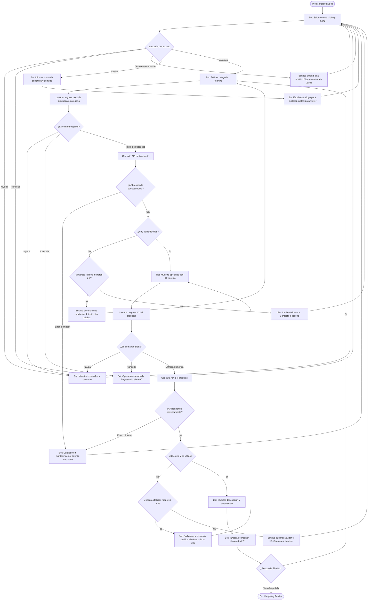

# Diseño Conversacional - Michu Bot

Documento de diseño para el asistente virtual en Telegram, correspondiente a la **Sesión 1 del Laboratorio 5** (CET115 - 2026).

---

## 1. Investigación del Usuario y Lista de Chequeo

### ¿Quién usará el chatbot?

Clientes y dueños de mascotas, principalmente entre 18 y 45 años, interesados en adquirir alimentos, accesorios y juguetes para gatos en El Salvador.

### ¿Qué problema o problemas resuelve?

Reduce los tiempos de espera al facilitar consultas frecuentes sobre productos y servicios de la tienda. Permite consultar el catálogo, precios, disponibilidad referencial y detalles de los artículos directamente desde Telegram, evitando la navegación obligatoria en el navegador web para consultas iniciales.

### ¿Qué necesidades específicas tienen?

* Consultar productos felinos (rascadores, arenas, alimentos y juguetes).
* Conocer precios, stock referencial y descripciones sin fricción.
* Obtener enlaces directos hacia la tienda web oficial para ver fotos y finalizar la compra.
* Conocer información sobre cobertura de entregas y canales de atención.

### ¿Qué preguntas se pueden hacer?

* "¿Tienen rascadores para gato?"
* "Ver catálogo de juguetes"
* "¿Cuánto cuesta el rascador torre?"
* "¿Hacen envíos a San Salvador?"
* "Quiero ver los detalles del producto 12"

### ¿Qué tipo de respuesta espero en cada caso?

* **Para búsqueda o categorías:** texto con lista formateada y opciones numeradas o comandos.
* **Para detalles de producto:** número entero (ID del producto).
* **Para envíos o soporte:** texto informativo estructurado.

### ¿Cuál es su edad, ocupación, intereses, nivel de experiencia con tecnología?

Entre 18 y 45 años. Estudiantes y profesionales dueños de mascotas con nivel tecnológico medio-alto en mensajería. Prefieren interacciones directas, opciones concretas y comandos claros.

### ¿Cuáles son los escenarios alternativos?

* **Error de formato o ID inexistente:** el usuario ingresa un código que no existe en la tienda. El bot avisa y pide verificar.
* **Límite de intentos:** el usuario falla 3 veces en la búsqueda o en el ID. El bot corta el flujo y deriva a un canal humano: `soporte@tiendahb21009.duckdns.org`.
* **Fallo de API:** la tienda WordPress/WooCommerce está caída o la API REST no responde. El bot avisa de problemas técnicos sin exponer trazas internas.
* **Cambio de tema / Cancelación:** el usuario escribe `/cancelar`, `/start` o `/ayuda` en medio de una consulta. El bot intercepta el comando de forma global, suspende la acción en curso y muestra el menú correspondiente.

### UI y Accesibilidad

* Mensajes breves, de menos de 3 párrafos.
* Uso de emojis temáticos como 🐱, 📦, 🏷️ y 🚚 para facilitar la lectura rápida.
* Enlaces web directos hacia la tienda oficial: https://tiendahb21009.duckdns.org.

### ¿Cómo haré para validar mi prototipo?

Se utilizará la técnica de **Mago de Oz** y la evaluación mediante **Heurísticas de Grice** (Actividad 4).

### Privacidad

Se recolecta el **Telegram User ID** y el primer nombre temporalmente para personalizar el saludo y retener el contexto durante la sesión.

Los datos se descartan al culminar la consulta o al reiniciar la interacción con `/cancelar`.

---

## 2. Inventario de Intenciones

| Intención                | Ejemplo de enunciado                | Frecuencia | Prioridad | Dato / Endpoint API                                    |
| :----------------------- | :---------------------------------- | :--------- | :-------- | :----------------------------------------------------- |
| **Inicio / Menú**        | `/start`, "hola"                    | Alta       | 1         | Lógica interna del bot                                 |
| **Buscar productos**     | "¿Tienen rascadores?" o `/catalogo` | Alta       | 1         | Término / `GET /wp-json/wp/v2/posts?search={query}`    |
| **Consultar categoría**  | "Ver juguetes"                      | Alta       | 1         | Categoría / `GET /wp-json/wp/v2/categories`            |
| **Detalle de producto**  | "¿Cuánto cuesta el rascador #12?"   | Alta       | 1         | ID Producto (entero) / `GET /wp-json/wp/v2/posts/{id}` |
| **Cobertura y envíos**   | "¿Hacen envíos?" o `/envios`        | Media      | 2         | Ninguno / Contenido local predefinido                  |
| **Ayuda**                | `/ayuda`                            | Baja       | 3         | Ninguno / Lógica interna del bot                       |
| **Cancelar interacción** | `/cancelar`                         | Baja       | 3         | Ninguno / Lógica interna del bot (Global)              |
| **Atención humana**      | `/soporte`, "contacto"              | Baja       | 3         | Ninguno / Correo o canal de soporte                    |

---

## 3. Diálogo de Muestra (Camino Feliz)

**Usuario:** `/start`

**Bot:**
¡Hola! 🐱 Soy **Michu**, tu asistente virtual de **Tienda Michuno Gatuno**. Te ayudo a consultar accesorios, alimentos y juguetes para tu mascota (no gestionamos consultas veterinarias por acá). Escribe `/catalogo`, `/envios` o `/ayuda`. ¿Qué deseas consultar hoy?

**Usuario:** `/catalogo`

**Bot:**
📦 **Catálogo de productos:** ¿Qué categoría deseas consultar?

Opciones: *Rascadores*, *Juguetes*, *Alimento*.

Puedes escribir una palabra clave o `/cancelar` para volver.

**Usuario:** `Rascadores`

**Bot:**
🔎 Encontré estas opciones disponibles en la tienda:

1. **Rascador Torre 3 Niveles** — $35.00 USD (ID: 12)
2. **Rascador de Cartón Corrugado** — $8.50 USD (ID: 15)

¿Deseas ver detalles de alguno? Ingresa el ID numérico, por ejemplo `12` o `15`, o escribe `/cancelar`.

**Usuario:** `12`

**Bot:**
🐱 **Rascador Torre 3 Niveles (ID #12):**

* Incluye hamaca, postes de sisal y juguete colgante.
* Altura: 1.20 m.
* Stock disponible.
* Puedes ver fotos y comprarlo aquí: https://tiendahb21009.duckdns.org

¿Puedo ayudarte con algo más? Responde **Sí** o **No**.

**Usuario:** `No`

**Bot:**
¡De acuerdo! Escribe `/catalogo` cuando quieras volver a consultar o `/start` para ver el menú principal. ¡Que tengas un excelente día! 🐾

---

## 4. Diagrama de Flujo de la Conversación

---

## 5. Revisión entre Pares - Revisado por PR21064

### 1. Alcance y descubribilidad

* **Veredicto:** Resuelto.
* **Evidencia:** El mensaje de bienvenida está claro y ofrece los comandos exactos (`/catalogo`, `/envios`, etc.). Como sugerencia, se recomendó considerar botones interactivos a futuro para evitar que el usuario deba digitar comandos completos.

### 2. Grice en el guion — cantidad, relación y manera

* **Veredicto:** Parcial.
* **Evidencia:** Se pedía al usuario escribir entradas abiertas como "Detalle 12" o "Rascadores", lo que daba pauta a errores ortográficos o ambigüedades. Se recomendó usar IDs numéricos directos, por ejemplo `12` en lugar de "Detalle 12", u opciones numeradas.

### 3. Grice — calidad y validación de datos

* **Veredicto:** Resuelto.
* **Evidencia:** Se mapeó adecuadamente cada intención con los endpoints reales de la API de WordPress. El bot promete lo que puede cumplir y no genera información no verificable.

### 4. Manejo de errores

* **Veredicto:** Parcial.
* **Evidencia:** En el diagrama de flujo inicial, si un usuario ingresaba un ID incorrecto, el bot emitía un mensaje de fallo y volvía a pedirlo indefinidamente en un bucle cerrado. Se sugirió cortar a los 3 intentos fallidos y proporcionar contacto de soporte humano.

### 5. Reglas del producto

* **Veredicto:** Parcial.
* **Evidencia:** Aunque en la descripción se mencionaba la disponibilidad de `/cancelar`, en el diagrama de flujo esa opción solo partía desde el menú principal. Se sugirió modelar `/cancelar` como salida global utilizable desde cualquier estado de captura interactiva.

---

## 6. Registro de Ajustes (Resolución de Actividad 4)

A partir de la evaluación de PR21064 y de la retroalimentación del docente, se implementaron los siguientes cambios:

### 1. Ruptura de bucles infinitos con tope de reintentos y derivación

Se agregaron contadores (`H_Count1` y `H_Count2`) con un tope de 3 intentos tanto para búsquedas sin resultados como para identificadores de producto no reconocidos, derivando a `soporte@tiendahb21009.duckdns.org` antes de reorientar al menú.

### 2. Globalización de los comandos de salida (`/cancelar` y `/ayuda`)

Se crearon los nodos de intercepción `GlobalCheck1` y `GlobalCheck2` en el diagrama de flujo, permitiendo abortar la acción en cualquier fase de captura de texto sin procesar los comandos como datos erróneos.

### 3. Cierre de callejones y bifurcación Sí/No

Se eliminó el estado ciego de espera al final de la ficha técnica. Ahora el flujo cuenta con una compuerta explícita para reiniciar la búsqueda de productos o emitir el mensaje de despedida.

### 4. Resiliencia ante fallos de la API REST

Se incorporaron validaciones de estado HTTP (`F_API_Status1` y `F_API_Status2`) para responder de forma accesible al usuario ante caídas o demoras de respuesta del servidor web sin exponer errores técnicos.

### 5. Máxima de Manera en la selección de productos

Se ajustó el diálogo de muestra para solicitar directamente el ID numérico (`12`) en lugar de comandos compuestos como "Detalle 12".
