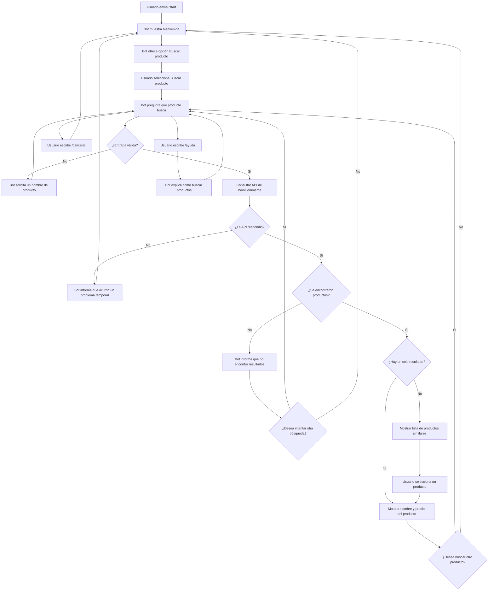

# Diseño conversacional - FerreBot

## 1. Descripción general

**FerreBot** es un chatbot de Telegram diseñado para una tienda de ferretería que utiliza WooCommerce.

Su objetivo principal es permitir que los clientes busquen productos y consulten sus precios de forma rápida desde Telegram, sin necesidad de recorrer manualmente todo el catálogo de la tienda web.

En una etapa posterior, el bot utilizará la API de WooCommerce para consultar la información real de los productos.

---

# 2. Lista de chequeo

## ¿Quién usará el chatbot?

El chatbot estará dirigido principalmente a clientes generales de la ferretería que desean consultar productos y precios.

No se espera que el usuario tenga conocimientos técnicos avanzados ni que conozca comandos complejos.

---

## ¿Qué problema resuelve?

Actualmente, un cliente que desea conocer el precio de un producto debe buscarlo manualmente en el sitio web de la ferretería o consultar directamente con una persona.

FerreBot permitirá realizar esta consulta directamente desde Telegram escribiendo el nombre del producto.

Esto busca reducir el tiempo necesario para encontrar información básica del catálogo.

---

## ¿Qué necesidades específicas tienen los usuarios?

Los usuarios necesitan:

- Buscar productos de manera rápida.
- Consultar el precio de un producto.
- Obtener resultados claros y fáciles de entender.
- Saber cuando un producto no existe.
- Elegir entre varios productos cuando existen coincidencias similares.
- Poder realizar otra búsqueda.
- Poder cancelar una búsqueda.
- Obtener ayuda cuando no sepan cómo utilizar el bot.

---

## ¿Qué preguntas se pueden hacer?

Ejemplos de consultas que el usuario podría realizar:

- ¿Cuánto cuesta un martillo?
- Busco pintura blanca.
- Quiero buscar un taladro.
- ¿Cuál es el precio de un serrucho?
- Buscar martillo.
- Quiero buscar un producto.
- Ayuda.
- Cancelar.

El alcance inicial del bot estará limitado a la búsqueda de productos y consulta de precios.

Si el usuario realiza una pregunta fuera de este alcance, FerreBot le explicará qué funciones tiene disponibles.

---

## ¿Qué tipo de respuesta se espera en cada caso?

| Situación | Tipo de respuesta |
|---|---|
| Inicio de conversación | Texto y opciones |
| Solicitud de producto | Texto |
| Producto encontrado | Nombre y precio |
| Varios productos encontrados | Lista de opciones |
| Producto no encontrado | Texto |
| Entrada incorrecta | Texto de orientación |
| Solicitud de ayuda | Texto |
| Cancelación | Texto y regreso al inicio |

---

## Perfil del usuario

### Edad

Aproximadamente entre 18 y 65 años.

### Ocupación

Diversa. El bot puede ser utilizado tanto por personas que realizan reparaciones en casa como por trabajadores, estudiantes o clientes que necesitan productos de ferretería.

### Intereses

- Herramientas.
- Materiales para reparaciones.
- Productos de ferretería.
- Consultar precios antes de realizar una compra.

### Nivel de experiencia con tecnología

Básico o intermedio.

Se espera que los usuarios tengan experiencia utilizando aplicaciones de mensajería como Telegram, pero no necesariamente conocimientos sobre comandos o programación.

---

# 3. Inventario de intenciones

| Intención | Ejemplo de enunciado | Frecuencia | Prioridad | Dato / API |
|---|---|---|---|---|
| Iniciar conversación | `/start` | Alta | 1 | No requiere API |
| Buscar producto | Quiero buscar un producto | Alta | 1 | API de productos de WooCommerce |
| Consultar precio | ¿Cuánto cuesta el martillo? | Alta | 1 | Nombre del producto / API de WooCommerce |
| Elegir entre resultados | Quiero el segundo | Media | 2 | Lista de resultados obtenidos |
| Producto no encontrado | Busco un producto que no existe | Media | 2 | API de WooCommerce |
| Solicitar ayuda | `/ayuda` o "ayuda" | Baja | 3 | No requiere API |
| Cancelar búsqueda | `/cancelar` o "cancelar" | Baja | 3 | No requiere API |
| Volver al inicio | Quiero regresar | Baja | 3 | No requiere API |

---

# 4. Escenarios alternativos

Además del camino principal, el bot deberá manejar situaciones en las que la conversación no siga el recorrido esperado.

## Producto no encontrado

Si WooCommerce no devuelve ningún producto relacionado con la búsqueda, el bot informará al usuario y le permitirá realizar otra búsqueda.

Ejemplo:

**Usuario:** Llave especial XYZ

**Bot:** No encontré productos relacionados con "Llave especial XYZ". Puedes intentar escribir otro nombre o buscar un producto diferente.

---

## Varios productos encontrados

Si existen varios productos relacionados con el término ingresado, el bot mostrará una lista corta de opciones.

Ejemplo:

**Usuario:** Martillo

**Bot:**

Encontré varios productos:

1. Martillo de acero - $8.50
2. Martillo de goma - $6.75
3. Martillo de carpintero - $10.00

Selecciona una opción.

---

## Entrada inválida

Si el usuario envía un mensaje vacío, un dato que no puede utilizarse como búsqueda o una respuesta que no corresponde con el estado actual de la conversación, el bot volverá a orientar al usuario.

Ejemplo:

**Bot:** Escribe el nombre del producto que deseas buscar.

---

## El usuario cambia de tema

Si el usuario pregunta sobre algo fuera del alcance del bot, FerreBot no intentará responder información que no puede proporcionar.

Ejemplo:

**Usuario:** ¿Cómo estará el clima mañana?

**Bot:** Por el momento puedo ayudarte a buscar productos de la ferretería y consultar sus precios. Escribe el nombre de un producto o utiliza `/ayuda`.

---

## Cancelación

Durante una búsqueda, el usuario podrá escribir:

`/cancelar`

El bot cancelará la búsqueda actual y regresará al menú principal.

---

## Solicitud de ayuda

El usuario podrá escribir:

`/ayuda`

El bot mostrará una explicación breve sobre sus funciones.

Ejemplo:

**Bot:**

Puedo ayudarte a buscar productos y consultar sus precios.

Escribe el nombre del producto que buscas o utiliza `/start` para volver al inicio.

---

## Error al consultar la API

Si la API de WooCommerce no responde, el bot deberá informar el problema sin mostrar errores técnicos al usuario.

Ejemplo:

**Bot:** No pude consultar el catálogo en este momento. Intenta nuevamente dentro de unos minutos.

---

# 5. Diagrama de flujo de la conversación

---

# 6. Diálogo de muestra - Camino feliz

**Usuario:** `/start`

**Bot:** ¡Hola! Soy FerreBot. Puedo ayudarte a buscar productos de la ferretería y consultar sus precios.

¿Qué deseas hacer?

**Usuario:** Buscar producto.

**Bot:** Claro. ¿Qué producto buscas?

**Usuario:** Martillo.

**Bot:** Encontré este producto:

**Martillo de acero**  
Precio: **$8.50**

¿Deseas buscar otro producto?

**Usuario:** No.

**Bot:** Entendido. Si necesitas consultar otro producto, puedes escribir `/start`.

---

# 7. UI y accesibilidad

FerreBot utilizará una interfaz conversacional sencilla.

Los mensajes serán breves y directos para facilitar su comprensión.

Se tendrán en cuenta las siguientes consideraciones:

- Evitar lenguaje técnico innecesario.
- Mostrar instrucciones claras.
- Utilizar mensajes cortos.
- Utilizar botones cuando sea posible.
- Permitir regresar al inicio.
- Proporcionar ayuda mediante `/ayuda`.
- Permitir cancelar mediante `/cancelar`.
- No depender únicamente de imágenes o colores para comunicar información.
- Mantener las respuestas comprensibles para usuarios con experiencia tecnológica básica.
- Evitar solicitar al usuario que memorice muchos comandos.

---

# 8. Validación del prototipo

El prototipo será validado mediante pruebas con usuarios que representen a clientes potenciales de la ferretería.

Se solicitará a cada participante realizar diferentes tareas sin explicarle previamente cómo funciona el bot.

Las tareas serán:

1. Iniciar una conversación.
2. Identificar qué puede hacer el bot.
3. Buscar un producto.
4. Consultar su precio.
5. Buscar un producto inexistente.
6. Solicitar ayuda.
7. Cancelar una búsqueda.

Durante las pruebas se observará:

- Si el usuario comprende el mensaje inicial.
- Si identifica fácilmente cómo buscar un producto.
- Si comprende las respuestas.
- Si sabe cómo continuar después de cada respuesta.
- Si existen partes de la conversación que produzcan confusión.

Los problemas encontrados serán utilizados para modificar el diseño conversacional.

---

# 9. Pruebas de usabilidad

Se evaluarán los siguientes aspectos:

- Facilidad para iniciar una búsqueda.
- Claridad del mensaje de bienvenida.
- Claridad de las instrucciones.
- Comprensión de los resultados.
- Facilidad para seleccionar un producto cuando existen varias coincidencias.
- Facilidad para volver al inicio.
- Facilidad para cancelar una operación.
- Facilidad para obtener ayuda.
- Comprensión de los mensajes de error.

Una prueba será considerada exitosa si el usuario puede completar la búsqueda de un producto sin recibir instrucciones adicionales de otra persona.

---

# 10. Pruebas de desempeño

Se comprobarán los siguientes aspectos técnicos:

- Tiempo de respuesta del bot.
- Tiempo de respuesta de la API de WooCommerce.
- Correcto funcionamiento de las búsquedas.
- Comportamiento cuando un producto no existe.
- Comportamiento cuando existen múltiples coincidencias.
- Comportamiento cuando la API no responde.
- Correcto funcionamiento con varias consultas consecutivas.

El bot deberá responder en un tiempo razonable para que la conversación no se sienta interrumpida.

---

# 11. Privacidad

FerreBot utilizará la menor cantidad posible de información personal.

Para buscar productos y consultar precios no será necesario solicitar:

- Nombre completo.
- Dirección.
- Número de teléfono.
- Contraseñas.
- Información bancaria.
- Información de tarjetas.

El bot únicamente necesitará procesar información necesaria para mantener la conversación y realizar la búsqueda.

---

# 12. Datos recolectados

Durante la interacción pueden procesarse los siguientes datos:

- Identificador del chat de Telegram.
- Texto enviado por el usuario.
- Nombre o término del producto buscado.

El identificador del chat se utilizará únicamente para poder enviar la respuesta al usuario.

Los términos de búsqueda se utilizarán para consultar los productos disponibles en WooCommerce.

En esta primera versión no se plantea almacenar permanentemente el historial de búsquedas de los usuarios.

Si posteriormente fuera necesario almacenar datos, se deberá definir un periodo de conservación y eliminar aquellos que ya no sean necesarios.

---

# 13. Alcance del bot

FerreBot tendrá inicialmente un alcance limitado.

Podrá:

- Iniciar una conversación.
- Buscar productos.
- Consultar precios.
- Mostrar productos similares.
- Informar cuando no existen resultados.
- Mostrar ayuda.
- Cancelar una búsqueda.

En esta primera versión no realizará:

- Compras.
- Pagos.
- Modificación de pedidos.
- Registro de clientes.
- Procesamiento de información bancaria.
- Atención de consultas que no estén relacionadas con el catálogo de productos.

# 14. Evaluación de Diseño Conversacional (revisado por HV21011)

### 1. Alcance y descubribilidad:
* *Veredicto:* Parcial.
* *Evidencia:* El mensaje inicial dice "¿Qué deseas hacer?", pero no muestra botones ni los comandos exactos disponibles.
* *Mejora:* Reescribir el saludo, especificando funciones y comandos disponibles, por ejemplo: "¡Hola! Soy FerreBot. Puedo ayudarte a buscar productos. Selecciona una opción: /buscar, /ayuda".

### 2. Grice en el guion (cantidad, relación, manera):
* *Veredicto:* Resuelto.
* *Evidencia:* El diálogo de muestra es directo, hace una sola pregunta a la vez ("¿Qué producto buscas?") y no utiliza lenguaje técnico de WooCommerce.
* *Mejora:* Mantener este formato conciso en los mensajes de error.

### 3. Grice (calidad y relleno de datos):
* *Veredicto:* Parcial.
* *Evidencia:* Si en el primer turno el usuario dice directamente "Quiero buscar un taladro", el flujo igual lo obligaría a pasar por el nodo "¿Qué producto buscas?" en lugar de extraer el dato.
* *Mejora:* Agregar una condición en el diagrama que verifique si el producto ya fue mencionado en la intención inicial para saltar directo a la API.

### 4. Manejo de errores:
* *Veredicto:* No resuelto (incompleto).
* *Evidencia:* El diagrama tiene ramas para "Entrada válida = No" y "La API respondió = No", pero no aplica restricciones ni máximo de intentos.
* *Mejora:* Agregar un contador de fallos en el nodo de entrada inválida y derivar a un humano tras el tercer error consecutivo.

### 5. Reglas de producto:
* *Veredicto:* Resuelto.
* *Evidencia:* El bot contempla /cancelar y /ayuda desde el nodo de búsqueda, y cierra el ciclo adecuadamente preguntando "¿Deseas buscar otro producto?" para ofrecer continuidad.
* *Mejora:* Se recomienda /cancelar y /ayuda como comandos globales disponibles desde cualquier estado de la conversación.
