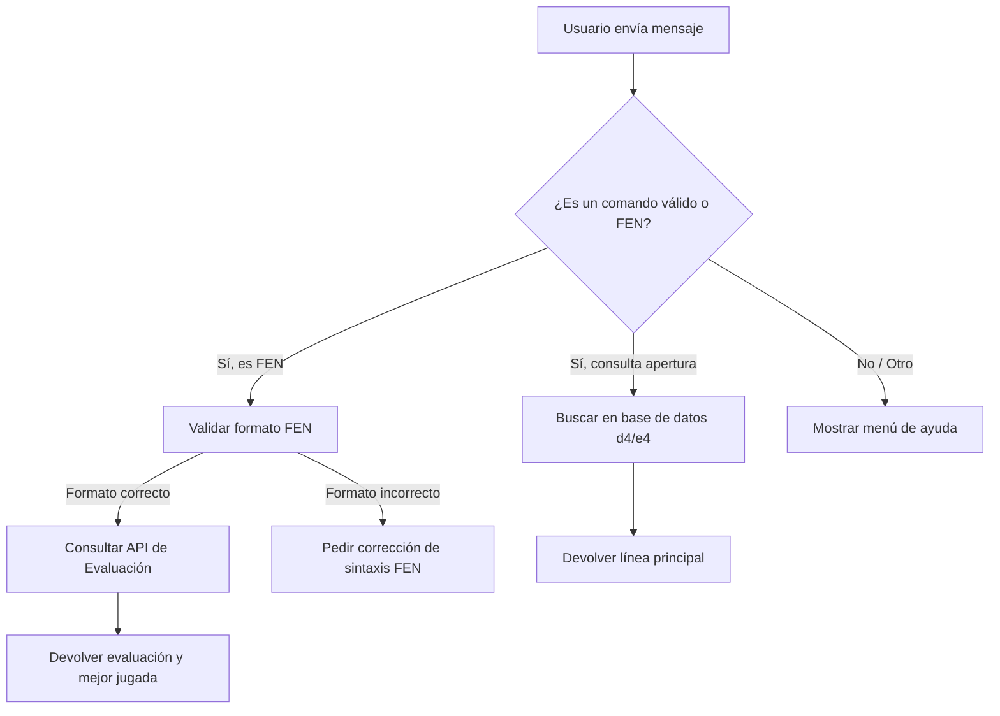

# Diseño Conversacional - Bot de Ajedrez

## Actividad 1 - Lista de Chequeo
* **¿Quién usará el chatbot?** Jugadores de ajedrez competitivo.
* **¿Qué problema o problemas resuelve?** Permite evaluar rápidamente posiciones tácticas y consultar líneas principales de apertura sin abrir interfaces pesadas.
* **¿Qué necesidades específicas tienen?** Obtener evaluación de módulo (Stockfish) a partir de una cadena FEN y revisar variantes de aperturas (ej. sistema Londres o Gambito de Dama d4).
* **¿Qué preguntas se pueden hacer?** "¿Cuál es la evaluación de esta posición FEN?", "¿Qué línea principal sigue después de d4 d5?".
* **¿Qué tipo de respuesta espero en cada caso?** Texto con la evaluación numérica (ej. +1.5), imagen del tablero, o notación algebraica de la variante.
* **¿Cuál es su edad, ocupación, intereses, nivel de experiencia con tecnología?** Estudiantes y profesionales, jugadores de torneos, alto nivel de experiencia técnica y familiaridad con notación ajedrecística.
* **¿Cuáles son los escenarios alternativos?** El usuario ingresa una cadena FEN inválida, la API de evaluación no responde, o solicita una apertura no registrada.
* **¿UI, Accesibilidad?** Interfaz basada en texto puro y respuestas rápidas.
* **¿Cómo haré para validar mi prototipo?** Pruebas de usabilidad ingresando FENs complejos extraídos de partidas reales.
* **¿Privacidad?** No se guardan registros de las preparaciones de apertura ni historiales de FENs consultados más allá del tiempo de sesión.

## Inventario de Intenciones

| Intención | Ejemplo de enunciado | Frecuencia | Prioridad | Dato / API |
| :--- | :--- | :--- | :--- | :--- |
| Evaluar FEN | "Evalúa esta posición: rnbqkbnr/pppppppp/8/8/3P4/8/PPP1PPPP/RNBQKBNR b KQkq - 0 1" | Alta | 1 | API de Lichess / Stockfish |
| Consultar Apertura | "¿Líneas principales para d4?" | Media | 2 | Base de datos local/API de aperturas |
| Ayuda | "/help" o "¿Qué puedes hacer?" | Baja | 3 | Ninguna |

## Diálogo de Muestra (Camino Feliz)
**Usuario:** /start
**Bot:** Hola. Puedo evaluar posiciones si me envías una cadena FEN, o darte líneas de apertura si me indicas el movimiento inicial. ¿Qué necesitas?
**Usuario:** Evaluar posición.
**Bot:** Envíame la cadena FEN exacta de la posición.
**Usuario:** r1bqkb1r/pppp1ppp/2n2n2/4p3/3P4/5N2/PPP1PPPP/RNBQKB1R w KQkq - 2 4
**Bot:** Evaluando... La posición tiene una ventaja blanca de +0.8. El mejor movimiento sugerido es dxe5. ¿Necesitas evaluar otra posición?

## Diagrama de Flujo

# Evaluación del Bot de Ajedrez (Pareja B)

## Notas del Ejercicio (Mago de Oz)

*   **Guion 1 (Camino Feliz):** Todo funcionó perfectamente  . El usuario saludó, pidió evaluar una posición, ingresó los datos correctamente y el bot le dio la respuesta final preguntando si quería seguir  . No hubo ningún problema.
*   **Guion 2 (Camino con Problemas):** El bot se trabó  . Cuando el usuario se equivocó al escribir (puso "d4" en vez del código completo), el bot le pidió que lo corrigiera  . El problema fue que, cuando el usuario quiso cambiar de tema y dijo "mejor quiero ver aperturas", el bot no entendió y se quedó repitiendo el mismo mensaje de error  . El usuario se quedó atrapado sin poder salir  .

---

## Revisión del Diseño (5 Preguntas)

### 1. ¿Queda claro lo que hace el bot? (Alcance)
*   **Veredicto:** A medias (Parcial) 
*   **Lo que vimos:** El bot saluda y dice qué hace muy bien, pero nunca le avisa al usuario que existe un comando `/help` (ayuda) en caso de sentirse perdido 
*   **Cómo mejorarlo:** Cambiar el saludo inicial para que diga: *"Hola. Puedo evaluar posiciones o darte líneas de apertura. Escribe /help en cualquier momento si necesitas ayuda."* 

### 2. ¿El bot habla claro y da la información justa? (Claridad)
*   **Veredicto:** A medias (Parcial) 
*   **Lo que vimos:** El bot es directo al pedir el código de la posición, pero no da ningún ejemplo de cómo debe verse  Esto hace que el usuario se pueda equivocar fácilmente de formato
*   **Cómo mejorarlo:** Dar un ejemplo visual en el mensaje: *"Envíame el código exacto de la posición (ejemplo: rnbqkbnr/pppp...)."* 

### 3. ¿El bot dice la verdad y no promete cosas imposibles? (Realismo)
*   **Veredicto:** Bien (Resuelto) 
*   **Lo que vimos:** Las respuestas del bot (como dar una ventaja de +0.8) son reales y sí se pueden lograr conectando el bot a Stockfish, tal como planeó el compañero . No promete cosas mágicas o imposibles 
*   **Cómo mejorarlo:** No hace falta cambiar nada aquí 

### 4. ¿Qué pasa si el usuario se equivoca? (Manejo de errores)
*   **Veredicto:** Mal (No resuelto)  .
*   **Lo que vimos:** Si el usuario escribe mal el código varias veces, el bot actúa como disco rayado repitiendo el mismo error  . No cuenta los intentos ni le ofrece otra salida para no frustrarlo  .
*   **Cómo mejorarlo:** El bot debería contar los errores en el diagrama  . Si el usuario falla dos veces, el bot debe decirle: *"El formato sigue mal. ¿Quieres intentar de nuevo o prefieres consultar una apertura?"*  .

### 5. ¿El usuario puede cancelar o pedir ayuda en medio de una acción? (Navegabilidad)
*   **Veredicto:** Mal (No resuelto)  .
*   **Lo que vimos:** Si el usuario se arrepiente y quiere salir de la opción de evaluar posición, no tiene cómo hacerlo  . Falla porque no hay un comando u opción visible para "cancelar" el proceso a la mitad  .
*   **Cómo mejorarlo:** Agregar en el diagrama una opción para salir en cualquier momento y cambiar el texto: *"Envíame el código de la posición, o escribe /cancelar para volver al inicio."*  .
