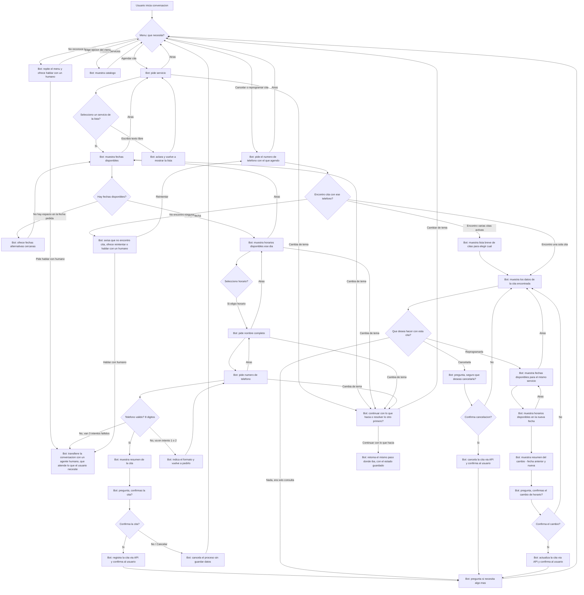

# Diseño conversacional — OdontoBot (Clínica Dental Sonrisa)

## 1. Lista de chequeo

**¿Quién usará el chatbot?**
Pacientes actuales de la clínica y personas interesadas en agendar una cita por primera vez. También personas que solo quieren consultar precios u horarios sin comprometerse todavía.

**¿Qué problema o problemas resuelve?**
Hoy agendar una cita requiere llamar por teléfono en horario de oficina o escribir por redes sociales y esperar respuesta. El bot permite agendar, consultar disponibilidad, cancelar o reprogramar, y resolver dudas frecuentes (precios, servicios, ubicación) a cualquier hora, sin depender de que alguien conteste el teléfono.

**¿Qué necesidades específicas tienen?**
- Conseguir una cita rápido, sin llamar.
- Saber el precio de un servicio antes de decidir si agendar.
- Poder cancelar o reprogramar sin tener que llamar.

**¿Qué preguntas se pueden hacer?**
¿Tienen espacio esta semana?, ¿cuánto cuesta una limpieza/extracción/ortodoncia?, ¿dónde están ubicados?, ¿a qué hora abren?, necesito cancelar mi cita, necesito cambiar mi cita, quiero hablar con alguien.

**¿Qué tipo de respuesta espero en cada caso?**
- Servicio deseado → selección de una lista (botones).
- Fecha preferida → selección de lista de fechas disponibles (no texto libre, para evitar formatos ambiguos).
- Hora → selección de lista de horarios disponibles ese día.
- Nombre completo → texto libre.
- Teléfono de contacto → número (se valida formato de 8 dígitos, formato El Salvador). También se usa para localizar una cita existente al cancelar/reprogramar.
- Confirmación (agendar, cancelar o reprogramar) → selección Sí/No, siempre en un turno separado del resumen.

**¿Cuál es su edad, ocupación, intereses, nivel de experiencia con tecnología?**
Rango amplio: adolescentes acompañados de un adulto hasta adultos mayores. Ocupaciones variadas (estudiantes, empleados, adultos mayores jubilados). Nivel de experiencia tecnológica heterogéneo, por lo que el bot debe apoyarse en botones (no exigir comandos ni sintaxis) y usar frases simples, sin jerga clínica.

**¿Cuáles son los escenarios alternativos (errores, datos faltantes, el usuario cambia de tema)?**
- El usuario pide una fecha/hora que ya no está disponible.
- El usuario escribe texto libre en vez de tocar un botón (por ejemplo "el jueves" en lugar de elegir de la lista).
- El usuario deja de responder a mitad del flujo.
- El usuario cambia de tema en cualquier paso del agendamiento (servicio, fecha, horario, nombre o teléfono).
- El usuario quiere cancelar el proceso de agendar a la mitad.
- El usuario se equivoca varias veces seguidas al escribir el teléfono (máximo 3 intentos, luego se escala a un humano).
- El usuario da un teléfono que no tiene ninguna cita asociada al querer cancelar/reprogramar.
- El usuario tiene más de una cita activa y hay que dejarlo elegir cuál.
- El usuario pide algo que el bot no reconoce, o pide hablar con un humano por un motivo que el bot no puede resolver (precio especial, queja, trámite distinto, etc.) — no siempre es porque falló un dato puntual.

**¿UI, Accesibilidad?**
Se usan botones (inline keyboard de Telegram) para todas las decisiones cerradas (servicio, fecha, hora, confirmar, cancelar/reprogramar), reduciendo errores de tipeo y facilitando el uso a personas con poca experiencia digital. Los mensajes son cortos (máximo 2–3 líneas), sin abreviaturas ni tecnicismos odontológicos. En cada paso intermedio hay un botón **"Atrás"** para corregir sin reiniciar todo el proceso, además de **"Cancelar"** y **"Hablar con alguien"** siempre visibles.

**¿Cómo haré para validar mi prototipo?**
Con la técnica de Mago de Oz: un compañero simula al bot leyendo únicamente el guion y el diagrama, sin improvisar, mientras otro hace de usuario con un guion de camino feliz y otro con fricción (dato faltante, cambio de tema, teléfono inválido repetido, cita no encontrada). Se aplican las heurísticas de Grice para revisar que cada mensaje del bot sea claro, breve, relevante, no prometa algo que no puede cumplir, y presente una sola idea por turno.

**Pruebas de usabilidad, desempeño**
Se mide si el usuario logra completar el agendamiento o la cancelación/reprogramación sin ayuda externa, cuántos turnos necesita, y en qué punto del guion se confunde o abandona. Esto se recoge en la hoja de evaluación de la pareja B (peer-review-conversacion.md).

**¿Privacidad?**
El bot recolecta: nombre completo, número de teléfono, servicio solicitado y fecha/hora de la cita. Estos datos se usan únicamente para gestionar la cita (crearla, cancelarla, reprogramarla) y contactar al paciente en caso de cambios. No se comparten con terceros. Se conservan hasta 30 días después de la fecha de la cita y luego se eliminan de la base de datos del bot (la clínica mantiene su propio expediente clínico por separado, bajo sus políticas internas).

---

## 2. Inventario de intenciones

| Intención | Ejemplo de enunciado | Frecuencia | Prioridad | Dato / API |
|---|---|---|---|---|
| Agendar cita | "quiero agendar una cita" | Alta | 1 | API de citas (crear) |
| Consultar disponibilidad | "¿tienen espacio el jueves?" | Alta | 1 | API de citas (consultar horarios libres) |
| Consultar servicios y precios | "¿cuánto cuesta una limpieza?" | Alta | 2 | Catálogo de servicios (estático o API) |
| Cancelar o reprogramar cita | "necesito cancelar mi cita" | Media | 2 | API de citas (buscar por teléfono, editar / eliminar) |
| Consultar horario y ubicación | "¿dónde están ubicados?" | Media | 3 | Información estática |
| Hablar con un humano | "quiero hablar con alguien" | Baja | 3 | Notifica al staff (canal interno); un agente humano continúa la atención, sea cual sea el motivo |

---

## 3. Diagrama de flujo (único, cubre menú, agendar y cancelar/reprogramar)



**Notas de diseño:**
- `ESC` (hablar con un humano) es un único punto de escalamiento, alcanzable desde el menú principal, desde el límite de intentos con el teléfono, y desde una búsqueda de cita sin resultados. No asume un solo motivo: el agente humano ve el contexto y resuelve lo que corresponda (precio especial, queja, teléfono que no valida, etc.), en vez de que el bot solo entregue un número de contacto.
- `TC` (cambio de tema) se reutiliza desde todos los pasos de agendamiento; "continuar" retoma el mismo paso con el estado guardado, "cambiar de tema" regresa al menú.
- Cancelar y reprogramar exigen confirmación explícita en un turno separado del resumen, igual que agendar.
- Si hay varias citas activas con el mismo teléfono, el bot deja elegir cuál antes de actuar.

---

## 4. Diálogo de muestra — agendar cita (camino feliz)

```
Usuario: Hola
Bot: ¡Hola! Bienvenido a Clínica Dental Sonrisa. Puedo ayudarte a agendar una cita,
     cancelar/reprogramar una existente, consultar precios o resolver dudas.
     ¿Qué necesitas?
     [Agendar cita] [Cancelar o reprogramar] [Ver servicios y precios] [Hablar con alguien]

Usuario: (toca) Agendar cita
Bot: Perfecto. ¿Qué servicio necesitas?
     [Limpieza dental] [Extracción] [Ortodoncia] [Revisión general] [Atrás]

Usuario: (toca) Limpieza dental
Bot: Estas son las fechas disponibles esta semana para limpieza dental:
     [Martes 9] [Miércoles 10] [Jueves 11] [Atrás]

Usuario: (toca) Jueves 11
Bot: Estos son los horarios disponibles el jueves 11:
     [9:00 am] [11:00 am] [2:00 pm] [Atrás]

Usuario: (toca) 11:00 am
Bot: Muy bien. ¿Cuál es tu nombre completo?

Usuario: María Hernández

Bot: Gracias, María. ¿A qué número de teléfono te podemos contactar? (8 dígitos)

Usuario: 7123-4567

Bot: Confirmo tu cita:
     Servicio: Limpieza dental
     Fecha: jueves 11, 11:00 am
     Nombre: María Hernández
     Teléfono: 7123-4567

Bot: ¿Confirmas la cita?
     [Sí, confirmar] [No, cancelar]

Usuario: (toca) Sí, confirmar
Bot: ¡Listo! Tu cita quedó agendada para el jueves 11 a las 11:00 am. ¿Necesitas algo más?
     [Ver servicios y precios] [Hablar con alguien] [No, gracias]
```

---

## 5. Diálogos de muestra — cancelar y reprogramar (camino feliz)

**Cancelar una cita**

```
Usuario: (toca) Cancelar o reprogramar
Bot: Claro. ¿Con qué número de teléfono agendaste la cita?

Usuario: 7123-4567

Bot: Encontré esta cita:
     Servicio: Limpieza dental
     Fecha: jueves 11, 11:00 am

Bot: ¿Qué deseas hacer con esta cita?
     [Cancelarla] [Reprogramarla] [Nada, era solo consulta]

Usuario: (toca) Cancelarla
Bot: ¿Seguro que deseas cancelar tu cita del jueves 11 a las 11:00 am?
     [Sí, cancelar] [No, mantenerla]

Usuario: (toca) Sí, cancelar
Bot: Listo, tu cita del jueves 11 a las 11:00 am quedó cancelada. ¿Necesitas algo más?
     [Agendar una nueva cita] [Hablar con alguien] [No, gracias]
```

**Reprogramar una cita**

```
Usuario: (toca) Cancelar o reprogramar
Bot: Claro. ¿Con qué número de teléfono agendaste la cita?

Usuario: 7123-4567

Bot: Encontré esta cita:
     Servicio: Limpieza dental
     Fecha: jueves 11, 11:00 am

Bot: ¿Qué deseas hacer con esta cita?
     [Cancelarla] [Reprogramarla] [Nada, era solo consulta]

Usuario: (toca) Reprogramarla
Bot: Estas son las fechas disponibles para limpieza dental:
     [Viernes 12] [Lunes 15] [Martes 16]

Usuario: (toca) Lunes 15
Bot: Estos son los horarios disponibles el lunes 15:
     [9:00 am] [1:00 pm] [3:00 pm]

Usuario: (toca) 3:00 pm
Bot: Tu cita cambiaría así:
     Antes: jueves 11, 11:00 am
     Nuevo: lunes 15, 3:00 pm

Bot: ¿Confirmas el cambio de horario?
     [Sí, confirmar] [No, mantener la cita original]

Usuario: (toca) Sí, confirmar
Bot: Listo, tu cita quedó reprogramada para el lunes 15 a las 3:00 pm. ¿Necesitas algo más?
     [Agendar otra cita] [Hablar con alguien] [No, gracias]
```

