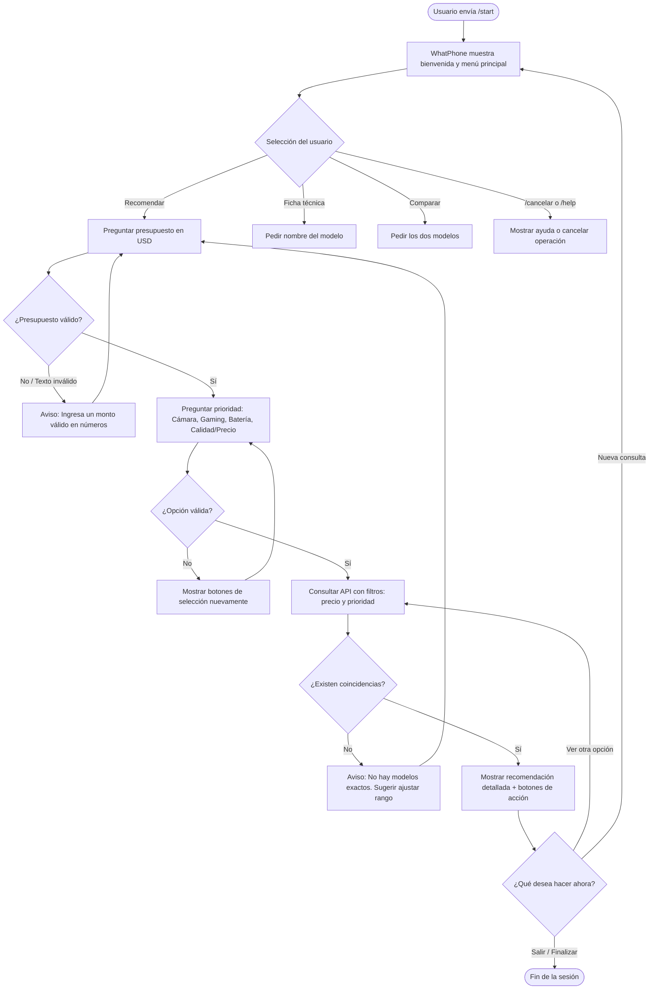

# Diseño Conversacional - WhatPhone Bot

## 1. Lista de Chequeo de Diseño Conversacional

* **¿Quién usará el chatbot?**  
  Usuarios interesados en renovar o comprar un smartphone, estudiantes, profesionales y entusiastas de la tecnología que buscan una recomendación rápida o comparar especificaciones sin saturarse de tecnicismos complejos.

* **¿Qué problema o problemas resuelve?**  
  Reduce la sobrecarga de información y el tiempo que toma comparar especificaciones técnicas (batería, procesador, cámara, pantalla) y precios entre decenas de modelos disponibles en el mercado.

* **¿Qué necesidades específicas tienen?**  
  1. Filtrar teléfonos según presupuesto o prioridad de uso (fotografía, gaming, batería/autonomía, calidad-precio).  
  2. Consultar fichas técnicas resumidas de modelos específicos.  
  3. Comparar rápidamente dos equipos frente a frente.

* **¿Qué preguntas se pueden hacer?**  
  - "¿Cuál es el mejor teléfono para fotos por menos de $400?"  
  - "¿Qué especificaciones tiene el Xiaomi Redmi Note 13 Pro?"  
  - "¿Mejor Samsung A55 o Poco X6 Pro?"  
  - "/recomendar", "/ficha", "/comparar"

* **¿Qué tipo de respuesta espero en cada caso?**  
  - **Presupuesto / Precio:** Número entero o selección de rango.  
  - **Uso / Categoría:** Selección de lista (Cámara, Gaming, Batería, Calidad-Precio).  
  - **Modelo:** Texto plano (nombre del modelo).

* **¿Cuál es su perfil (edad, ocupación, experiencia tecnológica)?**  
  Jóvenes y adultos de 16 a 45 años, estudiantes o trabajadores, con nivel de experiencia tecnológica básico a intermedio, acostumbrados al uso diario de apps de mensajería como Telegram.

* **¿Cuáles son los escenarios alternativos?**  
  - *Modelo no encontrado:* Sugiere modelos con nombres similares o permite reintentar.  
  - *Rango de precio sin opciones disponibles:* Notifica al usuario y le propone el teléfono más cercano superior o inferior.  
  - *Interrupción / Cambio de tema:* El usuario escribe `/cancelar` o `/menu` para regresar al inicio sin bloquear el flujo.  
  - *Entrada inválida:* Mensajes con botones estructurados y validación de texto para no romper la conversación.

* **¿UI y Accesibilidad?**  
  Uso de botones interactivos (Inline Keyboards de Telegram) para limitar errores de tipeo, mensajes concisos con formato Markdown (negritas y emojis para lectura ágil) y compatibilidad con lectores de pantalla móviles.

* **¿Cómo validaré mi prototipo? (Usabilidad y desempeño)**  
  - *Usabilidad:* Pruebas mediante la técnica del "Mago de Oz" y evaluación de heurísticas conversacionales de Grice.  
  - *Desempeño:* Medición de tiempos de respuesta del webhook/polling (< 1 segundo) y tasa de éxito al completar el slot filling sin reiniciar la sesión.

* **¿Privacidad y gestión de datos?**  
  - *Datos recolectados:* `chat_id` y `username` de Telegram, únicamente durante la sesión activa para contextualizar la respuesta.  
  - *Finalidad:* Enrutar los mensajes y mantener el estado de la búsqueda.  
  - *Retención y eliminación:* No se almacenan datos personales persistentes; el estado de la búsqueda se descarta al finalizar la recomendación o tras 10 minutos de inactividad.

---

## 2. Inventario de Intenciones

| Intención | Ejemplo de enunciado | Frecuencia | Prioridad | Dato / API |
| :--- | :--- | :--- | :--- | :--- |
| **Iniciar conversación (`/start`)** | Hola, comenzar, /start | Alta | 1 | Mensaje de bienvenida y menú de opciones |
| **Recomendar por presupuesto/uso** | Recomiéndame un celular para juegos de $300 | Alta | 1 | API de teléfonos (Filtro: uso + precio máx.) |
| **Consultar ficha técnica** | Ficha del Galaxy A55, especificaciones Redmi Note 13 | Media | 2 | API de teléfonos (Búsqueda por modelo) |
| **Comparar dos modelos** | Comparar S24 vs iPhone 15 | Media | 2 | API de teléfonos (Comparador de 2 IDs) |
| **Ayuda y comandos (`/help`)** | Ayuda, ¿qué puedes hacer?, opciones | Media | 3 | Guía rápida de comandos disponibles |
| **Cancelar operación (`/cancel`)** | Cancelar, salir, reiniciar | Baja | 2 | Reset del estado de sesión |

---

## 3. Diálogo de Muestra (Camino Feliz - Intención Principal: Recomendar)

**Usuario:** `/start`  
**WhatPhone:** ¡Hola! 👋 Soy **WhatPhone**, tu asistente para encontrar tu teléfono ideal. ¿Qué deseas hacer hoy?  
[ 1. Recomendar un teléfono ]  
[ 2. Ficha técnica de un modelo ]  
[ 3. Comparar 2 teléfonos ]  

**Usuario:** 1  
**WhatPhone:** ¡Excelente! Dime cuál es tu presupuesto máximo aproximado en dólares (USD).  
*(Ejemplo: 250, 400, 700)*  

**Usuario:** 350  
**WhatPhone:** Perfecto, hasta $350. ¿Cuál es tu prioridad principal?  
[ 📸 Buenas Cámaras ]  
[ 🎮 Rendimiento / Gaming ]  
[ 🔋 Batería de larga duración ]  
[ ⚖️ Calidad-Precio general ]  

**Usuario:** 🎮 Rendimiento / Gaming  
**WhatPhone:** 🎯 Mi mejor recomendación para ti es:  
📱 **Poco X6 Pro (8GB/256GB)**  
• **Precio estimado:** ~$320 USD  
• **Procesador:** Dimensity 8300 Ultra (Top en potencia por este precio)  
• **Pantalla:** AMOLED 1.5K a 120Hz  
• **Batería:** 5000 mAh (Carga 67W)  

¿Te gustaría ver otra opción similar o consultar la ficha detallada?  
[ Ver otra opción ] [ Ficha detallada ] [ Finalizar ]  

**Usuario:** Finalizar  
**WhatPhone:** ¡Un placer ayudarte a elegir! Si necesitas otra recomendación, solo escribe `/start`. ¡Hasta pronto! 👋  

---

## 4. Diagrama de Flujo (Mermaid)

---
# Revisión B: Camilo Medrano MM22108

**1. Alcance y descubribilidad.**
* **Veredicto:** Parcial.
* **Evidencia:** El mensaje de bienvenida explica la función principal, pero carece de delimitación explícita sobre sus límites. Además, si el usuario ignora los botones, no hay indicación visual para descubrir el comando `/help`. Existe una inconsistencia documental grave: el inventario lista `/cancel`, pero el texto usa `/cancelar` y menciona un comando `/menu` inexistente en el inventario.
* **Mejora:** Unificar la nomenclatura de comandos en todo el documento. Modificar el mensaje inicial a: "Soy WhatPhone. Te ayudo a recomendar, consultar y comparar smartphones según precio y uso. Selecciona una opción abajo o escribe `/help` para ver los comandos disponibles."

**2. Grice en el guion — cantidad, relación, manera.**
* **Veredicto:** Parcial.
* **Evidencia:** El bot no viola la cantidad (los datos técnicos mostrados son esenciales para justificar la recomendación), pero falla en la manera por falta de jerarquización. La pregunta de cierre presenta dos acciones posibles en una misma oración ("¿Te gustaría ver otra opción similar o consultar la ficha detallada?"), aumentando innecesariamente la carga cognitiva.
* **Mejora:** Estructurar la ficha técnica con viñetas priorizando el dato de interés del usuario. Eliminar la pregunta compuesta y ofrecer botones unívocos y directos: `[ Ver detalles completos ]` o `[ Buscar otra opción ]`.

**3. Grice — calidad, y relleno de datos.**
* **Veredicto:** No resuelto.
* **Evidencia:** El diseño asume que una "API de teléfonos" abstracta garantiza la calidad de la información. Omite definir la metodología de ranking (cómo el algoritmo determina que un teléfono es "el mejor"), el mercado geográfico de referencia (el precio en USD varía drásticamente por país o proveedor) y la fecha de actualización de los precios.
* **Mejora:** Especificar una fuente verificable de especificaciones y precios. Definir el mercado geográfico objetivo. Documentar una función de puntuación estandarizada (ej. filtro por precio máximo + orden por métrica de rendimiento) que justifique técnica y lógicamente la recomendación.

**4. Manejo de errores (Guion 2).**
* **Veredicto:** No resuelto.
* **Evidencia:** Existen bucles infinitos en `ErrorBudget` y `ErrorUsage`. El diseño ignora por completo las entradas fuera de contexto (ej. pedir características de cámara cuando se espera un número). La rama "No hay coincidencias" destruye el contexto de búsqueda obligando al usuario a reiniciar desde cero.
* **Mejora:** Implementar un límite de tres intentos; al fallar, el bot debe mostrar: "No pude interpretar el dato. `[ Volver al menú ]` `[ Intentar nuevamente ]`". En "No hay coincidencias", debe mantener el estado y sugerir aproximaciones: "No encontré modelos exactos por $250, pero tengo opciones desde $280. `[Ver opciones]` `[Cambiar presupuesto]`".

**5. Reglas de producto.**
* **Veredicto:** Parcial.
* **Evidencia:** Al finalizar el camino feliz, se expulsa al usuario forzándolo a escribir `/start` manualmente para continuar, lo cual degrada la usabilidad. Adicionalmente, el nodo `PostAction` -> `QueryAPI` para "Ver otra opción" está mal diseñado lógicamente: ejecutará los mismos parámetros exactos y la API devolverá el mismo equipo.
* **Mejora:** Reemplazar la instrucción en texto plano por un botón interactivo `[ Volver al menú principal ]`. Modificar la lógica de "Ver otra opción" para que la consulta a la API excluya explícitamente el modelo recomendado actual y busque el siguiente candidato en el ranking.
